# EPOS Desktop App — Project Documentation

> Konsolidovaná dokumentace projektu EPOS Desktop App.
>
> **Poslední aktualizace:** 2026-02-24

---

## Obsah

1. [Přehled](#přehled)
2. [Roadmap](#roadmap)
3. [Technologický Stack](#technologický-stack)
4. [Architektura](#architektura)
5. [Struktura Projektu](#struktura-projektu)
6. [Databáze](#databáze)
7. [Synchronizace](#synchronizace)
8. [Obchodní model — Účty a objednávky](#obchodní-model--účty-a-objednávky)
9. [Autentizace](#autentizace)
10. [Oprávnění](#oprávnění)
11. [UI/UX Design](#uiux-design)
12. [Možná rozšíření v budoucnu](#možná-rozšíření-v-budoucnu)
13. [Development Guide](#development-guide)

---

## Přehled

**EPOS Desktop App** je moderní pokladní systém (Point of Sale) pro desktopová i mobilní prostředí (Windows, macOS, Linux, Android, iOS). Aplikace klade důraz na robustnost, rychlost a schopnost fungovat bez závislosti na stálém internetovém připojení.

### Klíčové vlastnosti

| Vlastnost | Popis |
|-----------|-------|
| **Offline-first** | Lokální databáze je zdroj pravdy. Plná funkčnost bez internetu. |
| **Hybridní architektura** | Centralizovaná datová vrstva (`core/`) + feature-first UI (`features/`). |
| **Reaktivita** | UI automaticky reaguje na změny stavu a databáze pomocí Riverpodu a Streams. |
| **Outbox Pattern + LWW** | Sync engine pro multi-device provoz (od Etapy 3). |

---

## Roadmap

4 etapy, každá s milníky a tasky. Schéma obsahuje **45 tabulek** (42 doménových + 1 lokální device_registrations + 2 sync). Sync se řeší až v Etapě 3 — do té doby funguje aplikace offline na jednom zařízení.

---

### Etapa 1 — Core (offline, single-device)

Admin vytvoří firmu, nastaví uživatele, stoly a produkty. Více uživatelů se může přihlásit a přepínat. Žádný prodej, žádný sync.

#### Milník 1.1 — Projekt a databáze

- **Task1.1** Flutter projekt — desktop + mobile targets, build funguje
- **Task1.2** Drift databáze — 20 tabulek, code generation
- **Task1.3** Lokalizace — i18n infrastruktura, ARB soubory, čeština
- **Výsledek:** Aplikace se spustí, zkompiluje na všech platformách, DB je připravena.

#### Milník 1.2 — Onboarding

- **Task1.4** ScreenOnboarding — výběr "Založit firmu" / "Připojit se k firmě"
- **Task1.5** ScreenOnboarding wizard — cloud účet (sign-up/sign-in) + vytvoření firmy + admin uživatele
- **Task1.6** Seed dat — výchozí měna, daňové sazby, platební metody (viz [Platební metody](#platební-metody)), permissions, role, výchozí registr
- **Výsledek:** Při prvním spuštění uživatel vytvoří firmu a admin účet. V DB jsou výchozí data.

#### Milník 1.3 — Autentizace (single-user)

- **Task1.7** ScreenLogin — výběr uživatele ze seznamu → zadání PINu → ověření proti lokální DB
- **Task1.8** Brute-force ochrana — progresivní lockout, countdown v UI
- **Task1.9** SessionManager — volatile session v RAM
- **Výsledek:** Uživatel vybere svůj účet ze seznamu a přihlásí se PINem. Nesprávné pokusy jsou blokovány progresivním lockoutem.

#### Milník 1.4 — Oprávnění (engine)

- **Task1.10** Permission engine — 113 permissions v 17 skupinách, O(1) check přes in-memory Set
- **Task1.11** Role šablony — helper (19), operator (63), manager (92), admin (113)
- **Výsledek:** Permission engine a role šablony jsou připraveny. Admin má všech 113 oprávnění.

#### Milník 1.5 — Hlavní obrazovka

- **Task1.12** ScreenBills — prázdný stav, layout, navigační shell
- **Task1.13** AppBar — odhlášení
- **Výsledek:** Po přihlášení admin vidí hlavní obrazovku s prázdným seznamem účtů a může se odhlásit.

#### Milník 1.6 — Settings

- **Task1.14** Správa uživatelů — CRUD pro users, přiřazení role (applyRoleToUser)
- **Task1.15** Správa stolů — CRUD pro tables
- **Task1.15b** Správa sekcí — CRUD pro sections
- **Task1.16** Správa produktů — CRUD pro items, categories
- **Task1.17** Správa daňových sazeb — CRUD pro tax_rates
- **Task1.18** Správa platebních metod — CRUD pro payment_methods (viz [Platební metody](#platební-metody))
- **Výsledek:** Admin může vytvořit další uživatele, stoly, produkty, daňové sazby a platební metody.

#### Milník 1.7 — Multi-user

- **Task1.19** Přepínání uživatelů — tlačítko PŘEPNOUT OBSLUHU → dialog se seznamem aktivních uživatelů → výběr → zadání PINu
- **Task1.20** UI enforcement — hasPermissionProvider, skrývání/blokování akcí podle oprávnění
- **Výsledek:** Více uživatelů se může přihlašovat a přepínat. Každý vidí pouze akce, na které má oprávnění.

---

### Etapa 2 — Základní prodej

Uživatel může vytvořit účet, přidat položky a zaplatit. Register session řídí kdy je prodej aktivní. Bez slev, tisku, pokročilých funkcí.

#### Milník 2.1 — Vytvoření účtu

- **Task2.1** DialogNewBill — vytvoření účtu (stůl / bez stolu), rychlý prodej jako samostatný flow
- **Task2.2** DialogBillDetail — detail účtu, informace, stav, prázdný stav
- **Task2.3** Bill CRUD v repository — createBill, updateStatus, cancelBill
- **Výsledek:** Obsluha může otevřít nový účet (přiřazení ke stolu nebo bez stolu), zobrazit jeho detail a stornovat ho. Rychlý prodej je samostatný flow bez předchozího vytvoření účtu.

#### Milník 2.2 — Objednávky

- **Task2.4** ScreenSell — produktový grid/seznam, výběr položek a množství
- **Task2.5** createOrderWithItems — INSERT order + order_items, batch operace
- **Task2.6** Seznam objednávek na účtu — zobrazení orders a items v DialogBillDetail
- **Task2.7** PrepStatus flow — created → ready → delivered (ruční změna)
- **Výsledek:** Obsluha může přidávat položky na účet a sledovat stav přípravy objednávek.

#### Milník 2.3 — Platba

- **Task2.8** DialogPayment — výběr platební metody, zadání částky
- **Task2.9** recordPayment — INSERT payment + UPDATE bill (paidAmount, status)
- **Task2.10** Plná platba — bill status → paid, closedAt se nastaví
- **Task2.11** ScreenBills filtry — filtrování podle stavu (opened, paid, cancelled)
- **Výsledek:** Obsluha může zaplatit účet, účet se uzavře. Na hlavní obrazovce lze filtrovat podle stavu.

#### Milník 2.4 — Grid editor

- **Task2.12** Grid editor — editační režim pro přiřazení položek/kategorií tlačítkům v ScreenSell gridu (layout_items CRUD)
- **Výsledek:** Obsluha může v editačním režimu nastavit, co každé tlačítko v prodejním gridu zobrazuje (produkt, kategorie, nebo prázdné).

#### Milník 2.5 — Register session (lightweight)

- **Task2.13** RegisterSession — otevření/zavření prodejní session
- **Task2.14** Dynamické tlačítko — "Zahájit prodej" (žádná aktivní session) / "Uzávěrka" (aktivní session)
- **Task2.15** Order numbering — O-0001 reset per session, counter v register_sessions
- **Výsledek:** Při přihlášení se kontroluje aktivní session. Bez session nelze prodávat. Uzávěrka session uzavře (nastaví closed_at). Order čísla se resetují s novou session.

---

### Etapa 3 — Pokročilé funkce

Funkce, které nejsou nezbytné pro základní prodej, ale rozšiřují možnosti systému.

#### Milník 3.1 — Sync + multi-device (rozpracováno)

- **Task3.1** Supabase backend — Auth, RLS policies, triggery ✅
- **Task3.2** Outbox pattern — sync_queue, auto-retry, status tracking ✅
- **Task3.3** LWW conflict resolution — updated_at porovnání, merge logika ✅
- **Task3.2b** Sync pro bills, orders, order_items, payments — mappers, outbox registrace, pull tables ✅
- **Task3.4** ConnectCompanyScreen — připojení k existující firmě, InitialSync, sync pro 40 tabulek ✅
- **Task3.5** SyncAuthScreen — admin credentials pro Supabase session ✅ (ScreenCloudAuth)
- **Výsledek:** Data se synchronizují mezi zařízeními. Nové zařízení se připojí k firmě a stáhne data.

#### Milník 3.2 — Pokročilý prodej

- **Task3.7** ✅ Slevy na položku — discount na OrderItem, UI pro zadání slevy
- **Task3.8** ✅ Slevy na účet — discount_amount na Bill, UI pro zadání slevy
- **Task3.9** ✅ Poznámky k objednávce — UI pro notes na Order a OrderItem (sloupce již ve schématu)
- **Task3.10** ✅ Split payment — rozdělení platby mezi více platebních metod (celá částka musí být vždy uhrazena)
- **Task3.11b** ✅ Refund — vrácení peněz po zaplacení, bill status → `refunded` (ve filtru se řadí pod "Zaplacené")
- **Task3.11c** ✅ Sloučení účtů (merge) — přesun všech objednávek ze zdrojového účtu na cílový, zdrojový účet se zruší (cancelled)
- **Task3.11d** ✅ Rozdělení účtu (split) — výběr položek k oddělení, dva režimy: "rozdělit a zaplatit" (nový účet + okamžitá platba) a "rozdělit na nový účet" (konfigurace přes DialogNewBill)
- **Výsledek:** Obsluha může aplikovat slevy, rozdělit platbu mezi metody, provést refund, sloučit a rozdělit účty.

#### Milník 3.3 — Provoz (rozšíření register session)

- **Task3.11** ✅ Register session rozšíření — počáteční/koncový stav hotovosti (opening_cash, closing_cash, expected_cash, difference)
- **Task3.12** ✅ Cash movements — vklady, výběry, výdaje
- **Task3.13** ✅ Z-report — denní uzávěrka s detailním souhrnem (ZReportService, DialogZReport, DialogZReportList)
- **Výsledek:** Pokladna má plnou otevírací/zavírací proceduru s kontrolou hotovosti, evidenci hotovostních pohybů a denní uzávěrku.

> **Pozn.:** Základní register session (otevření/zavření bez hotovosti) je již v Etapě 2 (Milník 2.5).

#### Milník 3.4 — Rozšíření produktového katalogu

- **Task3.14** ✅ Dodavatelé a výrobci — tabulky `suppliers`, `manufacturers` (CRUD, sync, FK na items)
- **Task3.15** ✅ Rozšíření items — nákupní cena (`purchase_price`), alt SKU (`alt_sku`), FK na `supplier_id`, `manufacturer_id`, `parent_id`, `purchase_tax_rate_id`, flagy `is_on_sale`, `is_stock_tracked`
- **Task3.16** ✅ Receptury — tabulka `product_recipes` (parent_product_id → hotový produkt, component_product_id → surovina, quantity_required); item_type rozšíření o `recipe`, `ingredient`
- **Task3.17** ✅ Varianty produktů — `parent_id` ve items, item_type `variant`, `modifier` (velikost, barva apod.)
- **Task3.18** ✅ Hierarchické kategorie — `parent_id` v categories (stromová struktura, max 3 úrovně)
- **Task3.19** ✅ UI správa — nová route `/catalog` s 7 taby (Produkty, Kategorie, Skupiny modifikátorů, Dodavatelé, Výrobci, Receptury, Zákazníci); Sekce/Stoly/Mapa v ScreenVenueSettings, Daň. sazby/Plat. metody v ScreenCompanySettings
- **Výsledek:** Kompletní produktový katalog s dodavateli, výrobci, recepturami a variantami. Položky mají nákupní cenu, alt SKU a vazby na dodavatele/výrobce.

#### Milník 3.5 — Sklad a zásobování

##### Klíčová rozhodnutí

- **Jeden sklad** per firma (s přípravou na multi-warehouse — tabulka `warehouses` existuje, `warehouseId` na stock_levels/stock_documents)
- **Odpis při vytvoření objednávky** (`createOrderWithItems`), ne při delivered/paid
- **Receptury**: rozpad na ingredience přes `product_recipes`, samotná receptura nemá vlastní zásobu
- **Storno/void**: automatické vrácení zásob (reverzní stock_movement)
- **Odečítání**: vše s `isStockTracked=true` bez ohledu na `item_type`
- **Modifikátory**: stock-tracked modifikátory objednávkové položky se odečítají/vracejí společně s hlavní položkou (qty modifikátoru × qty hlavní položky)
- **Směr dle ceny**: záporná cena položky → inbound movement (přírůstek skladu, např. vratná láhev), kladná → outbound. Receptury vždy outbound/inbound bez ohledu na cenu.
- **Záporné zásoby povoleny** (běžné v gastronomii)
- **Nákupní cena při příjemce**: volba strategie per doklad s override per položka (přepsat / ponechat / průměr / vážený průměr)
- **Prodejní odpisy**: jen `stock_movements` bez `stock_document_id` (nullable FK). Doklady jen pro ruční operace (příjemka, výdejka, inventura, oprava).
- **Min. zásoby**: jen evidence (`min_quantity`), bez upozornění v první verzi
- **Inventura**: jednoduchá korekce — obsluha zadá skutečný stav, systém vypočítá rozdíl a vytvoří korekční movements

##### Tasky

- **Task3.20** ✅ Enumy + Drift tabulky — `StockDocumentType` (receipt, waste, inventory, correction), `PurchasePriceStrategy` (overwrite, keep, average, weightedAverage), `StockMovementDirection` (inbound, outbound). Tabulky: `warehouses` (id, company_id, name, is_default, is_active), `stock_levels` (id, company_id, warehouse_id, item_id, quantity real, min_quantity real), `stock_documents` (id, company_id, warehouse_id, supplier_id?, user_id, document_number, type, purchase_price_strategy, note?, total_amount, document_date), `stock_movements` (id, company_id, stock_document_id?, item_id, quantity real, purchase_price?, direction, purchase_price_strategy? override). Modely (freezed): WarehouseModel, StockLevelModel, StockDocumentModel, StockMovementModel.
- **Task3.21** ✅ Mappers + Sync — entity_mappers, supabase_mappers, supabase_pull_mappers pro všechny 4 tabulky. Outbox registrace v sync provideru. Supabase migrace: zatím nepřidány (klient-side hotový).
- **Task3.22** ✅ WarehouseRepository — getDefault (lazy init „Hlavní sklad" při prvním přístupu), watchAll. Extends BaseCompanyScopedRepository.
- **Task3.23** ✅ StockLevelRepository — getOrCreate (lazy init), watchByWarehouse (JOIN s items pro název/unit/purchasePrice), adjustQuantity (delta), setQuantity (absolutní), setMinQuantity. Injektovaný SyncQueueRepository.
- **Task3.24** ✅ StockDocumentRepository — createDocument (transakce: insert document + movements + adjust stock_levels + update purchase_price dle strategie per položka, enqueue všech dotčených entit). createInventoryDocument (difference-based movements). Logika nákupní ceny: per položka zjistí strategii (item override ?? document strategy), aplikuje dle typu (overwrite/keep/average/weightedAverage). watchByWarehouse, generateDocumentNumber (R-001/W-001/I-001/C-001).
- **Task3.25** ✅ Automatický odpis v OrderRepository — modifikace `createOrderWithItems`: po insertu pro každý isStockTracked item vytvořit stock_movement (bez stock_document_id). Receptury: rozpad přes product_recipes, odečtení ingrediencí. Modifikátory: po zpracování hlavní položky se iterují její modifikátory a pro stock-tracked modifikátory se vytvoří vlastní stock_movement (qty modifikátoru × qty hlavní položky). Směr dle ceny: záporná cena → inbound (přírůstek), kladná → outbound (odpis); receptury vždy outbound. Modifikace `updateStatus`: při cancelled/voided reverzní stock_movements (včetně modifikátorů, se správným směrem dle ceny). Modifikace `voidItem`: reversal jedné položky včetně jejích modifikátorů. Nové závislosti: StockLevelRepository, StockMovementRepository, OrderItemModifierRepository.
- **Task3.26** ✅ ScreenInventory — fullscreen route `/inventory`, 3 taby (Zásoby, Doklady, Pohyby). Tab Zásoby: DataTable se stock-tracked položkami (Položka, Jednotka, Množství, Min.množství, Nákupní cena, Celková hodnota) + footer s celkovou hodnotou skladu. Tab Doklady: DataTable se skladovými doklady (Číslo, Typ, Datum, Dodavatel, Poznámka, Celkem). Tab Pohyby: DataTable s historií skladových pohybů s vyhledáváním. Tlačítka: Příjemka, Výdejka, Inventura, Oprava. Přístup: tlačítko SKLAD na ScreenBills.
- **Task3.27** ✅ DialogStockDocument — znovupoužitelný dialog pro příjemku/výdejku/opravu. Pole: dodavatel (dropdown, jen receipt), strategie ceny (dropdown + per-item override, jen receipt), seznam položek (search + quantity + price). Validace: ≥1 položka.
- **Task3.28** ✅ Inventura — 3-krokový flow: (1) `DialogInventoryType` — výběr scope inventury (blind mode, filtr položek), (2) `DialogInventory` — zadání skutečných stavů, (3) `DialogInventoryResult` — zobrazení rozdílů a potvrzení. Výsledek vytvoří stock_movements a jeden stock_document typu `inventory`.
- **Výsledek:** Plné skladové hospodářství s evidencí zásob, příjemkami, výdejkami, automatickým odpisem při prodeji (s rozpadem receptur a odečtem stock-tracked modifikátorů), směrem pohybu dle ceny (záporná cena → inbound), inventurami a plnou synchronizací přes outbox.

#### Milník 3.6 — Tisk

- ✅ Účtenka — PDF 80mm šířka (thermal receipt styl), generováno lokálně přes `pdf` package, otevřeno v systémovém prohlížeči. Obsahuje: hlavička firmy (název, adresa, IČO, DIČ), info účtu, položky se slevami, DPH rekapitulace, platby se spropitným, patička.
- ✅ Z-report — PDF A4, kopíruje strukturu `DialogZReport` (session info, tržby, DPH, spropitné, slevy, počty účtů, cash reconciliation, směny).
- ✅ Fonty — bundled Roboto TTF (české diakritické znaky) v `assets/fonts/`.
- ✅ Voucher — PDF 80mm šířka (thermal receipt styl), tisk z `DialogVoucherDetail`. Obsahuje: název firmy, kód voucheru, typ, hodnota, scope (s názvem produktu/kategorie), max. použití, platnost, poznámka.
- ✅ Infrastruktura — `lib/core/printing/` (PdfFontLoader, ReceiptData, ReceiptPdfBuilder, ZReportPdfBuilder, InventoryPdfBuilder, VoucherPdfBuilder, PrintingService), provider v `lib/core/data/providers/printing_providers.dart`.
- **Task3.30** Tisk reportů — tržby, prodeje dle kategorií/zaměstnanců (backlog)
- **Výsledek:** Lze tisknout účtenky, denní uzávěrky a vouchery do PDF. Kuchyňské tisky a tisk reportů mimo scope v1.

#### Milník 3.7 — Rezervace

- **Task3.31** ✅ Rezervace — tabulka `reservations` (customer_name, customer_phone, reservation_date, party_size, table_id, status, optional FK na customers). Drift table, Freezed model, BaseCompanyScopedRepository, entity/supabase/pull mappers, sync registrace, provider. Status enum: created, confirmed, seated, cancelled.
- **Task3.32** ✅ UI — DialogReservationsList (seznam s date range filtrem, 7 sloupců), DialogReservationEdit (create/edit formulář s propojením zákazníka, date/time picker, table dropdown, status segmented button). Přístup přes menu "Další" → "Rezervace" na ScreenBills.
- **Výsledek:** Uživatel může vytvářet, prohlížet, editovat a mazat rezervace. Volitelné propojení se zákazníkem z DB (pre-fill jméno + telefon). Plná offline podpora a sync přes outbox.

#### Milník 3.8 — Správa objednávek

Storno jednotlivých položek (storno order), status timestamps, oddělovač chodů v košíku, samostatná obrazovka pro přehled objednávek. Objednávka (order) je neměnný „kuchyňský ticket" — po odeslání nelze editovat položky, přidání/odebrání = nový order. Storno položky vytvoří dedikovaný storno order pro audit trail a budoucí kuchyňský tisk.

- **Task3.33** ✅ Status timestamps — 3 nové nullable sloupce na `orders`: `prep_started_at` (D?, nastaví se při prvním bump ze `created`), `ready_at` (D?, nastaví `markReady`), `delivered_at` (D?, nastaví `markDelivered`). Drift tabulka, Freezed model, entity/supabase/pull mappers, Supabase migrace.
- **Task3.34** ✅ Storno order (void jednotlivé položky) — 2 nové sloupce na `orders`: `is_storno` (B, default false), `storno_source_order_id` (T? → orders). Nová metoda `OrderRepository.voidItem(orderId, orderItemId)`: validace → původní item status `voided` → stock reversal (vč. receptur) → nový storno order (`isStorno: true`, status `delivered`, `stornoSourceOrderId` = originál, order number `X{N}-{XXXX}` kde N=register_number) s kopií voidnuté položky → přepočet totals orderu (pokud všechny položky voided → auto-void celý order) → `updateTotals(billId)` (storno ordery se nepočítají) → enqueue sync. UI: tap na položku otevřeného účtu v DialogBillDetail → stávající dialog (poznámka + sleva) + tlačítko "Storno" → potvrzení → void. Storno ordery v historii červeně s prefixem "STORNO".
- **Task3.35** ✅ Oddělovač objednávek v košíku — nový toolbar chip "Oddělit" na ScreenSell. Vizuální čára v košíku oddělující skupiny položek. Oddělovač odebíratelný. Při submit: iterace přes skupiny → `createOrderWithItems()` pro každou → N po sobě jdoucích orderů (O-0001, O-0002...). Prázdné skupiny se ignorují.
- **Task3.36** ✅ ScreenOrders (přehled objednávek) — route `/orders`, přístup přes menu DALŠÍ → "Objednávky", permission `orders.view`. Kartový seznam (kuchyňský lístek): hlavička (číslo, stůl, čas, status barevně), položky přímo viditelné (název, qty, cena, poznámky). Storno ordery červeně s STORNO prefixem. Akce: status přechody (created→ready→delivered), void položek (→ storno order). Filtry (spodní lišta): Aktivní (default: created+ready) / Vytvořené / Hotové / Doručené / Stornované. Scope: default aktuální register session, přepínač na "vše".
- **Výsledek:** Obsluha může stornovat jednotlivé položky na otevřeném účtu (vznikne storno order pro audit/kuchyni). Objednávky mají timestamps pro měření doby přípravy. V košíku lze jedním odesláním vytvořit více oddělených objednávek (chody). Nová obrazovka ScreenOrders poskytuje přehled všech objednávek s filtry, akcemi a kartovým zobrazením.

#### Milník 3.9 — Multi-register architektura

Kompletní multi-register POS architektura: device binding, CRUD pokladen s platebním enforcement, per-register Z-report s cash handover, Supabase Broadcast from Database <2s sync, KDS (Kitchen Display System) a Customer Display.

- **Task3.37** ✅ Schéma + device binding — lokální tabulka `device_registrations` (nesync) pro vazbu zařízení↔pokladna. Rozšíření `registers` (name, register_number, parent_register_id), `register_sessions` (bill_counter), `orders` (register_id), `payments` (register_id). Provider `activeRegisterProvider` (vrací null pokud není device binding). `DeviceRegistrationRepository` (bind/unbind/getForCompany).
- **Task3.38** ✅ CRUD pokladen + payment enforcement — `RegistersTab` (PosTable s add/edit/delete, HardwareType, parent register, payment flags) přesunuto do `ScreenVenueSettings` (4. tab). `ScreenRegisterSettings` má 2 taby (Režim, Prodej). `DialogPayment` filtruje platební metody dle `register.allowCash/Card/Transfer/Credit/Voucher/Other`. `DialogVoucherCreate` respektuje `allowRefunds`. Režim zařízení (POS/KDS/Customer Display) se volí v ScreenRegisterSettings nebo přímo na login obrazovce (KDS).
- **Task3.39** ✅ Z-report per register + cash handover — `CashMovementType.handover` pro mobile→local předání hotovosti. `ZReportService.buildVenueZReport` (agregace N sessions s per-register breakdowns). `RegisterSessionRepository` rozšíření: billCounter increment, getClosedSessions. `DialogZReport` zobrazuje per-register breakdown. `DialogZReportList` filtrování dle registeru.
- **Task3.40** ✅ Supabase Realtime <2s sync — `RealtimeService` subscribuje Broadcast from Database na kanálu `sync:{companyId}` (server-side triggers na 36 tabulkách volají `realtime.send()`). LWW merge přes `insertOnConflictUpdate` v `SyncService.mergeRow`. Reconnect → okamžitý `pullAll` (flag `_wasSubscribed`). Dual sync: Broadcast from Database (primární, ~1-2s) + polling 30s (fallback). Immediate outbox flush přes `SyncQueueRepository.onEnqueue` → `OutboxProcessor.nudge()`.
- **Task3.41** ✅ KDS (Kitchen Display System) — route `/kds`, volba režimu na login obrazovce (POS/KDS radio). Touch-optimized seznam karet s objednávkami, live clock v AppBar, Drawer s logout. Status filter chips (4 filtry vč. storno), per-item a full-order bump (created→ready→delivered), prev-status undo, item void (long press). `_isBumping` guard proti double-tap. Session scope popup menu. Funkčně téměř identický s ScreenOrders — sdílí ceny, modifikátory, poznámky, storno zobrazení, urgency timer.
- **Task3.42** ✅ Customer Display — route `/customer-display` (idle/active via `?code=` query param). Read-only zákaznická obrazovka pro sekundární monitor. Register-centric architektura: displej sleduje `activeBillId` a `displayCartJson` na registru (sync přes outbox). Idle mód (jméno firmy + konfigurovatelný uvítací text z `welcomeText`), cart preview mód (položky z `displayCartJson` před submitnutím objednávky), active mód (reálné objednávky + totaly), ThankYou mód (5s po zaplacení, pak návrat na idle). Discount výpočet z `subtotalGross - totalGross + roundingAmount`. Storno ordery a voided/cancelled položky filtrovány. Tlačítko „Zák. displej" v DialogBillDetail pro manuální odeslání účtu na displej (toggle s eye ikonou). Triple-tap na idle obrazovce pro odpárování displeje (skrytá akce).
- **Task3.43** ✅ Display Devices + Pairing — nová tabulka `display_devices` (id, company_id, parent_register_id, code, name, welcome_text, type, is_active) s `DisplayDeviceType` enum (customerDisplay, kds). `DisplayDeviceModel` (Freezed), `DisplayDeviceRepository` (manual sync pattern), entity/supabase/pull mappers, sync registrace. `ScreenDisplayCode` — 6-digit kód pro spárování displeje s pokladnou. `PairingConfirmationListener` — modální overlay na hlavní pokladně pro potvrzení/zamítnutí párovací žádosti. `BroadcastChannel` wrapper pro Supabase Realtime broadcast (join/send/leave). Párovací protokol: displej odešle `pairing_request` přes broadcast kanál `pairing:{companyId}`, hlavní pokladna zobrazí potvrzovací dialog, odpověď `pairing_confirmed`/`pairing_rejected` zpět přes broadcast. Retry každých 5s, timeout 60s. Vstup přes ScreenOnboarding → "Customer Display" → `/display-code?type=customer_display`.
- **Výsledek:** Plně multi-register POS: zařízení se bindují na pokladny, každá pokladna má konfiguraci platebních metod, Z-reporty per register i venue-wide, Broadcast from Database sync mezi zařízeními <2s, kuchyňský displej, zákaznický displej a bezpečné párování displejů přes broadcast protokol.

---

### Etapa 4 — Statistiky a reporty

Přehledy a reporty pro majitele a manažery.

#### Milník 4.1 — Dashboard

- **Task4.1** Sales dashboard — denní/týdenní/měsíční tržby, graf
- **Task4.2** Živý přehled — aktuální otevřené účty, obsazenost stolů
- **Výsledek:** Majitel vidí přehled tržeb a aktuální stav provozu na dashboardu.

#### Milník 4.2 — Reporty

- **Task4.3** Prodeje dle kategorií — tržby per kategorie, top produkty
- **Task4.4** Prodeje dle zaměstnanců — tržby per obsluha
- **Task4.5** Prodeje dle času — hodinový/denní breakdown, peak hours
- **Task4.6** Platební metody — rozložení plateb (hotovost vs karta vs ostatní)
- **Výsledek:** Manažer může analyzovat prodeje podle kategorií, zaměstnanců, času a platebních metod.

#### Milník 4.3 — Export

- **Task4.7** PDF export — generování PDF reportů
- **Task4.8** Excel export — tabulkový export dat
- **Task4.9** Účetní export — formát pro účetní software
- **Task4.10** CSV export — univerzální CSV export tabulek (produkty, zákazníci, účty, objednávky)
- **Task4.11** Fiskalizace — export dat ve formátu pro finanční správu (připravenost na budoucí legislativu)
- **Task4.12** API/webhook — REST API nebo webhook pro napojení na externí systémy (účetní SW, BI, e-shop)
- **Výsledek:** Reporty a data lze exportovat do PDF, Excelu, CSV a formátu pro účetní software. Připravena infrastruktura pro fiskalizaci a napojení externích systémů.

#### Milník 4.4 — Import

- **Task4.13** CSV import produktů — hromadný import položek z CSV (název, SKU, cena, kategorie, DPH sazba). Validace, náhled před importem, deduplikace dle SKU.
- **Task4.14** CSV import zákazníků — hromadný import zákazníků z CSV (jméno, email, telefon, IČO, DIČ).
- **Task4.15** Migrace z jiného POS — import dat z konkurenčních POS systémů (Storyous, Dotykačka, iKelp apod.). Mapování kategorií, produktů, zákazníků.
- **Výsledek:** Lze hromadně naimportovat produkty a zákazníky z CSV, případně migrovat data z jiného POS systému.

#### Milník 4.5 — Zálohy

- **Task4.16** Lokální záloha DB — export celé lokální SQLite databáze (šifrované) do souboru pro přenos na jiné zařízení nebo disaster recovery.
- **Task4.17** Obnova ze zálohy — import zálohy zpět do aplikace s validací integrity a verzí schématu.
- **Výsledek:** Uživatel může zálohovat a obnovit celou lokální databázi pro přenos dat nebo disaster recovery.

#### Milník 4.6 — Licencování a povinná registrace

Registrace (email+heslo) je povinná při vytvoření firmy — spouští 30denní trial. Po vypršení trialu je nutné prodloužení licence (v1: aktivační kód; budoucnost: Play/App Store, online nákup). Licence má lokální expiraci obnovenou ze serveru při sync pull. Sync je jednoduchý on/off toggle per zařízení (SharedPreferences, ne databáze). Supabase session zůstává aktivní vždy — toggle ovládá pouze sync engine. Bez limitu zařízení.

| Parametr | Hodnota |
|----------|---------|
| Délka trialu | 30 dní |
| Grace period (trial) | 3 dny |
| Grace period (placený) | 7 dní |
| Platba v1 | Aktivační kód |
| Platba budoucí | Play Store, App Store, online nákup |
| Potvrzení e-mailu | Vypnuto v Supabase |
| Sync default | Uživatel volí při onboardingu (per-device) |
| Limit zařízení | Žádný |

##### Architekturní rozhodnutí (z 5-agentového security review)

1. **Licenční pole + status jsou server-autoritativní**: `trial_expires_at`, `license_expires_at`, `license_last_check_at` a `status` nastavuje server (triggery/Edge Functions). BEFORE UPDATE trigger na `companies` tiše zachovává tyto hodnoty z klientských pushů. Trigger používá `current_user NOT IN ('service_role', 'postgres', 'supabase_admin')` pro spolehlivou detekci role v Supabase.
2. **Supabase session zůstává aktivní permanentně** po registraci. Sync on/off používá per-device lokální preferenci (SharedPreferences), NE synchronizovaný DB sloupec. Tím se zabrání paradoxu synchronizace sync toggleu.
3. **signUp() probíhá atomicky se seedem** v `_finish()`, ne v samostatném kroku. Zabraňuje osiřelým Supabase účtům.
4. **`trialExpiresAt` nastavuje server** prostřednictvím PostgreSQL INSERT triggeru na `companies`. Klient nastaví lokálně pro okamžité zobrazení; server přepíše při prvním push; pull sync opraví klientskou hodnotu.
5. **`licenseLastCheckAt` se aktualizuje po každém úspěšném sync pull** přímým zápisem do DB v `SyncService.pullAll()`. Poskytuje monotónní kotvu hodin pro detekci manipulace s časem.
6. **Aktivace licence přes CompanyRepository** — Edge Function volání jdou přes `CompanyRepository.activateLicense()` (respektuje pravidlo "žádný přímý síťový přístup mimo repozitáře").
7. **`updateLicenseFromServer()` obchází outbox** — odůvodněná výjimka: data přišla ZE serveru, pushovat je zpět je redundantní. Server trigger by je ignoroval.
8. **Aktivace kódu je atomická** — `UPDATE ... WHERE used_by_company_id IS NULL RETURNING ...` zabraňuje race conditions.
9. **Edge Function odvozuje firmu z JWT** — lookup `companies.auth_user_id` odpovídající JWT `sub` claim. Nikdy nevěří client-supplied company ID.
10. **"Přihlásit se" flow kontroluje server PŘED kroky 1+2** — uživatelé s existujícím účtem nevyplňují zbytečně info o firmě.

##### Akceptovaná rizika (v1)

- **Lokální SQLite tampering**: Odhodlaný uživatel může modifikovat lokální expiry data. Mitigace: `licenseLastCheckAt` detekce hodin + periodická online verifikace. Plná mitigace vyžaduje app integrity checks (budoucnost).
- **Fresh trial přes nový email**: Žádné server-side omezení bránící neomezeným firmám per osoba. Mitigace pro budoucnost: rate limiting na vytváření firem, omezení e-mailových domén, telefonní verifikace.

##### Task4.18 — Schema: Licenční pole na companies

**Drift tabulka `companies.dart`** — přidat 3 sloupce:
- `DateTimeColumn get trialExpiresAt => dateTime().nullable()();`
- `DateTimeColumn get licenseExpiresAt => dateTime().nullable()();`
- `DateTimeColumn get licenseLastCheckAt => dateTime().nullable()();`

**CompanyModel** (`company_model.dart`) — přidat 3 nullable DateTime pole.

**Entity mappers** (`entity_mappers.dart`) — `companyFromEntity`/`companyToCompanion`: +3 pole.

**Supabase push mapper** (`supabase_mappers.dart`) — `companyToSupabaseJson`: +3 pole (klient pushuje, server trigger ignoruje).

**Supabase pull mapper** (`supabase_pull_mappers.dart`) — `case 'companies'`: +3 pole (pull přináší server-autoritativní hodnoty).

**SeedService** (`seed_service.dart`) — nový parametr `required String authUserId`. Nahradit `authUserId: ''` za `authUserId: authUserId`. Nastavit `trialExpiresAt: DateTime.now().add(Duration(days: 30))` lokálně (server přepíše). Nastavit `licenseLastCheckAt: DateTime.now()`. `syncEnabled` nejde do seedu — jde do SharedPreferences.

##### Task4.19 — Supabase migrace: Licenční sloupce + triggery

**Migrace 1:** 3 sloupce na `companies`:
```sql
ALTER TABLE public.companies ADD COLUMN trial_expires_at timestamptz;
ALTER TABLE public.companies ADD COLUMN license_expires_at timestamptz;
ALTER TABLE public.companies ADD COLUMN license_last_check_at timestamptz;
```

**Trigger `aa_protect_license_fields`** (BEFORE UPDATE na companies):
- Prefix `aa_` zajišťuje spuštění PŘED ostatními BEFORE UPDATE triggery (PostgreSQL alphabetical ordering).
- Pokud `current_user NOT IN ('service_role', 'postgres', 'supabase_admin')`:
  - `NEW.trial_expires_at := OLD.trial_expires_at;`
  - `NEW.license_expires_at := OLD.license_expires_at;`
  - `NEW.license_last_check_at := OLD.license_last_check_at;`
  - `NEW.status := OLD.status;` ← **KRITICKÉ: chrání i status, ne jen licenční pole**

**Trigger `set_trial_expiry_trigger`** (BEFORE INSERT na companies):
- Pokud `NEW.status = 'trial'`:
  - `NEW.trial_expires_at := now() + interval '30 days';`
  - `NEW.license_last_check_at := now();`

##### Task4.20 — Supabase migrace: activation_codes + rate limiting

**Tabulka `activation_codes`:**
```sql
CREATE TABLE public.activation_codes (
  id uuid PRIMARY KEY DEFAULT gen_random_uuid(),
  code text UNIQUE NOT NULL,
  duration_days integer NOT NULL DEFAULT 365,
  used_by_company_id uuid REFERENCES companies(id),
  used_at timestamptz,
  created_by uuid,        -- admin který kód vygeneroval (audit)
  created_at timestamptz DEFAULT now(),
  expires_at timestamptz  -- NULL = nikdy nevyprší
);
ALTER TABLE public.activation_codes ENABLE ROW LEVEL SECURITY;
-- RLS enabled + žádné policies = blokuje veškerý klientský přístup
-- Edge Function používá service_role pro bypass
```

**Tabulka `license_activation_attempts`** (rate limiting):
```sql
CREATE TABLE public.license_activation_attempts (
  id uuid PRIMARY KEY DEFAULT gen_random_uuid(),
  auth_user_id uuid NOT NULL,
  attempted_at timestamptz DEFAULT now(),
  success boolean DEFAULT false
);
ALTER TABLE public.license_activation_attempts ENABLE ROW LEVEL SECURITY;
CREATE INDEX idx_activation_attempts_user_time
  ON license_activation_attempts(auth_user_id, attempted_at);
```

##### Task4.21 — LicenseService (čistá lokální logika)

**Nový soubor:** `lib/core/auth/license_service.dart`
Reference: vzor pure-logic service jako `lib/core/auth/auth_service.dart`.

Enum `LicenseState` se třemi stavy: `active`, `grace`, `expired`.

**Metoda `checkLicense(CompanyModel)`:**
- `effectiveExpiry = licenseExpiresAt ?? trialExpiresAt`
- Pokud `null` → `expired`
- Pokud `isClockSuspicious()` → `expired`
- Pokud `now < effectiveExpiry` → `active`
- Grace: trial 3 dny, placený 7 dní → pokud v grace → `grace`, jinak `expired`

**Metoda `daysRemaining(CompanyModel)`:** Počet dní do expirace.

**Metoda `isClockSuspicious(CompanyModel)`:**
- Pokud `licenseLastCheckAt == null` → false
- Pokud `DateTime.now() < licenseLastCheckAt - 1 hodina` → true (hodiny nastaveny zpět)

##### Task4.22 — License providers + AppInitState

**Soubor:** `lib/core/data/providers/auth_providers.dart`

**`licenseServiceProvider`** — `Provider((ref) => LicenseService())`

**`licenseStateProvider`** — `Provider<LicenseState>` derivovaný z `companyStreamProvider` přes `.when()`. Reaktivní na DB změny ze sync pull. Pattern konzistentní s `isSupabaseAuthenticatedProvider`.

**`_AppInitState` enum rozšíření** o hodnotu `licenseExpired`.

**`appInitProvider` logika:** Po nalezení company zkontrolovat `licenseService.checkLicense(company)`. Pokud `expired` → `licenseExpired`. Jinak → `needsLogin`.

##### Task4.23 — Router: License redirect + ScreenLicenseExpired

**Soubor:** `lib/core/routing/app_router.dart`

- Přidat `licenseStateProvider` do `_RouterNotifier` listeners
- V redirect funkci: pokud `licenseState == expired` a cesta != `/license-expired` a != `/onboarding` → redirect na `/license-expired`
- Nová route: `GoRoute(path: '/license-expired', builder: (_, __) => const ScreenLicenseExpired())`
- License check běží na každé navigaci (jednodušší a spolehlivější než Timer.periodic)

**Nový soubor:** `lib/features/auth/screens/screen_license_expired.dart`
Reference: vzor `lib/features/auth/screens/screen_login.dart`.

Layout (centered, max-width 420, SingleChildScrollView):
- Warning ikona
- Titul: `l.licenseExpiredTrialTitle` nebo `l.licenseExpiredTitle` (dle `company.licenseExpiresAt == null`)
- Podnázev: `l.licenseExpiredMessage`
- **Sekce 1: Aktivační kód** — TextField + "Aktivovat" button → `companyRepo.activateLicense(code)`. Error inline pod polem (žádné snackbary). Loading state na buttonu.
- **Sekce 2: Re-autentizace** (zobrazena pouze pokud JWT expired) — Kontrola: `Supabase.instance.client.auth.currentSession == null`. Email pre-filled + password pole + "Přihlásit se" button. Link: zapomenuté heslo. **KRITICKÉ: zabraňuje deadlocku session expired + license expired.**

##### Task4.24 — Onboarding redesign: 3-krokový wizard + demo flow

**Soubor:** `lib/features/onboarding/screens/screen_onboarding.dart`

**Úvodní obrazovka** (implementováno):
- Přepínač jazyka (cs/en)
- „Založit novou firmu" (`FilledButton`) → wizard
- „Připojit se ke stávající" (`OutlinedButton`) → `/connect-company`
- „Připojit zákaznický displej" (`OutlinedButton`) → `/display-code`
- „Vytvořit Demo" (`FilledButton.tonal`) → demo dialog (viz [Vytvořit Demo](#vytvořit-demo-demo-dialog))

**Wizard — Krok 0 — Registrace / Přihlášení:**

Dva režimy (flag `_isSignIn`):

**Režim nový účet** (default):
- Email pole (povinné)
- Heslo pole (povinné, min 6 znaků)
- Checkbox: `l.registrationEnableSync` (default: off)
- "Pokračovat" button → validace, uloží email+heslo+syncEnabled do widget state, přejde na Krok 1
- Link: `l.registrationHaveAccount` → přepne do přihlášení
- Link: `l.registrationForgotPassword` → `supabase.auth.resetPasswordForEmail(email)`, inline potvrzení

**Režim přihlášení**:
- Email + heslo pole
- "Přihlásit se" button → volá `signIn(email, password)` IHNED (bez Kroků 1+2):
  - Úspěch: kontrola `companyRepo.findRemoteByAuthUserId(authUserId)`
  - Firma nalezena → navigate na `/connect-company`
  - Firma nenalezena → přepne do nového účtu, přejde na Krok 1 (email+heslo zachovány)
  - Selhání: inline error pod buttonem
- Link: `l.registrationNoAccount` → přepne do nového účtu
- Link: `l.registrationForgotPassword` → reset hesla

**DŮLEŽITÉ: Žádný auto-fallback signUp→signIn** — při chybě "user already registered" zobrazit jasnou chybovou hlášku `l.registrationEmailExists`, NE automaticky zkusit signIn.

**Krok 1 — Info o firmě** (beze změn oproti aktuálnímu Kroku 0)

**Krok 2 — Admin uživatel** (beze změn oproti aktuálnímu Kroku 1)

**`_finish()` — atomická registrace + seed:**
1. Loading indicator, disable button
2. `supabaseAuthService.signUp(email, password)`
3. Selhání → inline error (`l.registrationEmailExists` / `l.registrationNetworkError`), re-enable button
4. Úspěch → `authUserId` z response
5. `seedService.seedOnboarding(authUserId: authUserId, ...)`
6. Uložit `syncEnabled` do SharedPreferences
7. Invalidovat `appInitProvider`, navigate na `/login`

##### Task4.25 — Sync toggle (per-device SharedPreferences)

**`syncEnabled` NENÍ databázový sloupec.** Uloženo per-device v SharedPreferences.

**Důvod:** Pokud by `syncEnabled` bylo v synchronizované tabulce, zařízení B se sync off by nikdy nepullovalo změnu z A — paradox. Per-device storage se tomu vyhne.

**`syncEnabledProvider`** (`sync_providers.dart`) — `StateProvider<bool>`, initial value z SharedPreferences.

**`syncLifecycleWatcherProvider` změna:** Přidat `syncEnabled` do podmínky — sync se spustí pouze pokud `isAuthenticated && company != null && syncEnabled`, jinak `manager.stop()`.

##### Task4.26 — Cloud tab redesign

**Soubor:** `lib/features/settings/screens/screen_cloud_auth.dart`

Nahradit stávající `_buildAuthForm()`/`_signUp()`/`_signIn()`/`_saveAuthUserId()` (~150 řádků) třemi sekcemi:

**Sekce Účet:**
- Email (z `Supabase.instance.client.auth.currentUser?.email`)
- Status připojení
- Pokud session expired: inline heslo pole + "Přihlásit se" + zapomenuté heslo link

**Sekce Licence:**
- Plán: `l.licenseTrial` / `l.licenseActive` (dle `company.status`)
- Expirace: datum + `l.licenseExpiresIn(daysRemaining)`
- "Zadat aktivační kód" button → inline TextField + "Aktivovat"

**Sekce Synchronizace:**
- Switch toggle pro sync on/off → zápis do SharedPreferences + update `syncEnabledProvider`
- `syncLifecycleWatcherProvider` reaguje automaticky
- Podnázev: `l.syncToggleOn` / `l.syncToggleOff`
- Čas posledního sync

##### Task4.27 — CompanyRepository: activateLicense + updateLicenseFromServer

**Soubor:** `lib/core/data/repositories/company_repository.dart`

**`activateLicense(String code)`:** Volá Edge Function `activate-license` s `{method: 'activation_code', payload: {code: code}}`. Parsuje response, extrahuje `license_expires_at`. Volá `updateLicenseFromServer()` pro lokální zápis. Vrací `Result<DateTime>`.

**`updateLicenseFromServer(companyId, expiresAt, status)`:** Zapíše licenční pole do lokální DB BEZ enqueue do outboxu. Prominentně zdokumentováno jako odůvodněná výjimka z outbox patternu (data přišla ze serveru).

**Poznámka:** `CompanyRepository` již má `_supabase` klienta (používá ho `findRemoteByAuthUserId()`). Následovat stejný injection pattern.

##### Task4.28 — Edge Function: activate-license

**Deploy:** Supabase Edge Function via MCP.

**Input:** `{ "method": "activation_code", "payload": { "code": "XXXX-XXXX-XXXX" } }`
**Auth:** Vyžaduje validní Supabase JWT. Firma odvozena z JWT (`auth.uid()` → lookup `companies.auth_user_id`).

**V1 logika:**
1. Extrahovat `auth_user_id` z JWT
2. Lookup firma: `SELECT id FROM companies WHERE auth_user_id = auth.uid()`
3. Rate limit check: `SELECT count(*) FROM license_activation_attempts WHERE auth_user_id = ... AND attempted_at > now() - interval '1 hour'` — reject >= 5
4. Log pokus do `license_activation_attempts`
5. **Atomická aktivace kódu:** `UPDATE activation_codes SET used_by_company_id = $cid, used_at = now() WHERE code = $code AND used_by_company_id IS NULL AND (expires_at IS NULL OR expires_at > now()) RETURNING duration_days;`
6. Žádné řádky → neplatný/použitý kód → error
7. Update company (service_role, bypass trigger): `UPDATE companies SET license_expires_at = COALESCE(license_expires_at, now()) + (duration_days || ' days')::interval, status = 'subscribed', license_last_check_at = now(), updated_at = now() WHERE id = $cid;` ← **KRITICKÉ: `updated_at = now()` explicitně, aby pull sync detekoval změnu**
8. Return `{ success: true, license_expires_at: "..." }`

**CORS headers:** Nutné pro web platformu (Access-Control-Allow-Origin, preflight OPTIONS).

**Budoucí `method` hodnoty:** `play_store`, `app_store`, `stripe` — stejný response formát.

##### Task4.29 — SyncService: licenseLastCheckAt update po pull

**Soubor:** `lib/core/sync/sync_service.dart`

V `pullAll()`, po úspěšném dokončení for-loopu, aktualizovat `licenseLastCheckAt = DateTime.now()` na companies záznamu. Běží bez ohledu na to, zda se companies řádky změnily. Zaznamenává "úspěšně jsme kontaktovali server v tomto čase". Bez outbox entry (server trigger hodnotu chrání).

##### Task4.30 — Grace period banner

**Soubor:** `lib/app.dart`

Když `licenseState == grace`: zobrazit tenký amber banner pod routerem. Zobrazuje `l.licenseBannerGrace(daysRemaining)`. Tap naviguje do Cloud tabu v Settings. Dismissible per session.

##### Task4.31 — L10n: Licenční klíče

**Soubor:** `lib/l10n/app_cs.arb` — ~30 nových klíčů:

Registrace: `registrationTitle`, `registrationSubtitle`, `registrationEmail`, `registrationPassword`, `registrationContinue`, `registrationHaveAccount`, `registrationNoAccount`, `registrationForgotPassword`, `registrationPasswordResetSent`, `registrationEnableSync`, `registrationEmailExists`, `registrationNetworkError`, `registrationSignIn`, `registrationSignInFailed`

Licence: `licenseExpiredTitle`, `licenseExpiredTrialTitle`, `licenseExpiredMessage`, `licenseActivationCode`, `licenseActivate`, `licenseActivateInvalidCode`, `licenseActivateUsedCode`, `licenseActivateNetworkError`, `licenseActivateRateLimit`, `licenseTrial`, `licenseActive`, `licenseExpiresIn` (plural), `licenseBannerGrace` (plural), `licenseReauthNeeded`

Cloud/Sync: `syncToggleLabel`, `syncToggleOn`, `syncToggleOff`, `syncReauthNeeded`, `cloudAccountSection`, `cloudLicenseSection`, `cloudSyncSection`, `cloudEnterActivationCode`

##### Pořadí implementace

1. Schema + model + mappers (Task4.18)
2. Supabase migrace + triggery (Task4.19)
3. Supabase migrace: activation_codes + rate limiting (Task4.20)
4. SeedService update (Task4.18)
5. LicenseService + providers (Task4.21, Task4.22)
6. AppInitState + router + ScreenLicenseExpired (Task4.23)
7. Onboarding redesign (Task4.24)
8. Sync toggle SharedPreferences (Task4.25)
9. Cloud tab redesign (Task4.26)
10. CompanyRepository: activateLicense + updateLicenseFromServer (Task4.27)
11. Edge Function: activate-license (Task4.28)
12. SyncService: licenseLastCheckAt update (Task4.29)
13. Grace period banner (Task4.30)
14. L10n (Task4.31)
15. Build runner + delete DB

##### Soubory

**Modifikované (14):** `companies.dart` (Drift), `company_model.dart`, `entity_mappers.dart`, `supabase_mappers.dart`, `supabase_pull_mappers.dart`, `seed_service.dart`, `auth_providers.dart`, `sync_providers.dart`, `company_repository.dart`, `sync_service.dart`, `app_router.dart`, `screen_onboarding.dart`, `screen_cloud_auth.dart`, `app_cs.arb`

**Nové (2):** `lib/core/auth/license_service.dart`, `lib/features/auth/screens/screen_license_expired.dart`

**Server-side (5):** 3 sloupce na companies, trigger `aa_protect_license_fields`, trigger `set_trial_expiry_trigger`, tabulka `activation_codes`, tabulka `license_activation_attempts`, Edge Function `activate-license`

##### Verifikace

1. Delete DB, launch → onboarding s registračními poli
2. Email+heslo offline → inline error
3. Email+heslo online → Supabase účet + seed s real authUserId
4. Supabase: `trial_expires_at` nastaveno serverem (ne klientem)
5. App normálně funguje, `licenseState == active`
6. Toggle sync ON → sync startuje. OFF → sync stopuje. Session aktivní.
7. SET `trial_expires_at` na minulost v Supabase → pull → redirect na `/license-expired`
8. Aktivační kód → Edge Function → `license_expires_at` → app funguje
9. Client push company NEPŘEPÍŠE licenční pole (trigger)
10. Grace period: expirace za 2 dny → banner na všech obrazovkách
11. Druhé zařízení: "Přihlásit se" → `/connect-company` → pull → licence zděděna
12. Clock manipulace → `isClockSuspicious` → expired
13. Session expired + license expired → re-auth sekce → signIn → aktivace kódu
14. Reset hesla: "Zapomenuté heslo" → email odeslán
15. Rate limiting: 6 pokusů → 6. odmítnut
16. Konkurenční kód: 2 zařízení, stejný kód → pouze 1 uspěje (atomický UPDATE)

- **Výsledek:** Aplikace vyžaduje registraci se startem 30denního trialu. Po expiraci licence je uživatel zablokován na expiry obrazovce s možností zadat aktivační kód. Sync je per-device toggle. Licenční pole jsou server-autoritativní a chráněná triggery. Systém je rozšiřitelný pro Play/App Store/online platby.

---

### Infrastruktura (odloženo — lze implementovat kdykoliv před produkčním nasazením)

- **Task3.6** SQLCipher šifrování — migrace plain SQLite → šifrovaná DB, klíč ve secure storage ⬜

---

## Technologický Stack

- **Flutter / Dart** — UI toolkit, multiplatformní (desktop + mobile)
- **Riverpod** — state management a dependency injection
- **Freezed** — code generation pro immutable modely a union types
- **Drift** — reaktivní persistence nad SQLite
- **Supabase** — backend: Auth, Realtime, Database, Storage (od Etapy 3)
- **uuid** — generování unikátních identifikátorů (v7 — chronologické řazení, lepší výkon B-tree)
- **go_router** — deklarativní routing, auth guard, redirect
- **intl** — formátování dat, časů, měn, lokalizace
- **pdf** — generování PDF (účtenky, Z-reporty)
- **printing** — tisková infrastruktura (preview, tisk)
- **crypto** — kryptografické funkce (hashování PINů — SHA-256)
- **path_provider** — přístup k systémovým adresářům (umístění DB)
- **SQLCipher** — šifrování lokální databáze (plánováno, zatím neimplementováno)
- **flutter_secure_storage** — bezpečné úložiště klíčů (plánováno, zatím neimplementováno)

---

## Architektura

### Diagram vrstev

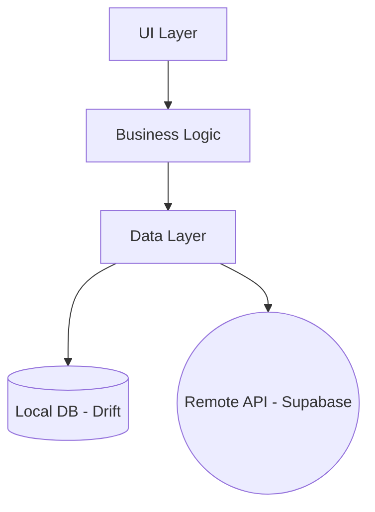

### Popis vrstev

#### 1. UI Layer (Presentation)

- **Komponenty:** Ekrany (`Screen`), Widgety, Dialogy
- **Odpovědnost:** Vykreslování stavu a zachytávání vstupů uživatele
- **Pravidlo:** Žádná business logika v UI. UI pouze volá metody z controllerů/notifierů
- **Bez notifikací:** Žádné snackbary, toasty ani jiné popup notifikace. Stav se zobrazuje přímo v UI komponentách.
- **Implementace:** `ConsumerWidget` pro přístup k Riverpod providerům

#### 2. Business Logic Layer (Application)

- **Komponenty:** `ConsumerStatefulWidget` s lokálním `setState()` pro UI stav, core `StateProvider`/`StreamProvider`/`FutureProvider` pro sdílený app stav
- **Odpovědnost:**
    - Feature-level UI stav (košík, filtry, UI flags) žije přímo v `ConsumerStatefulWidget` (`setState()`)
    - Sdílený app stav (aktivní uživatel, firma, sync status) žije v core providerech (`StateProvider`, `FutureProvider`, `StreamProvider`)
    - Volání metod z Data Layer přes `ref.read(repositoryProvider)`
    - Error handling pro UI pomocí typu `Result<T>`
- **State:** Doménové modely jsou immutable (`Freezed`), UI stav je mutable (`setState`)

#### 3. Data Layer (Domain/Data)

- **Komponenty:** Repositories, Data Sources (Local/Remote), Models
- **Odpovědnost:**
    - Abstrahovat zdroj dat od zbytku aplikace
    - Implementace "Offline-first" logiky (nejdříve zapsat lokálně, pak sync)
    - Mapování mezi DB entitami a doménovými modely
- **Result Pattern:** Mutační operace repozitářů (create, update, delete) vracejí `Result<T>` (sealed class: `Success` nebo `Failure`). Query metody (getById, watchAll) vracejí přímo model nebo null. Viz [Result Pattern](#result-pattern).

### Hybridní architektura

Projekt kombinuje **centralizovanou datovou vrstvu** s **feature-first přístupem pro UI**:

- **Core Data Layer (`lib/core/data/`)**: Centralizovaná definice dat, repozitářů a synchronizace. Zabraňuje cyklickým závislostem v relačně provázaném datovém modelu.
- **Feature Layer (`lib/features/`)**: Distribuovaná prezentační vrstva. Obsahuje pouze UI (Screens, Widgets) a aplikační logiku (Providers/View Models).

### Result Pattern

Všechny repozitáře vracejí `Result<T>` místo throwování výjimek. Sealed class se dvěma variantami:

- **`Success(T value)`** — úspěšný výsledek s hodnotou
- **`Failure(String message)`** — chyba s textovou zprávou

Repozitář obalí operaci v try/catch a vrátí `Success` nebo `Failure`. UI/Notifier zpracuje výsledek přes pattern matching (`switch`).

### BaseCompanyScopedRepository

Všechny entity-specific repozitáře dědí z `BaseCompanyScopedRepository<T>`, který poskytuje standardní CRUD + watch metody s automatickým company scope:

| Metoda | Návratový typ | Popis |
|--------|---------------|-------|
| `create(T model)` | `Future<Result<T>>` | Vytvoření entity + enqueue sync |
| `update(T model)` | `Future<Result<T>>` | Aktualizace entity + enqueue sync |
| `delete(String id)` | `Future<Result<void>>` | Soft delete (nastaví `deletedAt`) + enqueue sync |
| `getById(String id)` | `Future<T?>` | Načtení podle ID (nullable, bez Result) |
| `watchAll(String companyId)` | `Stream<List<T>>` | Reaktivní stream všech entit firmy |
| `enqueueAll(String companyId)` | `Future<void>` | Bulk enqueue všech existujících entit (initial push) |

Specifické query a business metody (např. `getByStatus`, `createOrderWithItems`) si definuje každý repozitář sám.

### Navigace (GoRouter)

Deklarativní routing s auth guardem:

```
/loading             → _LoadingScreen (private, inline v app_router.dart; čeká na inicializaci)
/onboarding          → ScreenOnboarding (nové zařízení)
/connect-company     → ScreenConnectCompany (připojení k existující firmě)
/login               → ScreenLogin (výběr uživatele → PIN)
/bills               → ScreenBills (hlavní obrazovka)
/sell                → ScreenSell (rychlý prodej — bez billId)
/sell/:billId        → ScreenSell (objednávka na existující účet)
/settings/company    → ScreenCompanySettings (Firma, Uživatelé, Zabezpečení, Cloud, Daň. sazby, Plat. metody, Log) — vyžaduje settings_company.*
/settings/venue      → ScreenVenueSettings (Sekce, Stoly, Mapa podlaží) — vyžaduje settings_venue.*
/settings/register   → ScreenRegisterSettings (Režim, Prodej) — vyžaduje settings_register.*
/catalog             → ScreenCatalog (7 tabů: Produkty, Kategorie, Skupiny modifikátorů, Dodavatelé, Výrobci, Receptury, Zákazníci) — vyžaduje products.*
/inventory           → ScreenInventory (3 taby: Zásoby, Doklady, Pohyby) + akční tlačítka (Příjemka, Výdejka, Oprava, Inventura) — vyžaduje stock.*
/orders              → ScreenOrders (přehled objednávek, kartový seznam, filtry, akce) — vyžaduje orders.view
/kds                 → ScreenKds (kuchyňský displej, touch-optimized grid, status bumping) — volba na login obrazovce
/vouchers            → ScreenVouchers (správa voucherů) — vyžaduje vouchers.*
/statistics          → ScreenStatistics (Receipts, Sales, Shifts, Z-Reports, Tips, Orders taby) — vyžaduje stats.*
/customer-display    → ScreenCustomerDisplay (idle nebo active mód via `?code=` query param)
/display-code        → ScreenDisplayCode (6-digit kód pro spárování displeje, `?type=` query param — default `customer_display`)
```

**Auth guard:** Router čeká na `appInitProvider`. Nepřihlášený uživatel je přesměrován na `/login`. Pokud neexistuje firma, přesměrování na `/onboarding`. Po přihlášení se z auth/onboarding stránek přesměruje na `/bills` (POS režim) nebo `/kds` (KDS režim — dle volby na login obrazovce).

**Permission guard:** Každá chráněná routa používá `hasAnyPermissionInGroupProvider` — uživatel se na obrazovku dostane, pokud má **alespoň jedno** oprávnění z příslušné skupiny. Routy `/settings/*` vyžadují odpovídající `settings_company.*` / `settings_venue.*` / `settings_register.*`. `/catalog` vyžaduje `products.*`, `/inventory` vyžaduje `stock.*`, `/vouchers` vyžaduje `vouchers.*`, `/statistics` vyžaduje `stats.*`. Routa `/orders` vyžaduje konkrétní `orders.view`. Route `/kds` nemá permission guard (režim se volí při přihlášení). Route `/customer-display` a `/display-code` nemají permission guard (veřejný displej). Bez oprávnění se uživatel přesměruje na `/bills`.

---

## Struktura Projektu

```text
lib/
├── main.dart                          # Supabase.initialize + runApp
├── app.dart                           # EposApp, MaterialApp.router
├── core/                              # Globální infrastruktura a sdílené jádro
│   ├── auth/                          # Autentizace
│   │   ├── auth_service.dart          # PIN ověření + brute-force lockout
│   │   ├── session_manager.dart       # Multi-user session v RAM
│   │   ├── supabase_auth_service.dart # Supabase GoTrue (email/password)
│   │   └── pin_helper.dart            # Hashing (salt + SHA-256)
│   ├── data/                          # Globální datová vrstva
│   │   ├── enums/                     # Dart enum definice (22 enumů + barrel)
│   │   ├── mappers/                   # Entity ↔ Model mapování (3 soubory)
│   │   ├── models/                    # Doménové modely (43 souborů: 41 Freezed + interface + sealed class)
│   │   ├── providers/                 # DI registrace (Riverpod, 7 souborů)
│   │   ├── repositories/              # Repozitáře (41 souborů: 40 repozitářů + 1 base abstrakce)
│   │   └── services/                  # SeedService (onboarding seed)
│   ├── database/                      # Drift databáze
│   │   ├── app_database.dart          # @DriftDatabase (45 tabulek)
│   │   └── tables/                    # Definice tabulek (46 souborů: 45 tabulek + mixin)
│   ├── widgets/                       # PosTable<T>, PosTableToolbar, PosDialogShell, PosDialogActions, PosDialogTheme, PosNumpad, LockOverlay, InactivityDetector, PosColorPalette, PairingConfirmationListener
│   ├── utils/                         # search_utils.dart, formatters.dart, formatting_ext.dart, file_opener.dart
│   ├── printing/                      # PdfFontLoader, ReceiptData, ReceiptPdfBuilder, ZReportPdfBuilder, InventoryPdfBuilder, VoucherPdfBuilder, PrintingService
│   ├── routing/                       # GoRouter + auth guard (app_router.dart)
│   ├── network/                       # Supabase konfigurace (URL, anon key)
│   ├── sync/                          # Sync engine
│   │   ├── sync_service.dart          # Pull (30s interval, 40 tabulek, paginovaný po 1000 řádcích) + mergeRow (LWW) + tableDependencyOrder
│   │   ├── outbox_processor.dart      # Push přes Ingest Edge Function (5s interval + immediate nudge, FK ordering, retry)
│   │   ├── realtime_service.dart      # Supabase Broadcast from Database (36 tabulek, <2s)
│   │   ├── broadcast_channel.dart     # Supabase Realtime Broadcast wrapper (pairing, display)
│   │   └── sync_lifecycle_manager.dart # Orchestrace start/stop/initial push/drain + realtime
│   ├── logging/                       # AppLogger (dart:developer + debugPrint), LogFileWriter
│   └── l10n/                          # Extension context.l10n
├── features/                          # Funkční moduly (UI only)
│   ├── auth/                          # ScreenLogin (PIN + numpad)
│   ├── bills/                         # Přehled účtů
│   │   ├── screens/                   # ScreenBills
│   │   ├── widgets/                   # DialogBillDetail, DialogNewBill, DialogPayment,
│   │   │                              # DialogOpeningCash, DialogClosingSession,
│   │   │                              # DialogCashMovement, DialogCashJournal,
│   │   │                              # DialogDiscount, DialogChangeTotalToPay,
│   │   │                              # DialogZReport, DialogZReportList, DialogShiftsList,
│   │   │                              # DialogMergeBill, DialogSplitBill, DialogCustomerSearch,
│   │   │                              # DialogLoyaltyRedeem, DialogVoucherRedeem,
│   │   │                              # DialogReceiptPreview, DialogReservationsList,
│   │   │                              # DialogReservationEdit, FloorMapView
│   │   ├── providers/                 # z_report_providers
│   │   ├── services/                  # ZReportService (výpočet Z-reportu)
│   │   └── models/                    # ZReportData (model pro Z-report)
│   ├── catalog/                       # ScreenCatalog (7 tabů: Produkty, Kategorie, Skupiny modifikátorů, Dodavatelé, Výrobci, Receptury, Zákazníci)
│   ├── inventory/                     # ScreenInventory (3 taby: Zásoby, Doklady, Pohyby),
│   │                                  # DialogStockDocument, DialogInventoryType, DialogInventory, DialogInventoryResult
│   ├── onboarding/                    # ScreenOnboarding, ScreenConnectCompany, ScreenDisplayCode
│   ├── sell/                          # ScreenSell (grid + košík), ScreenCustomerDisplay (zákaznický displej)
│   ├── settings/                      # ScreenCompanySettings (7 tabů), ScreenVenueSettings (4 taby),
│   │                                  # ScreenRegisterSettings (2 taby: Režim, Prodej),
│   │                                  # RegistersTab (CRUD pokladen v ScreenVenueSettings),
│   │                                  # ScreenCloudAuth (embedded widget v CloudTab, bez vlastní route)
│   ├── orders/                        # ScreenOrders (přehled objednávek), ScreenKds (kuchyňský displej)
│   ├── shared/                        # session_helpers.dart (sdílená session/shift/cash logika)
│   └── vouchers/                      # ScreenVouchers, DialogVoucherCreate, DialogVoucherDetail
└── l10n/                              # ARB soubory + generovaný kód
```

### Core Data Layer konvence

Každá entita v `core/data/` se skládá z následujících souborů:

| Soubor | Vzor |
|--------|------|
| `models/<entity>_model.dart` | Doménový model (Freezed) |
| `repositories/<entity>_repository.dart` | Repository — přímý přístup k AppDatabase |
| `mappers/supabase_mappers.dart` | Push: Model → Supabase JSON (typované parametry) |
| `mappers/supabase_pull_mappers.dart` | Pull: Supabase JSON → Drift Companion |

**Architektura:** Repozitáře pracují přímo s `AppDatabase` (Drift) bez DataSource abstrakce. Sync logika (outbox zápis, pull merge) žije přímo v repozitářích.

### Core Widgets (`lib/core/widgets/`)

#### PosTable<T>
Generický unifikovaný tabulkový widget používaný napříč celou aplikací (35 použití ve 20 souborech).
Nahrazuje individuální DataTable implementace konzistentním API.

- `PosColumn<T>` — definice sloupce: label, flex/width, cellBuilder, numeric
- `PosTableToolbar` — doprovodný widget: vyhledávací pole + trailing akce
- Použití: katalog (produkty, kategorie, dodavatelé, výrobci, receptury, zákazníci),
  settings (uživatelé, sekce, stoly, daň. sazby, plat. metody), bills, inventory, shifts

#### Dialog System

Sjednocený dialogový systém s 4 sdílenými building blocks:

- **`PosDialogTheme`** — konstanty (padding 24, spacing 24/12, action height 44, numpad large/compact profily)
- **`PosDialogShell`** — wrapper nahrazující opakovaný `Dialog > ConstrainedBox > Padding > Column` pattern. Parametry: title, children, maxWidth (420), maxHeight, padding, titleStyle, scrollable
- **`PosDialogActions`** — řada akčních tlačítek v `Row > [Expanded > SizedBox(height) > action]`. Parametry: actions, height (44), spacing (8)
- **`PosNumpad`** — sdílený numpad se dvěma velikostmi (large/compact), konfigurovatelnými tlačítky (clear, dot, bottomLeftChild). Použito v 10 obrazovkách (login, lock, switch user, opening cash, cash movement, loyalty, credit, discount, change total, voucher create)

Migrace: 29 dialogů celkem, z toho 25 migrovaných na sdílené widgety, 4 ponechané s vlastním layoutem (bill_detail, payment, grid_editor, cash_journal).

#### Další core widgety
- `LockOverlay` — overlay pro auto-lock po neaktivitě
- `InactivityDetector` — detekce neaktivity uživatele
- `PairingConfirmationListener` — modální overlay pro potvrzení/zamítnutí párovací žádosti z displeje. Wrappuje celou aplikaci v `app.dart`. Zobrazí dialog s názvem zařízení, kódem a tlačítky Potvrdit/Zamítnout. Odpověď se odesílá přes `BroadcastChannel`.

**Dva vzory outbox zápisu:**
- **Konfigurační entity** (company_settings, sections, categories, items, tables, map_elements, payment_methods, tax_rates, users, suppliers, manufacturers, product_recipes, warehouses, reservations, vouchers, customers, customer_transactions, modifier_groups, modifier_group_items, item_modifier_groups, order_item_modifiers): Dědí z `BaseCompanyScopedRepository<T>` — automatický outbox zápis v transakci s CRUD operací.
- **Prodejní a provozní entity** (bills, orders, order_items, payments, registers, register_sessions, cash_movements, layout_items, user_permissions, shifts, stock_levels, stock_documents, stock_movements, display_devices): Vlastní repozitáře s injektovaným `SyncQueueRepository` a explicitním `_enqueue*` voláním po každé mutaci. Ruční přístup — business metody (createOrderWithItems, recordPayment, cancelBill cascade, openSession, closeSession, applyRoleToUser, createDocument, adjustQuantity) nepasují do CRUD patternu base repository.
- **Lokální entity** (device_registrations): Nesynchronizované — `DeviceRegistrationRepository` pracuje přímo s Drift DB bez outbox/sync.

---

## Databáze

### Posílení autentizace operátorů (plánováno — Etapa 4)

> **Stav:** Zatím neimplementováno. Aktuálně se operátoři přihlašují pouze PINem (SHA-256 hash).

Plánovaná změna:
- **Heslo** — primární přihlášení operátora (bcrypt/argon2 hash)
- **PIN** — pouze pro rychlé přepínání mezi již přihlášenými účty v rámci jedné session
- Tím se eliminuje riziko offline bruteforce krátkého PINu — PIN bude sloužit jen jako rychlý switch, ne jako jediný autentizační faktor

### Šifrování databáze (plánováno)

> **Stav:** Zatím neimplementováno. DB běží jako plain SQLite. SQLCipher a flutter_secure_storage nejsou v dependencies.

Plánované řešení:

- **Technologie:** SQLCipher (`sqlcipher_flutter_libs`)
- **Šifrovací klíč:** 32-byte náhodný hex řetězec, generován při prvním spuštění
- **Úložiště klíče:** `flutter_secure_storage` (macOS: Keychain, Linux: libsecret, Windows: Credential Manager)
- **Migrace:** Automatická detekce plain SQLite a migrace přes `sqlcipher_export`

### Umístění lokální databáze

Databáze se ukládá v adresáři dokumentů aplikace (`getApplicationDocumentsDirectory()` z `path_provider`):

```
<applicationDocumentsDirectory>/epos_database.sqlite
```

Cesta se skládá pomocí `path` package (`p.join(dir.path, 'epos_database.sqlite')`). Na macOS typicky `~/Library/Containers/.../Data/Documents/`, na Android `data/data/<package>/files/`.

### Mazání lokálních dat (Clean Install)

Pro simulaci čisté instalace (např. testování onboardingu) smazat DB soubor z příslušného umístění a restartovat aplikaci.

Po smazání databáze a restartu aplikace se zobrazí **ScreenOnboarding** — onboarding wizard pro vytvoření firmy a admin účtu.

### Schema — Drift (SQLite)

> **Development mode:** Žádné migrace. Při změně schématu stačí smazat lokální DB soubor a spustit aplikaci znovu. Migrace budou přidány až pro produkční nasazení.

#### SyncColumnsMixin

> Sync sloupce jsou předpřipravené ve schématu od Etapy 1. V Etapě 1–2 zůstávají prázdné (nullable). Využijí se až v Etapě 3 při aktivaci sync.

Všechny doménové tabulky (40) používají mixin `SyncColumnsMixin` se sloupci: `lastSyncedAt` (D?), `version` (I, default 1), `serverCreatedAt` (D?), `serverUpdatedAt` (D?). Mixin rovněž přidává `createdAt` (D, default now), `updatedAt` (D, default now), `deletedAt` (D, nullable) pro soft delete. Tabulky `sync_queue` a `sync_metadata` mixin nepoužívají (vlastní timestamps).

Navíc každá tabulka definuje: `createdAt`, `updatedAt`, `deletedAt` (soft delete).

> **Konvence:** Drift automaticky konvertuje camelCase na snake_case (`createdAt` → `created_at`, `companyId` → `company_id`). Používáme `.named()` **pouze** když potřebujeme jiný název než automatická konverze (např. `layoutMap` → `.named('map')` pro zkrácení názvu, nebo `name` → `.named('table_name')` pro vyhnutí se konfliktu s klíčovým slovem).

#### Přehled tabulek

##### Aktivní tabulky (43) — registrované v @DriftDatabase

**Doménové tabulky (40):**

| SQL tabulka | Drift Table | Drift Entity | Model |
|-------------|-------------|--------------|-------|
| `bills` | `Bills` | `Bill` | `BillModel` |
| `cash_movements` | `CashMovements` | `CashMovement` | `CashMovementModel` |
| `categories` | `Categories` | `Category` | `CategoryModel` |
| `company_currencies` | `CompanyCurrencies` | `CompanyCurrency` | `CompanyCurrencyModel` |
| `companies` | `Companies` | `Company` | `CompanyModel` |
| `company_settings` | `CompanySettings` | `CompanySetting` | `CompanySettingsModel` |
| `currencies` | `Currencies` | `Currency` | `CurrencyModel` |
| `customers` | `Customers` | `Customer` | `CustomerModel` |
| `customer_transactions` | `CustomerTransactions` | `CustomerTransaction` | `CustomerTransactionModel` |
| `display_devices` | `DisplayDevices` | `DisplayDevice` | `DisplayDeviceModel` |
| `items` | `Items` | `Item` | `ItemModel` |
| `item_modifier_groups` | `ItemModifierGroups` | `ItemModifierGroup` | `ItemModifierGroupModel` |
| `layout_items` | `LayoutItems` | `LayoutItem` | `LayoutItemModel` |
| `manufacturers` | `Manufacturers` | `Manufacturer` | `ManufacturerModel` |
| `map_elements` | `MapElements` | `MapElementEntity` | `MapElementModel` |
| `modifier_groups` | `ModifierGroups` | `ModifierGroup` | `ModifierGroupModel` |
| `modifier_group_items` | `ModifierGroupItems` | `ModifierGroupItem` | `ModifierGroupItemModel` |
| `order_items` | `OrderItems` | `OrderItem` | `OrderItemModel` |
| `order_item_modifiers` | `OrderItemModifiers` | `OrderItemModifier` | `OrderItemModifierModel` |
| `orders` | `Orders` | `Order` | `OrderModel` |
| `payment_methods` | `PaymentMethods` | `PaymentMethod` | `PaymentMethodModel` |
| `payments` | `Payments` | `Payment` | `PaymentModel` |
| `permissions` | `Permissions` | `Permission` | `PermissionModel` |
| `product_recipes` | `ProductRecipes` | `ProductRecipe` | `ProductRecipeModel` |
| `registers` | `Registers` | `Register` | `RegisterModel` |
| `register_sessions` | `RegisterSessions` | `RegisterSession` | `RegisterSessionModel` |
| `reservations` | `Reservations` | `Reservation` | `ReservationModel` |
| `role_permissions` | `RolePermissions` | `RolePermission` | `RolePermissionModel` |
| `roles` | `Roles` | `Role` | `RoleModel` |
| `sections` | `Sections` | `Section` | `SectionModel` |
| `session_currency_cash` | `SessionCurrencyCash` | `SessionCurrencyCashEntity` | `SessionCurrencyCashModel` |
| `shifts` | `Shifts` | `Shift` | `ShiftModel` |
| `stock_documents` | `StockDocuments` | `StockDocument` | `StockDocumentModel` |
| `stock_levels` | `StockLevels` | `StockLevel` | `StockLevelModel` |
| `stock_movements` | `StockMovements` | `StockMovement` | `StockMovementModel` |
| `suppliers` | `Suppliers` | `Supplier` | `SupplierModel` |
| `tables` | `Tables` | `TableEntity` | `TableModel` |
| `tax_rates` | `TaxRates` | `TaxRate` | `TaxRateModel` |
| `user_permissions` | `UserPermissions` | `UserPermission` | `UserPermissionModel` |
| `users` | `Users` | `User` | `UserModel` |
| `vouchers` | `Vouchers` | `Voucher` | `VoucherModel` |
| `warehouses` | `Warehouses` | `Warehouse` | `WarehouseModel` |

**Lokální tabulky (1) — nesynchro:**

| SQL tabulka | Drift Table | Drift Entity | Model |
|-------------|-------------|--------------|-------|
| `device_registrations` | `DeviceRegistrations` | `DeviceRegistration` | `DeviceRegistrationModel` |

> `device_registrations` je lokální tabulka — nepoužívá `SyncColumnsMixin`, nesynchronizuje se do Supabase. Ukládá vazbu mezi fyzickým zařízením a pokladnou (1:1 per firma).

**Sync tabulky (2):**

| SQL tabulka | Drift Table | Popis |
|-------------|-------------|-------|
| `sync_queue` | `SyncQueue` | Outbox fronta (pending → processing → completed/failed). Sloupce: id, company_id, entity_type, entity_id, operation (sync_operation enum na Supabase), payload (jsonb), status (sync_status enum na Supabase), idempotency_key, retry_count, error_message, last_error_at, processed_at, created_at. Supabase má navíc: client_created_at, updated_at. |
| `sync_metadata` | `SyncMetadata` | Last pull timestamp per tabulka per firma. Sloupce: id (T, PK), company_id (T), table_name (T), last_pulled_at (T? — ISO 8601 string pro zachování mikrosekund přesnosti), updated_at (D, default now) |

> **Poznámky:**
> - `TableEntity` používá `@DataClassName('TableEntity')` anotaci (konflikt s Drift `Table`)
> - `SyncQueue` a `SyncMetadata` nepoužívají `SyncColumnsMixin` (vlastní timestamps)
> - **Drift vs Supabase:** Drift má 45 tabulek (42 doménových + device_registrations + sync_queue + sync_metadata). Supabase má 44 tabulek (42 doménových + sync_queue + audit_log). `device_registrations` a `sync_metadata` jsou Drift-only, `audit_log` je server-only.

#### Sloupce tabulek

Všechny aktivní tabulky obsahují společné sync sloupce (viz [SyncColumnsMixin](#synccolumnsmixin)).

> Typy: **T** = TEXT, **I** = INT, **R** = REAL, **B** = BOOL, **D** = DATETIME
> FK sloupce jsou označeny → cílová tabulka

##### Prodej (bills, orders, payments)

| Tabulka | Sloupce |
|---------|---------|
| **bills** | id (T), company_id →companies, section_id →sections?, table_id →tables?, opened_by_user_id →users, register_id →registers?, last_register_id →registers?, register_session_id →register_sessions?, bill_number (T), number_of_guests (I, default 0), is_takeaway (B, default false), status (T — BillStatus), currency_id →currencies, customer_id →customers?, customer_name (T?), subtotal_gross (I, default 0), subtotal_net (I, default 0), discount_amount (I, default 0), discount_type (T? — DiscountType), tax_total (I, default 0), total_gross (I, default 0), rounding_amount (I, default 0), paid_amount (I, default 0), loyalty_points_used (I, default 0), loyalty_discount_amount (I, default 0), loyalty_points_earned (I, default 0), voucher_discount_amount (I, default 0), voucher_id →vouchers?, opened_at (D), closed_at (D?), map_pos_x (I?), map_pos_y (I?) |
| **orders** | id (T), company_id →companies, bill_id →bills, created_by_user_id →users, register_id →registers?, order_number (T), notes (T?), status (T — PrepStatus), item_count (I, default 0), subtotal_gross (I, default 0), subtotal_net (I, default 0), tax_total (I, default 0), is_storno (B, default false), storno_source_order_id →orders?, prep_started_at (D?), ready_at (D?), delivered_at (D?) |
| **order_items** | id (T), company_id →companies, order_id →orders, item_id →items, item_name (T), quantity (R), sale_price_att (I), sale_tax_rate_att (I), sale_tax_amount (I), discount (I, default 0), discount_type (T? — DiscountType), notes (T?), status (T — PrepStatus), prep_started_at (D?), ready_at (D?), delivered_at (D?) |
| **payments** | id (T), company_id →companies, bill_id →bills, register_id →registers?, register_session_id →register_sessions?, payment_method_id →payment_methods, user_id →users?, amount (I), paid_at (D), currency_id →currencies, tip_included_amount (I, default 0), notes (T?), transaction_id (T?), payment_provider (T?), card_last4 (T?), authorization_code (T?), foreign_currency_id →currencies?, foreign_amount (I?), exchange_rate (R?) |
| **payment_methods** | id (T), company_id →companies, name (T), type (T — PaymentType), is_active (B, default true) |
| **company_currencies** | id (T), company_id →companies, currency_id →currencies, exchange_rate (R), is_active (B, default true), sort_order (I, default 0) |
| **session_currency_cash** | id (T), company_id →companies, register_session_id →register_sessions, currency_id →currencies, opening_cash (I, default 0), closing_cash (I?), expected_cash (I?), difference (I?) |

##### Katalog (items, categories, tax)

| Tabulka | Sloupce |
|---------|---------|
| **items** | id (T), company_id →companies, category_id →categories?, name (T), description (T?), item_type (T — ItemType), sku (T?), alt_sku (T?), unit_price (I), sale_tax_rate_id →tax_rates?, purchase_price (I?), purchase_tax_rate_id →tax_rates?, is_sellable (B, default true), is_active (B, default true), is_on_sale (B, default true), is_stock_tracked (B, default false), unit (T — UnitType), manufacturer_id →manufacturers?, supplier_id →suppliers?, parent_id →items? |
| **categories** | id (T), company_id →companies, name (T), parent_id →categories?, is_active (B, default true) |
| **suppliers** | id (T), company_id →companies, supplier_name (T), contact_person (T?), email (T?), phone (T?) |
| **manufacturers** | id (T), company_id →companies, name (T) |
| **modifier_groups** | id (T), company_id →companies, name (T), min_selections (I, default 0), max_selections (I?), sort_order (I, default 0) |
| **modifier_group_items** | id (T), company_id →companies, modifier_group_id →modifier_groups, item_id →items, sort_order (I, default 0), is_default (B, default false) |
| **item_modifier_groups** | id (T), company_id →companies, item_id →items, modifier_group_id →modifier_groups, sort_order (I, default 0) |
| **order_item_modifiers** | id (T), company_id →companies, order_item_id →order_items, modifier_item_id →items, modifier_group_id →modifier_groups, modifier_item_name (T, default ''), quantity (R, default 1.0), unit_price (I), tax_rate (I), tax_amount (I) |
| **product_recipes** | id (T), company_id →companies, parent_product_id →items, component_product_id →items, quantity_required (R) |
| **tax_rates** | id (T), company_id →companies, label (T), type (T — TaxCalcType), rate (I), is_default (B, default false — max 1 per company) |
| **currencies** | id (T), code (T), symbol (T), name (T), decimal_places (I) |

##### Firma, uživatelé, oprávnění

| Tabulka | Sloupce |
|---------|---------|
| **companies** | id (T), name (T), status (T — CompanyStatus), business_id (T?), address (T?), phone (T?), email (T?), vat_number (T?), country (T?), city (T?), postal_code (T?), timezone (T?), business_type (T?), default_currency_id →currencies, auth_user_id (T — uuid na Supabase, FK na auth.users), is_demo (B, default false), demo_expires_at (DT?) |
| **company_settings** | id (T), company_id →companies, require_pin_on_switch (B, default true), auto_lock_timeout_minutes (I?), loyalty_earn_rate (I, default 0), loyalty_point_value (I, default 0), locale (T, default 'cs') |
| **users** | id (T), company_id →companies, auth_user_id (T?), username (T), full_name (T), email (T?), phone (T?), pin_hash (T), pin_enabled (B, default true), role_id →roles, is_active (B, default true) |
| **roles** | id (T), name (T — RoleName enum) |
| **permissions** | id (T), code (T), name (T), description (T?), category (T) |
| **role_permissions** | id (T), role_id →roles, permission_id →permissions |
| **user_permissions** | id (T), company_id →companies, user_id →users, permission_id →permissions, granted_by →users |

##### Pokladna

| Tabulka | Sloupce |
|---------|---------|
| **registers** | id (T), company_id →companies, code (T), name (T, default ''), register_number (I, default 1), parent_register_id →registers?, is_main (B, default false), is_active (B, default true), type (T — HardwareType), allow_cash (B, default true), allow_card (B, default true), allow_transfer (B, default true), allow_credit (B, default true), allow_voucher (B, default true), allow_other (B, default true), allow_refunds (B, default false), bound_device_id (T?), active_bill_id (T?), grid_rows (I, default 5), grid_cols (I, default 8), display_cart_json (T?), sell_mode (T — SellMode, default gastro) |
| **register_sessions** | id (T), company_id →companies, register_id →registers, opened_by_user_id →users, parent_session_id →register_sessions?, opened_at (D), closed_at (D?), order_counter (I, default 0), bill_counter (I, default 0), opening_cash (I?), closing_cash (I?), expected_cash (I?), difference (I?), open_bills_at_open_count (I?), open_bills_at_open_amount (I?), open_bills_at_close_count (I?), open_bills_at_close_amount (I?) |
| **cash_movements** | id (T), company_id →companies, register_session_id →register_sessions, user_id →users, type (T — CashMovementType), amount (I), reason (T?) |
| **shifts** | id (T), company_id →companies, register_session_id →register_sessions, user_id →users, login_at (D), logout_at (D?) |

##### Stoly

| Tabulka | Sloupce |
|---------|---------|
| **tables** | id (T), company_id →companies, section_id →sections?, table_name (T), capacity (I, default 0), is_active (B, default true), grid_row (I), grid_col (I), grid_width (I, default 3), grid_height (I, default 3), shape (T — TableShape, default rectangle), color (T?), font_size (I?), fill_style (I, default 1), border_style (I, default 1) |
| **map_elements** | id (T), company_id →companies, section_id →sections (nullable), grid_row (I), grid_col (I), grid_width (I, default 2), grid_height (I, default 2), label (T, nullable), color (T, nullable — hex #RRGGBB), shape (T — TableShape, default rectangle), font_size (I?), fill_style (I, default 1), border_style (I, default 1) |

##### Sekce

| Tabulka | Sloupce |
|---------|---------|
| **sections** | id (T), company_id →companies, name (T), color (T?), is_active (B, default true), is_default (B, default false — max 1 per company) |

##### Rezervace

| Tabulka | Sloupce |
|---------|---------|
| **reservations** | id (T), company_id →companies, customer_id →customers?, table_id →tables?, customer_name (T), customer_phone (T?), reservation_date (D), party_size (I, default 2), status (T — ReservationStatus), notes (T?) |

##### Zákazníci

| Tabulka | Sloupce |
|---------|---------|
| **customers** | id (T), company_id →companies, first_name (T), last_name (T), email (T?), phone (T?), address (T?), points (I, default 0), credit (I, default 0), total_spent (I, default 0), last_visit_date (D?), birthdate (D?) |
| **customer_transactions** | id (T), company_id →companies, customer_id →customers, points_change (I), credit_change (I), order_id →orders?, processed_by_user_id →users |

##### Vouchery

| Tabulka | Sloupce |
|---------|---------|
| **vouchers** | id (T), company_id →companies, code (T), type (T — VoucherType), status (T — VoucherStatus), value (I), discount_type (T? — DiscountType), discount_scope (T? — VoucherDiscountScope), item_id →items?, category_id →categories?, min_order_value (I?), max_uses (I, default 1), used_count (I, default 0), customer_id →customers?, source_bill_id →bills?, redeemed_on_bill_id →bills?, expires_at (D?), redeemed_at (D?), created_by_user_id (T?), note (T?) |

##### Sklad

| Tabulka | Sloupce |
|---------|---------|
| **warehouses** | id (T), company_id →companies, name (T), is_default (B, default false), is_active (B, default true) |
| **stock_levels** | id (T), company_id →companies, warehouse_id →warehouses, item_id →items, quantity (R), min_quantity (R?) |
| **stock_documents** | id (T), company_id →companies, warehouse_id →warehouses, supplier_id →suppliers?, user_id →users, document_number (T), type (T — StockDocumentType), purchase_price_strategy (T? — PurchasePriceStrategy), note (T?), total_amount (I, default 0), document_date (D) |
| **stock_movements** | id (T), company_id →companies, stock_document_id →stock_documents?, item_id →items, quantity (R), purchase_price (I?), direction (T — StockMovementDirection), purchase_price_strategy (T? — PurchasePriceStrategy per-item override) |

**Pravidla:**
- `stock_levels` — composite index na `(warehouse_id, item_id)`, lazy created přes `getOrCreate`
- `stock_documents` — `supplier_id` a `purchase_price_strategy` pouze pro typ `receipt`
- `stock_movements` — `stock_document_id` nullable: null pro automatické prodejní odpisy, nastaveno pro ruční doklady
- `purchase_price_strategy` na movements — per-item override, nullable (fallback na strategii dokladu)

##### Display devices (párování displejů)

| Tabulka | Sloupce |
|---------|---------|
| **display_devices** | id (T), company_id →companies, parent_register_id →registers (nullable), code (T), name (T, default ''), welcome_text (T, default ''), type (T — DisplayDeviceType), is_active (B, default true) |

**Pravidla:**
- `parent_register_id` — FK na registers, nullable (customerDisplay vyžaduje vazbu, KDS ne)
- `code` — 6-místný párovací kód zobrazený na pokladně, zadávaný na displeji
- `welcome_text` — konfigurovatelný uvítací text pro idle obrazovku customer displeje
- `type` — `customerDisplay` nebo `kds`
- Používá `SyncColumnsMixin` — synchronizuje se přes outbox
- **Pairing lookup**: RPC funkce `lookup_display_device_by_code(lookup_code)` (SECURITY DEFINER) — vrací `company_id`, `name`, `welcome_text`, `type` pro anonymní párování bez broad anon SELECT policy

##### Layout grid

| Tabulka | Sloupce |
|---------|---------|
| **layout_items** | id (T), company_id →companies, register_id →registers, page (I), grid_row (I), grid_col (I), type (T — LayoutItemType), item_id →items?, category_id →categories?, label (T?), color (T?) |

**Pravidla:**
- `register_id` — FK na registers (každá pokladna má svůj grid layout)
- `page` — číslo stránky gridu (výchozí 0, pro budoucí multi-page)
- `grid_row`, `grid_col` — pozice v gridu (0-based)
- `type` — `item` nebo `category`
- `item_id` — nastaveno když `type = item` (nullable)
- `category_id` — nastaveno když `type = category` (nullable)
- `label` — volitelný custom popis tlačítka (nullable, jinak se použije název item/category)
- `color` — volitelná custom barva tlačítka (nullable)
- Grid rozměry (`grid_rows`, `grid_cols`) — minimum 5×8, tlačítka se automaticky přizpůsobí velikosti gridu. Uloženy na tabulce `registers` (per-pokladna).

##### Device binding (lokální)

| Tabulka | Sloupce |
|---------|---------|
| **device_registrations** | id (T), company_id (T), register_id (T), created_at (D) |

**Pravidla:**
- Lokální tabulka — nepoužívá `SyncColumnsMixin`, nesynchronizuje se do Supabase
- Max 1 záznam per firma per zařízení (aplikační constraint)
- Slouží pro automatickou identifikaci pokladny bez manuálního výběru při startu
- Bind/unbind přes `DeviceRegistrationRepository`

#### Indexy

- Indexy na `company_id` + `updated_at` pro tabulky s definovanou `@TableIndex` anotací
- Definovány přes `@TableIndex` anotace v Drift tabulkách (automaticky vytvořeny při `createAll()`)

> **Sync indexy (implementováno):** `sync_queue` má indexy na `company_id + status`, `entity_type + entity_id`, `created_at`.

### Schema — Supabase (PostgreSQL) — od Etapy 3

> Celá Supabase schema se implementuje až v Etapě 3 (Milník 3.1 — Sync + multi-device).

#### Server-only tabulky

| Tabulka | Důvod |
|---------|-------|
| audit_log | Audit trail, write-only (zapisuje Ingest Edge Function). RLS zapnuto, SELECT policy `audit_log_select_own` pro `authenticated` (company-scoped). Zápis pouze přes Edge Functions (service_role). |

#### Timestamp konvence

| Sloupec | Popis | Kdo nastavuje |
|---------|-------|---------------|
| `created_at` | Čas vytvoření na serveru | Trigger (Supabase) |
| `updated_at` | Čas poslední změny na serveru | Trigger (Supabase) |
| `client_created_at` | Čas vytvoření na klientovi | Aplikace (Flutter) |
| `client_updated_at` | Čas změny na klientovi | Aplikace (Flutter) |
| `deleted_at` | Čas soft delete | Aplikace (Flutter) |

Klientské timestampy se ukládají v **UTC**.

> **Mapování Drift → Supabase:** Drift `createdAt`/`updatedAt` = Supabase `client_created_at`/`client_updated_at`. Serverové `created_at`/`updated_at` nastavuje trigger a v Drift schématu odpovídají SyncColumnsMixin sloupkům `serverCreatedAt`/`serverUpdatedAt`.

#### RLS a přístupová politika

- **Anon přístup**: `lookup_display_device_by_code` RPC (SECURITY DEFINER, vrací 4 pole pro pairing flow), `get_my_company_ids` RPC (SECURITY DEFINER)
- **Authenticated read-only**: `currencies`, `roles`, `permissions`, `role_permissions` — read-only SELECT policy pro authenticated
- `display_devices` má navíc INSERT a UPDATE RLS politiky (company-scoped) pro přímé zápisy mimo ingest Edge Function (pairing flow)
- Sync tabulky vyžadují authenticated + company-scope policy

#### ENUMs

##### Aktivní ENUMs (Etapa 1–2)

| Dart Enum | Model | Hodnoty |
|-----------|-------|---------|
| `CompanyStatus` | `CompanyModel` | trial, subscribed, deleted |
| `ItemType` | `ItemModel` | product, service, counter, recipe, ingredient, variant, modifier |
| `UnitType` | `ItemModel`, `OrderItemModel` | ks, g, kg, ml, cl, l, mm, cm, m, min, h |
| `BillStatus` | `BillModel` | opened, paid, cancelled, refunded |
| `PrepStatus` | `OrderModel`, `OrderItemModel` | created, ready, delivered, cancelled, voided |
| `PaymentType` | `PaymentMethodModel` | cash, card, bank, credit, voucher, other |
| `RoleName` | `RoleModel` | helper, operator, manager, admin |
| `TaxCalcType` | `TaxRateModel` | regular, noTax, constant, mixed |
| `HardwareType` | `RegisterModel` | local, mobile, virtual |
| `LayoutItemType` | `LayoutItemModel` | item, category |
| `CashMovementType` | `CashMovementModel` | deposit, withdrawal, expense, handover |
| `DiscountType` | `OrderItemModel`, `BillModel`, `VoucherModel` | absolute, percent |
| `StockDocumentType` | `StockDocumentModel` | receipt, waste, inventory, correction |
| `PurchasePriceStrategy` | `StockDocumentModel`, `StockMovementModel` | overwrite, keep, average, weightedAverage |
| `StockMovementDirection` | `StockMovementModel` | inbound, outbound |
| `ReservationStatus` | `ReservationModel` | created, confirmed, seated, cancelled |
| `TableShape` | `TableModel`, `MapElementModel` | rectangle, round, triangle, diamond |
| `VoucherType` | `VoucherModel` | gift, deposit, discount |
| `VoucherStatus` | `VoucherModel` | active, redeemed, expired, cancelled |
| `VoucherDiscountScope` | `VoucherModel` | bill, product, category |
| `DisplayDeviceType` | `DisplayDeviceModel` | customerDisplay, kds |
| `SellMode` | `RegisterModel` | gastro, retail — na Supabase uložen jako TEXT (bez PG enum), validace pouze na klientovi. UI label: cs „Gastro" / „Maloobchod", en „Gastro" / „Retail" |

##### ENUMs rozšíření (přidají se s příslušnými tabulkami)

| Dart Enum | Kdy | Hodnoty |
|-----------|-----|---------|
| `SubscriptionPlan` | Plánováno (Etapa 4) | free, basic, advance, pro, enterprise, tech |

Hodnoty ENUM jsou uloženy jako `TEXT` v lokální SQLite databázi. Drift `textEnum<T>()` automaticky zajišťuje konverzi mezi enum typy a string hodnotami.

> **Poznámka:** `BillStatus` obsahuje `refunded` od Etapy 3.2. `DiscountType` (`absolute`, `percent`) byl přidán v Etapě 3.2 pro slevy na položku i účet. `ItemType` obsahuje `recipe`, `ingredient`, `variant`, `modifier` od Etapy 3.4. `StockMovementDirection` používá `inbound`/`outbound` (ne `in`/`out` — `in` je reserved keyword v Dartu). `PaymentType` obsahuje `credit` od Etapy 3.7 (zákaznický kredit). `PaymentType` obsahuje `voucher` od rozšíření platebních metod. `PaymentType` neobsahuje `points` — přidá se s CRM rozšířením. `ReservationStatus` přidán v Etapě 3.7. `TableShape` (`rectangle`, `round`, `triangle`, `diamond`) přidán s mapou stolů (Etapa 3.7). `VoucherType`, `VoucherStatus`, `VoucherDiscountScope` přidány s voucher systémem (Etapa 3.7). `DisplayDeviceType` přidán s display device párováním (Milník 3.9).

---

## Synchronizace (Etapa 3 — implementováno)

Offline-first architektura: lokální SQLite (Drift) je zdroj pravdy pro klienta. Změny se ukládají lokálně okamžitě a synchronizují se se Supabase asynchronně. Systém používá **tři mechanismy** pro sync dat mezi pokladnami a jeden **broadcast kanál** pro zákaznický displej:

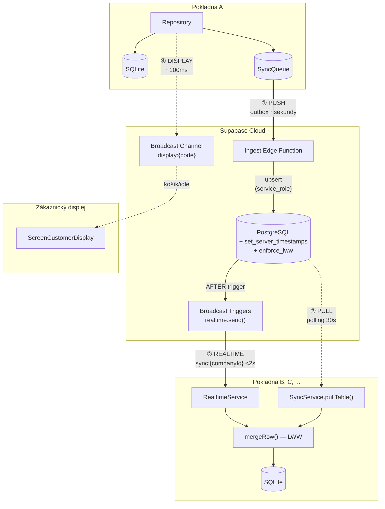

| # | Mechanismus | Směr | Latence | Kanál / Protokol |
|---|------------|------|---------|------------------|
| ① | **Push** (Outbox → Ingest EF) | klient → server | ~sekundy | Edge Function `ingest` |
| ② | **Realtime** (Broadcast from Database) | server → klienti | <2s | Supabase Broadcast `sync:{companyId}` |
| ③ | **Pull** (Watermark polling) | server → klient | 30s interval | Supabase REST `.gt('updated_at', cursor)` |
| ④ | **Display** (Broadcast Channel) | pokladna → displej | ~100ms | Supabase Broadcast `display:{code}` |

**36 company-scoped tabulek** se synchronizuje přes Push/Realtime/Pull. **4 globální tabulky** (currencies, roles, permissions, role_permissions) se pouze pullují (30s polling, bez broadcast triggerů).

### Outbox Pattern

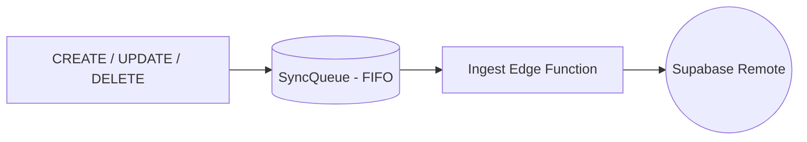

**Výhody:**
- Garantované pořadí operací
- Crash resilience (operace se neztratí)
- Auditovatelnost
- Retry každých 5s (fixní interval, max 10 pokusů)
- FK dependency ordering — pending entries se před zpracováním seřadí podle `SyncService.tableDependencyOrder`, takže rodičovské řádky se pushnou před dětmi
- Reset failed — při startu `OutboxProcessor.start()` se resetují dříve selhané entries pro opětovný pokus
- `processQueue({int limit = 50})` — parametr `limit` omezuje počet zpracovaných entries v jednom cyklu. Periodický timer (5s) volá s výchozím limitem 50; drain loop po initial push přepisuje na `limit: 500`

### Ingest Edge Function

Všechny outbox zápisy procházejí přes Supabase Edge Function `ingest` (`supabase/functions/ingest/index.ts`). `OutboxProcessor` nevolá Supabase tabulky přímo — místo toho posílá payload do EF přes `_supabaseClient.functions.invoke('ingest', ...)`. ALLOWED_TABLES obsahuje 38 tabulek (42 doménových minus 4 globální server-owned: currencies, roles, permissions, role_permissions, které se seedují migrací; audit_log je write-only server-side).

**Architektura:**
- Přijímá JWT z klienta, validuje autentizaci
- Ověřuje company ownership (auth_user_id = JWT user, `deleted_at IS NULL` — zabraňuje zápisům do soft-deleted firem)
- Zapisuje do Supabase tabulek přes `service_role` (obchází RLS)
- Loguje operace do `audit_log`
- Vše prochází přes `upsert(payload, { onConflict: "id" })` — pole `operation` slouží pouze pro audit log, ne pro routing
- **FK violation handling:** Při Postgres error `23503` (foreign key violation) vrací `error_type: "transient"` — klient retry po synchronizaci rodičovského řádku. Loguje jako `fk_pending` do audit_log.

**Payload formát:**
```json
{
  "table": "bills",
  "operation": "update",
  "payload": { ... },
  "idempotency_key": "uuid"
}
```

### Create-Demo-Data Edge Function

Edge Function `create-demo-data` (`supabase/functions/create-demo-data/index.ts`) vytváří kompletní demo firmu se 90 dny historických dat.

**Autentizace:** JWT (anonymous nebo registered user).

**Parametry:** `locale` ('cs'|'en'), `mode` ('gastro'|'retail'), `currency_code`, `company_name`

**Postup:**
1. Ověří JWT, získá `auth_user_id`
2. **Abuse guard:** Pokud user již má firmu (`companies WHERE auth_user_id = uid AND deleted_at IS NULL`), vrátí chybu
3. Volá RPC `create_demo_company(p_auth_user_id, p_locale, p_mode, p_currency_code, p_company_name)` — PL/pgSQL funkce (~1700 řádků) generující veškerá demo data z tabulky `seed_demo_data`
4. Označí firmu jako demo: `UPDATE companies SET is_demo = true, demo_expires_at = <now + 24h>` (JS Date, ne SQL now())
5. Vrátí `{ company_id, register_id }`

**SQL funkce `create_demo_company`** (`supabase/migrations/20260224_004_create_demo_company_function.sql`):
- Načítá šablony z tabulky `seed_demo_data` (4 varianty: cs/gastro, cs/retail, en/gastro, en/retail)
- Generuje: firmu s kompletními údaji (IČO, DIČ, email, telefon, adresa — fiktivní, lokalizované), company_settings, 4 uživatele (PIN 1111), tax rates, payment methods, warehouses, sections, tables, categories, items, modifiers, suppliers, manufacturers, customers, vouchers
- **90-day history loop:** Pro každý den vytváří register sessions, shifts, bills s orders a payments, cash movements, stock documents, reservations, customer transactions
- Multi-currency support (cizí měna s manuálním kurzem)

**Seed data** (`supabase/migrations/20260224_003_seed_demo_data.sql`):
- Tabulka `seed_demo_data` s 4 variantami dat (locale × mode)
- Obsahuje: tax rates, payment methods, sections, tables, map elements, categories, items, modifiers, suppliers, manufacturers, customers, vouchers, daily schedule template

### Wipe Edge Function

Edge Function `wipe` (`supabase/functions/wipe/index.ts`) slouží k úplnému smazání dat firmy na serveru. Volá se z CloudTab před lokálním vymazáním databáze.

**Postup:**
1. Autentizace JWT → najde firmu podle `companies.auth_user_id = userId`
2. Smaže company-scoped tabulky v reverse FK dependency order (children first)
3. Smaže záznam firmy (`companies`)
4. Vyčistí systémové tabulky (`sync_queue`, `audit_log`) dané firmy

> Globální tabulky (currencies, roles, permissions, role_permissions) jsou server-owned a wipe je záměrně nemaže.

**Volání z klienta (CloudTab):**
- `Supabase.instance.client.functions.invoke('wipe')` → sign out → smazání lokální DB → navigace na `/onboarding`

### Reset-DB Edge Function (dev-only)

Edge Function `reset-db` je dev-only utilita pro úplný reset všech dat na Supabase. Zdrojový kód **není v repozitáři** (`supabase/functions/reset-db/` neexistuje) — funkce je nasazena přímo na Supabase.

**Autentizace:** Sdílené tajemství přes hlavičku `X-Reset-Secret` (ne JWT).

**Postup:**
1. Smaže všechna data ze všech company-scoped tabulek
2. Vyčistí `sync_queue` a `audit_log`
3. Smaže všechny auth users
4. Globální data (currencies, roles, permissions, role_permissions) zachová

**Volání:** Bash skript `reset-db.sh` v kořenu repozitáře — interaktivní (heslo + potvrzení), po úspěchu smaže i lokální SQLite databázi.

### Sync Lifecycle

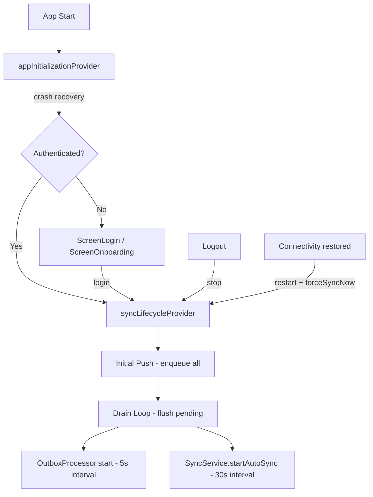

**Klíčové vlastnosti:**
- Sync se **nespouští** dokud se uživatel nepřihlásí
- Při logoutu se sync zastaví
- Crash recovery probíhá při startu aplikace
- **Drain loop:** Po `_initialPush` se v cyklu (max 50 iterací × 500 entries) volá `processQueue(limit: 500)` a `countPending()`, dokud se fronta nevyprázdní — teprve poté se spustí periodické timery
- Při selhání startu se zavolá `_stopServices()` pro cleanup částečně spuštěných služeb

### Realtime Sync — Broadcast from Database

`RealtimeService` poskytuje near-instant (<2s) cross-device sync přes Supabase Broadcast from Database:

**Architektura:**
- Server-side AFTER INSERT OR UPDATE triggers (`trg_{table}_broadcast`) na 36 company-scoped tabulkách
- Trigger funkce `broadcast_sync_change()` (35 tabulek s `company_id`) a `broadcast_company_sync_change()` (tabulka `companies` s `id`) volají `realtime.send()` s `to_jsonb(NEW)` do kanálu `sync:{company_id}`
- Triggers jsou `SECURITY DEFINER` s `SET search_path = 'public'` (přístup k `realtime` schématu) s `EXCEPTION WHEN OTHERS` (best-effort, nezablokují DML)
- Klient: jeden `RealtimeChannel` (`sync:{companyId}`) s `onBroadcast(event: 'change')`
- Callback: `_handleBroadcast` → `SyncService.mergeRow` (LWW merge přes `insertOnConflictUpdate`)
- Pouze INSERT a UPDATE — systém používá soft deletes (UPDATE na `deleted_at`), hard DELETE se nevyskytuje

**36 company-scoped tabulek s triggery:** companies, company_settings, sections, tax_rates, payment_methods, categories, users, user_permissions, tables, map_elements, suppliers, manufacturers, items, modifier_groups, modifier_group_items, item_modifier_groups, product_recipes, registers, display_devices, layout_items, customers, reservations, warehouses, bills, orders, order_items, order_item_modifiers, payments, register_sessions, cash_movements, shifts, customer_transactions, vouchers, stock_levels, stock_documents, stock_movements.

**Tabulky BEZ triggerů** (4 globální, nemají `company_id`): currencies, roles, permissions, role_permissions — mění se extrémně vzácně, synchronizují se 30s pollingem.

**Immediate outbox flush:**
- `SyncQueueRepository.onEnqueue` callback → `OutboxProcessor.nudge()` pro okamžitý push nových entries
- `nudge()` má guard `_timer != null` — je no-op dokud se nezavolá `OutboxProcessor.start()` (bezpečné během initial push)
- Výsledek: nové entity se pushnou do Supabase v řádu sekund místo čekání na 5s interval

**Reconnect handling:**
- Flag `_wasSubscribed` — po prvním úspěšném subscribe se nastaví na `true`
- Při opětovném subscribe (reconnect) se triggerne `syncService.pullAll(companyId)` pro doplnění změn ztracených během výpadku
- Polling 30s zůstává jako fallback pro případy, kdy Broadcast selže

**Lifecycle:**
- `start(companyId)` — vytvoří channel, subscribe na broadcast event `change`
- `stop()` — odstraní channel, zastaví listening
- Spravováno přes `SyncLifecycleManager` (start při přihlášení, stop při odhlášení)

**Supabase prerekvizita:**
- Funkce `realtime.send()` musí být dostupná (Supabase late 2024+)
- Migrace `20260222_001_add_broadcast_triggers.sql` vytvoří trigger funkce a triggery na 36 tabulkách
- `supabase_realtime` publication není nadále využívána (žádný subscriber), nebude součástí budoucích nasazení

### Data Flow

**Write — kompletní cesta od UI po ostatní zařízení:**
1. UI volá `repository.create(item)` / `repository.recordPayment(...)` apod.
2. Repository uloží do lokální DB (Drift)
3. Vytvoří se záznam v `sync_queue`:
   - **Konfigurační entity:** Atomicky ve stejné transakci (`BaseCompanyScopedRepository`)
   - **Prodejní entity:** Explicitní `_enqueue*` volání po mutaci (`BillRepository`, `OrderRepository`)
   - **Custom metody** (`clearDefault`, `setCell`, `incrementOrderCounter`): Enqueue mimo base CRUD — volá `syncQueueRepo!.enqueue(...)` přímo
4. Repository vrátí úspěch UI (okamžitě)
5. **Asynchronně** `OutboxProcessor` zpracuje frontu — odešle payload do Ingest Edge Function
6. Ingest EF provede `upsert` do PostgreSQL přes `service_role`
7. PostgreSQL trigger `set_server_timestamps()` nastaví `updated_at = now()` (watermark pro pull)
8. PostgreSQL trigger `broadcast_sync_change()` odešle řádek přes `realtime.send()` do kanálu `sync:{companyId}`
9. Ostatní zařízení přijmou broadcast → `RealtimeService._handleBroadcast` → `SyncService.mergeRow` (LWW)

**Read:**
1. UI volá `repository.watchAll(companyId)` nebo `getById(id)`
2. Repository čte z lokální DB (Drift) — data jsou vždy aktuální díky sync na pozadí
3. **Pozadí:** Dvě cesty aktualizace lokální DB:
   - **Realtime** (<2s): broadcast přijatý v kroku 9 výše
   - **Pull** (30s): `SyncService.pullTable()` — watermark-based polling (viz Pull Sync níže)

### Pull Sync — Watermark

Pull je fallback mechanismus zajišťující konzistenci i při výpadku Broadcast kanálu.

**Jak `pullTable()` funguje:**
1. Načte watermark: `syncMetadataRepo.getLastPulledAt(companyId, tableName)` — ISO 8601 string uložený v `sync_metadata`
2. Query na Supabase: `.from(tableName).select().eq('company_id', companyId).gt('updated_at', lastPulledAt).order('updated_at', ascending: true).range(offset, offset + 999)`
3. Pro každý řádek: `mergeRow()` (LWW merge do lokální DB)
4. Pokud vrátil `_pageSize` (1000) řádků → offset += rows.length, opakuje bod 2 (další stránka)
5. Uloží nový watermark: `max(updated_at)` z odpovědi → `syncMetadataRepo.setLastPulledAt(...)`

**Klíčové detaily:**
- **Paginace po 1000 řádcích** — PostgREST má default `max-rows = 1000`, větší `.limit()` je tiše oříznut. `.range()` offset-based paginace zajistí stažení všech řádků i pro tabulky s tisíci záznamy (bills, orders, order_items...)
- Watermark je server-side `updated_at` (nastavený triggerem `set_server_timestamps`), ne klientský `client_updated_at`
- Globální tabulky se pullují bez `company_id` filtru; tabulka `companies` se filtruje přes `.eq('id', companyId)`
- `pullAll()` iteruje všech 40 tabulek v FK-respektujícím pořadí (`tableDependencyOrder`) — rodiče před dětmi
- Guard `_isPulling` zabraňuje souběžným pullům
- Chyba v jedné tabulce neblokuje pull ostatních

### Zákaznický displej — Broadcast Channel

Zákaznický displej **nepoužívá sync** (nemá lokální DB). Komunikuje přes samostatný Supabase Broadcast kanál `display:{deviceCode}`:

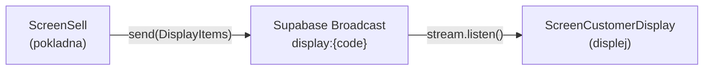

**Pokladna (ScreenSell):**
- Při otevření prodeje najde zákaznický displej přiřazený k registru (`displayDeviceRepo.getByParentRegister`)
- Připojí se na `display:{deviceCode}` přes `BroadcastChannel.join()`
- Při změně košíku posílá `DisplayItems` (položky, ceny, modifikátory, celkem)
- Při dokončení prodeje posílá `DisplayIdle`

**Displej (ScreenCustomerDisplay):**
- Připojí se na `display:{code}` (kód z URL parametru nebo SharedPreferences)
- Přijímá tři typy zpráv: `DisplayItems` (košík), `DisplayMessage` (text s auto-clear), `DisplayIdle` (uvítací obrazovka)

**Párování:** Displej se páruje přes 6-místný kód → RPC `lookup_display_device_by_code()` (SECURITY DEFINER, anon access) → vrátí `company_id` pro autentizaci.

### Conflict Resolution — Last Write Wins (LWW)

#### 1. Server-side trigger (`enforce_lww`)

PostgreSQL BEFORE UPDATE trigger `trg_{table}_lww` s funkcí `enforce_lww` je aktivní na company-scoped tabulkách. Porovnává `client_updated_at` — pokud je příchozí timestamp starší než existující záznam, vyhodí výjimku `LWW_CONFLICT` (P0001). Ingest Edge Function tento error zachytí a vrátí klientovi `error_type: "lww_conflict"`.

> **Poznámka:** Definice funkce `enforce_lww()` (i `set_server_timestamps()`) je součástí počátečního Supabase schématu, které předchází inkrementální migrace v tomto repozitáři. Triggery pro tabulky přidané později se vytváří v příslušných migracích (např. `20260221_001_add_modifier_tables.sql`).

#### 2. Pull-side LWW

Při stahování změn:
- Entita neexistuje lokálně → vloží se
- Entita existuje, nemá neodeslané změny → přijme se remote verze
- Entita má neodeslané změny → porovnají se `updatedAt` timestamps, novější vyhrává

#### 3. Outbox LWW rejection handling

Když server odmítne push (`LWW_CONFLICT`), outbox processor označí entry jako `completed`. Příští pull přinese správnou verzi ze serveru.

### Retry strategie

- **Transient chyby** (síť, timeout, auth): retry každých 5s (fixní interval, max 10 pokusů)
- **Permanent chyby** (data/constraint/permission): označí se jako `failed` hned
- FIFO je zachováno
- **DB stuck reset** (processing > 5 min dle `processedAt` timestampu): `resetStuck()` jednorázově při startu `SyncLifecycleManager` resetuje stuck záznamy na `pending`
- **In-memory watchdog** (60s timeout v `OutboxProcessor`): pokud `processQueue()` běží déle než 60s, watchdog resetuje `_isProcessing` flag, aby další cyklus nebyl blokován
- `markProcessing()` nastavuje `processedAt` jako processing-started timestamp → `resetStuck()` měří skutečnou dobu zpracování

### Globální reference data

`roles` (4), `permissions` (113), `role_permissions`, `currencies` jsou **globální** (bez `company_id`):
- V Etapě 1–2: seedovány lokálně při onboardingu
- Od Etapy 3: pull ze Supabase (bez company_id filtru); nejsou v ALLOWED_TABLES Ingest EF — klient je nepushuje
- Aktuální design předpokládá 1 firma = 1 Supabase projekt

> **Pozn.:** `payment_methods` nejsou read-only — mají plný CRUD od Etapy 1 (viz [Platební metody](#platební-metody)).

### ConnectCompanyScreen — připojení k existující firmě

Flow pro nové zařízení (6 kroků — enum `_Step`):
1. `credentials` — Formulář: email + heslo → `supabaseAuthService.signIn()`
2. `searching` — Loading: „Hledání firmy..." → fetch company z Supabase (`companies.auth_user_id = userId`)
3. `companyPreview` — Zobrazí název firmy + tlačítko „Připojit"
4. `syncing` — Loading: „Synchronizace dat..." → `syncService.pullAll(companyId)` — stáhne všech 40 tabulek
5. `selectRegister` — Výběr pokladny pro zařízení (device binding)
6. `done` — „Synchronizace dokončena" → invalidace `appInitProvider` → navigace na `/login`

### Known Issues / Limitations

- **Company switching**: Nepodporováno. Jedno zařízení = jedna firma. Přepnutí na jinou firmu vyžaduje smazání lokální DB.
- **Globální tabulky vs multi-company**: roles/permissions/role_permissions/currencies jsou globální (bez company_id). Při více firmách na jednom Supabase projektu by došlo ke kolizím. Aktuální design předpokládá 1 firma = 1 Supabase projekt.
- **InitialSync recovery**: Pokud InitialSync selže uprostřed, data jsou neúplná. Další auto-pull (30s) doplní chybějící data.
- **Z-report per-register filtering**: Venue Z-report agreguje všechny sessions dle data — pro přesné per-register výsledky by měl filtrovat dle `registerSessionId` (design issue, ne bug).
- **Mobile session Z-report po handover**: Po cash handover (mobile→local) se `expectedCash` v Z-reportu mobile session zobrazí nekonzistentně — handover snižuje cash, ale session Z-report to nereflektuje v řádku expected cash (design issue vyžadující redesign close/handover flow).
- **Demo firma — currency auto-derived**: Měna se odvozuje z jazyka (cs→CZK, en→EUR). Uživatelé, kteří potřebují jinou měnu, musí použít regulární flow.
- **Demo firma — expirace během aktivního použití**: pg_cron hard-deletuje expired demo firmy (včetně všech child records). Pokud k tomu dojde během aktivní práce, klient to detekuje: (a) `appInitProvider` při dalším spuštění/re-init zjistí `demoExpiresAt < now()` z lokální DB → `needsOnboarding`, (b) push selže s chybou (firma neexistuje na serveru) — nefatální, outbox ji označí jako permanent error. Lokální data zůstanou do dalšího onboardingu.
- **Demo firma — ztráta anonymního tokenu**: Při reinstalaci/uninstall aplikace se ztratí refresh token, demo firma je osiřelá dokud ji pg_cron necleanupuje. Klient to detekuje (no Supabase auth + local demo company → expired).

### Supabase Deployment Requirements (Milník 3.9)

Při nasazení na existující Supabase projekt je nutné provést:

```sql
-- 1. Nová enum hodnota
ALTER TYPE cash_movement_type ADD VALUE 'handover';

-- 2. Nové sloupce (multi-register)
ALTER TABLE registers ADD COLUMN name text DEFAULT '';
ALTER TABLE registers ADD COLUMN register_number integer DEFAULT 1;
ALTER TABLE registers ADD COLUMN parent_register_id text REFERENCES registers(id);
ALTER TABLE registers ADD COLUMN is_main boolean DEFAULT false;
ALTER TABLE registers ADD COLUMN bound_device_id text;
ALTER TABLE registers ADD COLUMN active_bill_id text;
ALTER TABLE registers ADD COLUMN display_cart_json text;
ALTER TABLE register_sessions ADD COLUMN bill_counter integer DEFAULT 0;
ALTER TABLE register_sessions ADD COLUMN parent_session_id text REFERENCES register_sessions(id);
ALTER TABLE orders ADD COLUMN register_id text REFERENCES registers(id);
ALTER TABLE payments ADD COLUMN register_id text REFERENCES registers(id);
ALTER TABLE bills ADD COLUMN register_id text REFERENCES registers(id);
ALTER TABLE bills ADD COLUMN last_register_id text REFERENCES registers(id);
ALTER TABLE bills ADD COLUMN register_session_id text REFERENCES register_sessions(id);
ALTER TABLE bills ADD COLUMN customer_name text;

-- 3. Broadcast from Database triggers (see 20260222_001_add_broadcast_triggers.sql)
-- Triggers on 36 tables call realtime.send() to push changes to sync:{company_id} channel.

-- 4. Voucher: created_by_user_id
ALTER TABLE vouchers ADD COLUMN created_by_user_id text;

-- 5. Voucher discount on order_items
ALTER TABLE order_items ADD COLUMN voucher_discount integer NOT NULL DEFAULT 0;

-- 6. Audit fixes (audit_fixes_schema + audit_fixes_manager_role migrations):
--    - K3: ALTER TYPE role_name ADD VALUE 'manager' + INSERT manager role row
--    - V1: SET search_path = 'public' on broadcast_sync_change, broadcast_company_sync_change
--    - S1: RLS SELECT policy audit_log_select_own for authenticated
--    - S2: 7 FK indexes on modifier tables (item_modifier_groups, modifier_group_items, order_item_modifiers)
--    - S3: Modifier RLS policies fixed from public → authenticated role

-- 7. Permissions 113 (permissions_113 migration):
--    - Replaces 16 seed permissions with 113 granular permissions in 17 groups
--    - 287 role_permission assignments (helper: 19, operator: 63, manager: 92, admin: 113)

-- 8. Verify RLS SELECT policies allow company-scoped reads for all users

-- 9. Demo company columns + cleanup
ALTER TABLE companies ADD COLUMN is_demo boolean NOT NULL DEFAULT false;
ALTER TABLE companies ADD COLUMN demo_expires_at timestamptz;
CREATE INDEX idx_companies_demo_expires ON companies (demo_expires_at) WHERE is_demo = true AND deleted_at IS NULL;

-- 10. Demo cleanup cron job (pg_cron, hourly hard-delete expired demos)
-- See 20260225_002_demo_cleanup_cron.sql

-- 11. Demo seed data + creation function
-- See 20260224_003_seed_demo_data.sql + 20260224_004_create_demo_company_function.sql

-- 12. Display devices: per-company unique constraint (replaces global UNIQUE(code))
-- See 20260225_003_fix_display_devices_unique.sql

-- 13. Anonymous sign-ins: Enable in Supabase Dashboard > Authentication > Settings
```

---

## Obchodní model — Účty a objednávky

### Přehled architektury Bill/Order

POS systém odděluje **platební/účetní jednotku** (Bill) od **kuchyňské dispečerské jednotky** (Order):

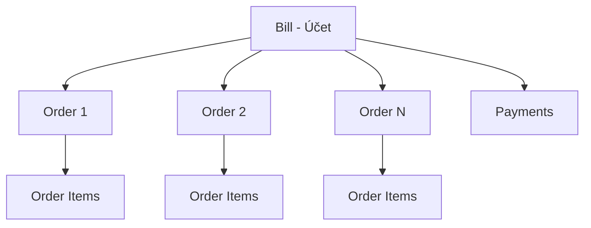

| Entita | Český název | Účel | Vztah |
|--------|-------------|------|-------|
| **Bill** | Účet | Platební/účetní jednotka, seskupuje objednávky | 1:N s Orders, 1:N s Payments |
| **Order** | Objednávka | Kuchyňská dispečerská jednotka, seskupuje položky | N:1 s Bill, 1:N s OrderItems |
| **OrderItem** | Položka | Jednotlivá položka objednávky s cenou a stavem přípravy | N:1 s Order |
| **Payment** | Platba | Záznam o platbě | N:1 s Bill |

> **Rozšíření:** OrderItemModifier (modifikátory položek) se přidá s gastro rozšířením. Voucher systém (poukazy vázané na bill) je implementován — viz tabulka `vouchers` a `VoucherRepository`.

### Přepočet Bill totalů a slevy

Bill totaly se přepočítávají **po každé změně** (createOrder, cancelOrder, voidOrder). Výpočet zahrnuje pouze aktivní položky (ne cancelled/voided):

1. `item_subtotal = sale_price_att × quantity`
2. `item_discount = discount_type == percent ? (item_subtotal × discount / 10000) : discount`
3. `bill.subtotal_gross = Σ(item_subtotal - item_discount)` přes všechny aktivní orders
4. `bill.tax_total = Σ(sale_tax_amount × quantity)` přes aktivní items
5. `bill.subtotal_net = subtotal_gross - tax_total`
6. `bill_discount = discount_type == percent ? (subtotal_gross × discount_amount / 10000) : discount_amount`
7. `bill.total_gross = subtotal_gross - bill_discount - loyalty_discount_amount - voucher_discount_amount + rounding_amount`

**Slevy (od Etapy 3.2):** 2 úrovně — položka (`order_items.discount` + `discount_type`) a účet (`bills.discount_amount` + `discount_type`). `DiscountType` enum: `absolute` (v haléřích) nebo `percent` (v setinách procenta, 10000 = 100%). UI: `DialogDiscount` s přepínačem Kč/%, numpadem a náhledem efektivní slevy. Slevy na úrovni objednávky (Order) neexistují.

**Voucher slevy — scope-aware výpočet s per-item atribucí:**

Utility `VoucherDiscountCalculator` (`lib/core/data/utils/voucher_discount_calculator.dart`) — stateless pure-computation třída (žádný DB přístup). Vstup: voucher, aktivní položky, modifikátory, subtotalGross, volitelně itemId→categoryId mapa. Výstup: `VoucherDiscountResult` s `totalDiscount` a `List<VoucherItemAttribution>` (orderItemId, coveredQty, discountAmount).

Algoritmus:
1. **Filtr dle scope:** `bill` → všechny položky, `product` → pouze item.itemId == voucher.itemId, `category` → pouze položky se shodnou categoryId
2. **Effective unit price:** `(basePrice × qty + modifiers − itemDiscount) / qty` pro každou matchující položku
3. **Třídění:** sestupně dle effective unit price (nejdražší první)
4. **Alokace `maxUses`:** přidělení covered qty přes seřazené položky (každá jednotka = 1 use)
5. **Výpočet slevy:** percent → `coveredValue × voucher.value / 10000` per item; absolute → `voucher.value` rozdělen proporcionálně
6. **Cap:** celková sleva ≤ subtotalGross

**Zobrazení atribuce:**
- **Bill Detail (Summary view):** položky s částečným pokrytím se rozdělí na 2 řádky (se slevou × plná cena); slevené řádky zobrazují přeškrtnutou původní cenu
- **Bill Detail (Order History view):** kombinace manuální slevy + voucher slevy v přeškrtnutí
- **Účtenka (PDF):** řádek „Voucher: −X" pod dotčenou položkou (`ReceiptItemData.voucherDiscount`, `ReceiptLabels.voucherDiscount`)
- **Statistiky (Sales tab):** voucher sleva atribuována k jednotlivým položkám v `_SalesRow.voucherDiscount`; bill-level `_salesTotalVoucherDiscount` zobrazuje pouze neatribuovaný zbytek (gift/deposit vouchery)

**Redeem/unredeem:** `VoucherRepository.redeem()` přijímá `usesConsumed` (počet pokrytých jednotek, ne hardcoded 1). `VoucherRepository.unredeem()` vrací uses zpět (dekrementuje `usedCount`, nastaví `status = active` pokud `usedCount < maxUses`).

**Odebrání voucheru z účtu:** Tlačítko VOUCHER v Bill Detail funguje jako toggle — pokud účet má voucher, zobrazí „Zrušit voucher" s potvrzením. Sekvence: unredeem (spočítá uses z položek s voucherDiscount > 0) → `OrderRepository.clearVoucherDiscounts` (vynuluje per-item voucherDiscount, enqueue, přepočet totálů) → `BillRepository.removeVoucher` (vymaže bill-level voucher pole). Freeze-on-apply strategie: po aplikaci voucheru přidání nových položek nevyvolá přepočet; uživatel musí voucher ručně odebrat a znovu aplikovat.

**Odebrání slevy z účtu:** Tlačítko SLEVA v Bill Detail funguje jako toggle — pokud účet má slevu, zobrazí „Zrušit slevu" s potvrzením → `BillRepository.updateDiscount(billId, DiscountType.absolute, 0)`.

### Platební metody

Při vytvoření firmy (onboarding) se seedují **5 výchozích platebních metod**:

| Seed název | PaymentType | Popis |
|------------|-------------|-------|
| Hotovost | `cash` | Platba v hotovosti |
| Karta | `card` | Platba kartou |
| Převod | `bank` | Bankovní převod |
| Zákaznický kredit | `credit` | Platba z kreditu zákazníka |
| Stravenky | `voucher` | Platba stravenkami / meal vouchery |

**Pravidla:**
- Plný **CRUD** je dostupný od Etapy 1 (Settings → Správa platebních metod)
- Uživatel může přidat novou platební metodu (name + PaymentType)
- Uživatel může deaktivovat platební metodu (`is_active = false`, soft-delete)
- Seedované metody lze deaktivovat, ale nelze je smazat z DB
- Každá platební metoda odkazuje na `PaymentType` enum (`cash`, `card`, `bank`, `credit`, `voucher`, `other`)
- Při přidání vlastní metody uživatel vybere typ z PaymentType

> **Pozn.:** Tabulka `payment_methods` je per-company (filtruje se přes `company_id`). Na rozdíl od `roles`/`permissions` není read-only.

### Statusy

#### BillStatus (stav účtu)

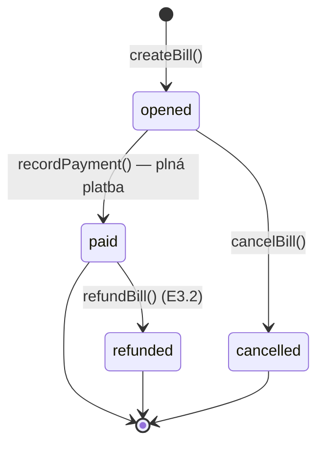

| Status | Podmínka | closedAt |
|--------|----------|----------|
| `opened` | `paid_amount < total_gross` | null |
| `paid` | `paid_amount >= total_gross` | set |
| `cancelled` | Manuální storno (pouze z `opened`) | set |
| `refunded` | Vrácení peněz po `paid` | set |

> **Poznámka:** Ve filtru ScreenBills se `refunded` účty zobrazují pod filtrem „Zaplacené" (zelený chip) — nemá vlastní chip. Status `partiallyPaid` neexistuje — platba musí vždy pokrýt celou částku (lze rozdělit mezi více platebních metod). Refund vytváří záporné platby a automatický CashMovement (withdrawal) pro hotovostní platby. Loyalty reversal: refundBill vrátí redeemed body a odebere earned body; refundItem proporcionálně odebere earned body (při plném refundu vrátí i redeemed); cancelBill vrátí redeemed body. Záporný zůstatek bodů je povolený.

#### PrepStatus (stav přípravy objednávky a položky)

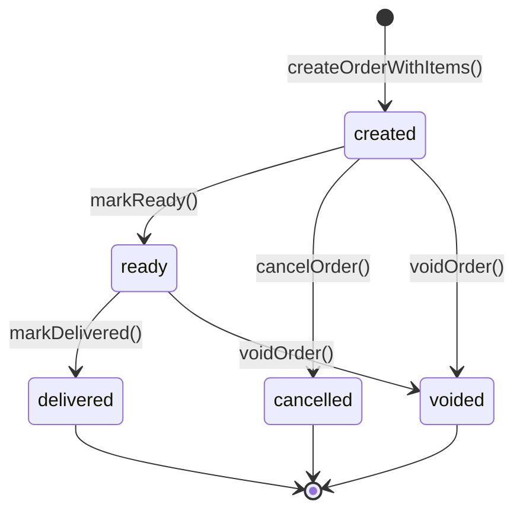

| Status | Popis | Lze změnit na |
|--------|-------|---------------|
| `created` | Objednávka vytvořena | `ready`, `cancelled`, `voided` |
| `ready` | Připraveno k výdeji (`ready_at` se nastaví) | `delivered`, `voided` |
| `delivered` | Doručeno zákazníkovi (`delivered_at` se nastaví) | (finální stav) |
| `cancelled` | Zrušeno před přípravou | (finální stav) |
| `voided` | Stornováno | (finální stav) |

**Void jednotlivé položky (od E3.8):** `voidItem(orderId, orderItemId)` — void jedné položky v orderu (ne celého orderu). Vytvoří storno order (`is_storno: true`, `storno_source_order_id` → originál, order number `X{N}-{XXXX}` kde N=register_number). Pokud se voidnou všechny položky v orderu → auto-void celý order.

#### Agregace Order.status z OrderItem.status

**Implementováno.** Status se nastavuje na úrovni jednotlivých položek (OrderItem). Order.status se automaticky odvozuje z item statusů metodou `_deriveOrderStatus()`.

`updateItemStatus(itemId, orderId, newStatus)` — změní status jedné položky a přepočte order status.

Pravidla (vyhodnocují se v pořadí, `activeItems` = items kde status ∉ {voided, cancelled}):

1. `activeItems` prázdné + všechny cancelled → Order = `cancelled`
2. `activeItems` prázdné + všechny voided nebo mix → Order = `voided`
3. Všechny `activeItems` delivered → Order = `delivered`
4. Všechny `activeItems` ∈ {ready, delivered} → Order = `ready`
5. Jinak (všechny `activeItems` created) → Order = `created`

Order-level timestamps (`prepStartedAt`, `readyAt`, `deliveredAt`) se nastaví při prvním dosažení daného agregovaného stavu.

**Item-level timestamps:** Každý OrderItem má vlastní `prepStartedAt`, `readyAt`, `deliveredAt` — nastavují se při změně statusu dané položky.

### Klíčová rozhodnutí

| Aspekt | Rozhodnutí |
|--------|------------|
| **Bill číslo** | `B{register_number}-{counter:3d}` (např. `B1-001`) — per-day reset, 3 cifry. Fallback bez registru: `B-{counter:3d}`. |
| **Order číslo** | `O{register_number}-{counter:4d}` (např. `O1-0001`) — per register session, reset při nové session, 4 cifry. Storno ordery: `X{register_number}-{counter:4d}`. |
| **Prázdný bill** | Povolen (placeholder pro stůl) |
| **Po zrušení všech items** | Bill zůstane otevřený |
| **Slevy** | 2 úrovně — bill, item (od Etapy 3.2) |
| **Přepočet totalů** | Po každé změně (createOrder, cancelOrder, voidOrder) |
| **Zaokrouhlení** | Pouze na bill level |
| **Payment** | Pouze na bill |
| **Permissions** | `orders.*`, `payments.*`, `discounts.*` (viz [Oprávnění](#oprávnění)) |

### Workflow — Quick Sale (rychlý prodej)

Rychlý prodej je zjednodušený flow pro prodej bez stolů. Spouští se tlačítkem **Rychlý účet** na ScreenBills, naviguje na `/sell` (bez billId). Účet se vytvoří až při potvrzení platby.

**Příznak:** `is_takeaway = true` v tabulce bills. V UI se zobrazuje jako "Rychlý účet". Při vytvoření se automaticky nastaví `section_id` na výchozí sekci (`isDefault=true`). Stejně tak konverze rychlého prodeje na běžný účet ("Uložit na účet") resolvuje výchozí sekci.

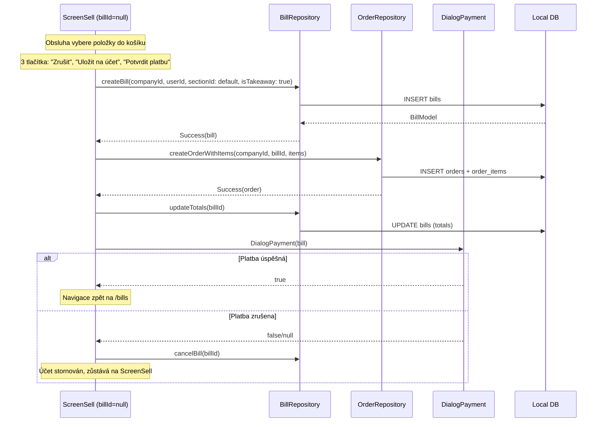

**Rozdíl oproti stolovému prodeji:**
- Účet se vytvoří **až při potvrzení** (ne předem)
- 3 tlačítka: **"Zrušit"** (storno), **"Uložit na účet"** (vytvoří účet bez platby), **"Potvrdit platbu"** (vytvoří účet + otevře platební dialog)
- Po zrušení platby se účet automaticky stornuje
- V přehledu účtů se zobrazuje jako "Rychlý účet"

### Workflow — Stolový prodej

Pro restaurační provoz s více objednávkami na jeden účet:

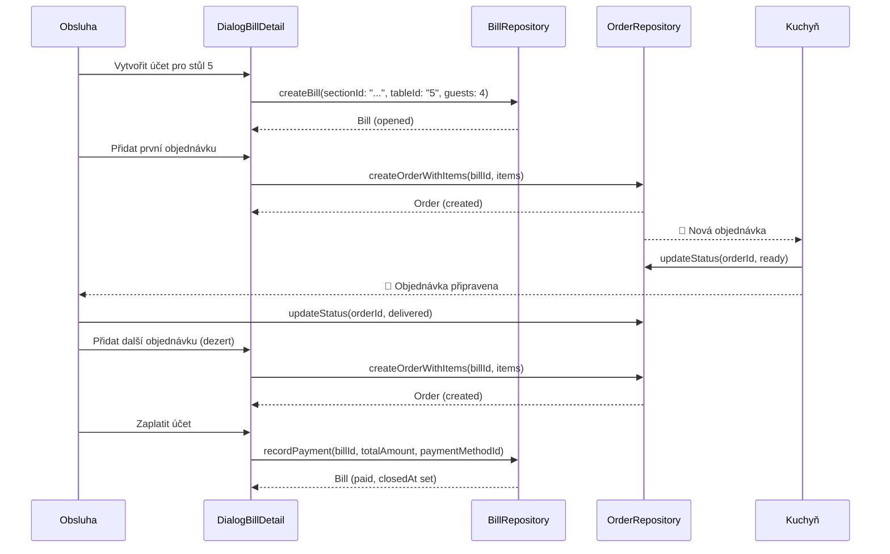

### Workflow — Vytvoření účtu (DialogNewBill)

Jednokrokový dialog s dropdown formulářem. Obsluha vybere sekci (s výchozí pre-selekcí), stůl a počet hostů. Dialog vrací `NewBillResult` s 3 tlačítky. Rychlý prodej je **samostatný flow** (viz [Quick Sale](#workflow--quick-sale-rychlý-prodej)) — nespouští se přes DialogNewBill.

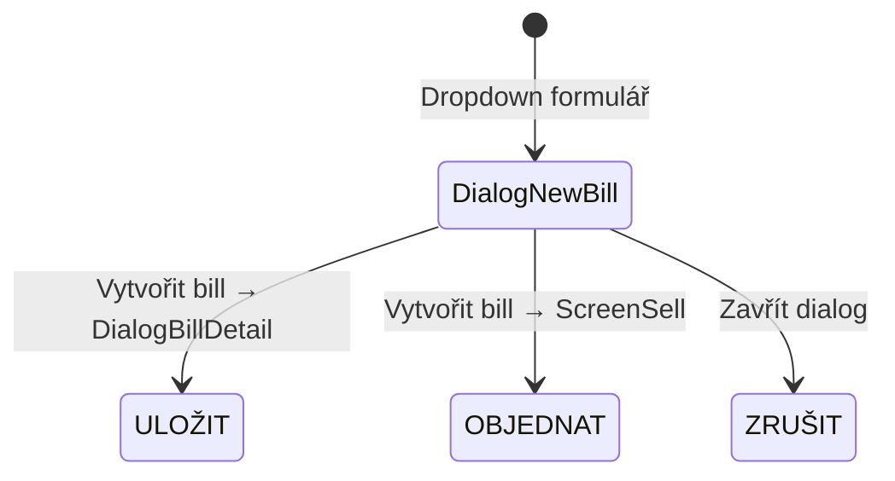

**Formulář:**

| Pole | Widget | Hodnota |
|------|--------|---------|
| Sekce | DropdownButton | Výchozí sekce (`isDefault=true`) pre-selektována automaticky |
| Stůl | DropdownButton (filtrován dle sekce) | Volitelný — „Bez stolu" jako první možnost |
| Počet hostů | Stepper (+/-) | Výchozí 0 |
| Zákazník | TextField | Volitelné přiřazení zákazníka k účtu |

**Tlačítka:**

| Tlačítko | Barva | Výsledek |
|----------|-------|----------|
| ZRUŠIT | Červená (outlined) | `Navigator.pop(context)` |
| ULOŽIT | Modrá (filled) | `NewBillResult(navigateToSell: false)` |
| OBJEDNAT | Zelená (filled) | `NewBillResult(navigateToSell: true)` |

**Výchozí pole na bill:**

| Pole | Hodnota |
|------|---------|
| `is_takeaway` | false (vždy) |
| `section_id` | vybraná sekce |
| `table_id` | vybraný stůl nebo null |
| `number_of_guests` | vstup (výchozí 0) |
| `currency_id` | default |
| `opened_by_user_id` | current |

**Pravidla:**
- Sekce s `isDefault=true` se automaticky pre-selektuje při otevření dialogu
- `is_takeaway=true` se nastavuje **pouze** při rychlém prodeji (automaticky)
- Stůl je volitelný — účet může existovat bez přiřazení ke stolu (filtrování v přehledu funguje přes `section_id`)
- Stoly v dropdown jsou filtrovány podle vybrané sekce (pouze aktivní)
- Prázdný bill je povolen (placeholder pro stůl)
- Bill se vytvoří se statusem `opened` a `opened_at = now`
- ULOŽIT → otevře **DialogBillDetail**, OBJEDNAT → naviguje na **ScreenSell**

### Workflow — Storno

Systém rozlišuje **2 typy storna** podle fáze přípravy:

| Typ | Kdy | Přechod |
|-----|-----|---------|
| **Cancel** | Před začátkem přípravy | `created` → `cancelled` |
| **Void** | Položky v přípravě/hotové | `created`/`ready` → `voided` |

#### Storno účtu (cancelBill)

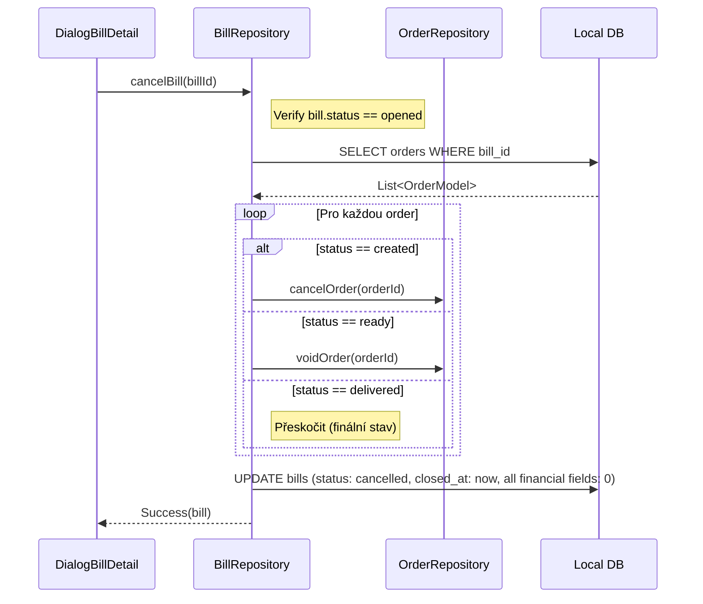

**Pravidla pro cancelBill:**
- Lze stornovat pouze `opened` bill (ne `paid`)
- Payment záznamy se neruší — zůstávají jako audit trail
- V E3.2+: zaplacený bill → refund (ne cancel)
- **Nulování finančních hodnot:** při stornu se vynulují `subtotalGross`, `subtotalNet`, `taxTotal`, `totalGross`, `discountAmount`, `discountType`, `loyaltyDiscountAmount`, `voucherDiscountAmount`, `roundingAmount` → stornovaný účet má vždy `totalGross = 0`
- Pokud bill měl loyalty slevu (`loyaltyPointsUsed > 0`), vrátí redeemed body zákazníkovi
- Pokud bill měl voucher (`voucherId != null`), vrátí spotřebované uses přes `VoucherRepository.unredeem()` (počet uses se spočítá z aktivních položek před stornováním objednávek pomocí `VoucherDiscountCalculator`)
- **Transakčnost:** Cancel/void jednotlivých objednávek probíhá před hlavní transakcí (update bill status + enqueue). Přeskočení delivered objednávek je implicitní (žádný else branch).

#### Storno objednávky (cancelOrder / voidOrder)

- **cancelOrder:** `status` musí být `created` → všechny items → `cancelled`, order → `cancelled`
- **voidOrder:** `status` musí být `created` nebo `ready` → všechny items → `voided`, order → `voided`
- **delivered** order nelze stornovat (finální stav)
- Po stornování se **Bill totals přepočítají** (odečtou se cancelled/voided items)

| Akce | Bill.status | Bill.totals |
|------|-------------|-------------|
| Cancel/void jedné order | Zůstává `opened` | Přepočítají se |
| Cancel/void všech orders | Zůstává `opened` (prázdný bill povolen) | 0 |
| cancelBill | → `cancelled` | Vynulovány (subtotal, total, slevy, rounding) + orders cancel/void |

### Workflow — Register Session (od Etapy 2)

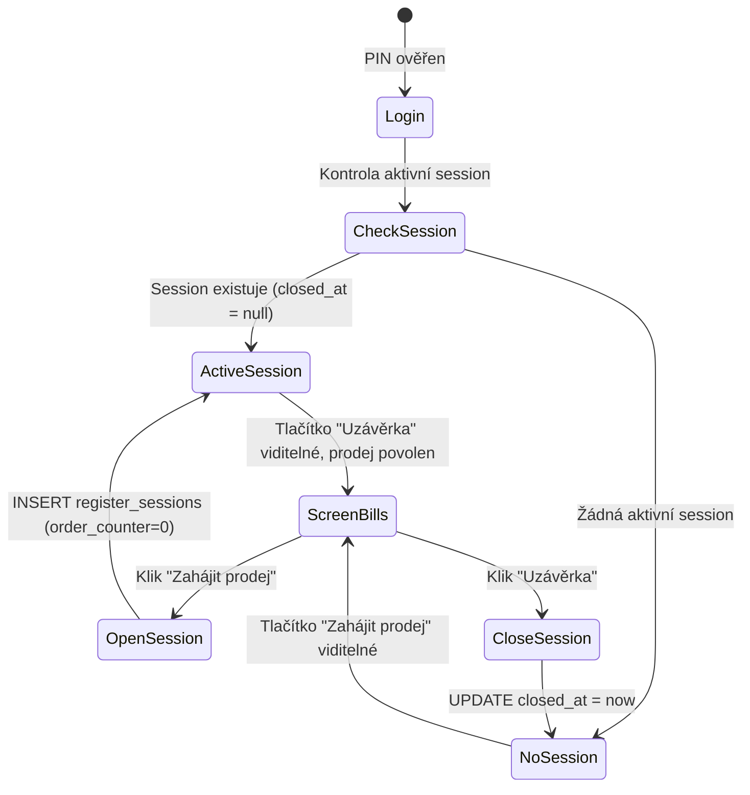

**Pravidla:**
- Bez aktivní register session **nelze vytvářet účty ani objednávky**
- Tlačítko v pravém panelu ScreenBills se mění dynamicky:
  - Žádná aktivní session → **"Zahájit prodej"** (zelená)
  - Aktivní session → **"Uzávěrka"** (neutrální)
- Order counter (`O-0001`) se resetuje při otevření nové session
- Otevření session: `DialogOpeningCash` (numpad pro zadání počáteční hotovosti)
- Uzávěrka session: `DialogClosingSession` (souhrn — opening cash, expected vs actual, platby dle metody, tržby dle typu)
- Hotovostní pohyby: `DialogCashJournal` (přehled vkladů/výběrů/tržeb) + `DialogCashMovement` (nový pohyb)

**Dialogy pro cash management:**

| Dialog | Účel |
|--------|------|
| `DialogOpeningCash` | Numpad pro zadání počáteční hotovosti (haléře), vrací amount nebo null |
| `DialogClosingSession` | Souhrn session: opening/closing/expected cash, platby dle metody, tržby |
| `DialogCashMovement` | Nový vklad/výběr: typ (deposit/withdrawal), částka (numpad), důvod (text) |
| `DialogCashJournal` | Tabulka hotovostních pohybů s filtry, možnost přidat nový pohyb. Počáteční hotovost se zobrazuje jako syntetický záznam „Počáteční stav" (pokud ≠ 0). |

### Repository API

#### BillRepository

- **Query:** watchByCompany (s filtry status/section — filtruje účty podle `tableId` přes tabulky v dané sekci, nebo podle `sectionId` pro účty bez stolu), watchById, watchByStatus, getById, getByCompany
- **Business:** createBill (atomická transakce: `_generateBillNumber` + INSERT; přijímá volitelný `sectionId` — vždy se nastavuje, i pro rychlý prodej a konverzi na účet kde se resolvuje výchozí sekce), updateTotals (s discount + loyalty + voucher kalkulací), recordPayment (v transakci: vytvoří Payment + aktualizuje Bill + uloží loyaltyPointsEarned, podpora tipAmount pro přeplatky; po transakci: aktualizuje customer.totalSpent + lastVisitDate a přiřadí auto-earned loyalty body), cancelBill (cancel/void jednotlivých orders před transakcí, update bill status + enqueue v transakci, vrácení redeemed loyalty bodů), updateDiscount (bill-level sleva), moveBill (přesun účtu na jiný stůl/sekci — nastaví tableId, numberOfGuests, isTakeaway=false), refundBill (záporné platby za každou orig. platbu + auto CashMovement + reversal earned/redeemed loyalty bodů + reversal totalSpent), refundItem (záporná platba za položku + void item + auto CashMovement + proporcionální reversal earned loyalty bodů + reversal totalSpent; při plném refundu vrátí i redeemed body), mergeBill (přesun všech objednávek na cílový účet přes OrderRepository, zdrojový účet → cancelled), splitBill (přesun vybraných položek na cílový účet přes OrderRepository, přepočet totalů obou účtů), applyLoyaltyDiscount (aplikace slevy z věrnostních bodů), applyVoucher (aplikace voucheru na účet), removeVoucher (odebrání voucheru z účtu), updateCustomer (přiřazení/odebrání zákazníka), updateMapPosition (pozice účtu na mapě), updateCustomerName (jméno zákazníka bez vazby)
- **Závislosti:** Injektovaný `OrderRepository` (pro merge/split operace), `CustomerRepository` (pro loyalty body)
- **Sync:** Injektovaný `SyncQueueRepository`, ruční enqueue — `_enqueueBill`, `_enqueueOrderItem`, `_enqueuePayment`, `_enqueueCashMovement`. Každá mutace po sobě enqueueuje všechny dotčené entity. DB operace v transakcích, enqueue vždy mimo transakci. (Order enqueue řeší `OrderRepository`.)

#### OrderRepository

- **Query:** watchByBill, watchByCompany, watchOrderItems, getOrderItems, getOrderItemsByBill, watchLastOrderTimesByCompany
- **Business:** createOrderWithItems (s orderNotes a item notes + automatický stock odpis), updateStatus (s automatickým reversal stock při cancelled/voided), markReady, markDelivered, cancelOrder, voidOrder, updateItemStatus (per-item status s odvozeným order status), voidItem (void jedné položky + storno order), updateOrderNotes, updateItemNotes, updateItemDiscount, clearVoucherDiscounts (vynuluje `voucherDiscount` na všech položkách účtu, enqueue + přepočet totálů — pro odebrání voucheru), reassignOrdersToBill (přesun všech objednávek mezi účty — pro merge), splitItemsToNewOrder (vytvoření nové objednávky na cílovém účtu a přesun vybraných položek — pro split; automaticky zruší zdrojové objednávky bez zbývajících položek)
- **Stock deduction:** Po `createOrderWithItems` automaticky volá `_deductStockForOrder` mimo hlavní transakci (po úspěšném insertu objednávky) — pro každý `isStockTracked` item vytvoří `stock_movement` (bez stock_document_id). Směr dle ceny: záporná cena položky → inbound (přírůstek skladu, např. vratná láhev), kladná → outbound (odpis). Receptury (`item_type == recipe`): rozpad přes `product_recipes`, odečtení ingrediencí místo receptury samotné (vždy outbound). Po zpracování hlavní položky se iterují její modifikátory — pro každý stock-tracked modifikátor se vytvoří vlastní stock_movement (qty modifikátoru × qty hlavní položky, směr dle ceny modifikátoru).
- **Stock reversal:** Při `updateStatus` do cancelled/voided volá `_reverseStockForOrder` — vytvoří reverzní movements (opačný směr dle ceny) pro hlavní položky i jejich modifikátory. `_reverseStockForSingleItem` (při voidItem) reverzuje jednu položku včetně jejích modifikátorů přes `orderItemModifierRepo.getByOrderItem()`.
- **Závislosti:** Injektovaný `SyncQueueRepository`, volitelné `StockLevelRepository`, `StockMovementRepository` a `OrderItemModifierRepository` (pro stock odpis/reversal včetně modifikátorů)
- **Sync:** Ruční enqueue — `_enqueueOrder`, `_enqueueOrderItem`. createOrderWithItems enqueueuje order + všechny items. updateStatus enqueueuje order + všechny items (delegující metody cancelOrder, voidOrder, markReady, markDelivered automaticky pokryty přes updateStatus).

#### PaymentRepository

- **Vazba:** Payments jsou vázány na Bill (ne Order)
- **Query:** getByBill, watchByBill
- **Pozn.:** Vytváření plateb řídí `BillRepository.recordPayment` — PaymentRepository má pouze query metody

#### RegisterRepository

- **Business:** create (auto `registerNumber` + `code` generace REG-N), update (včetně grid layout), delete (soft), updateGrid (rows/cols), setMain, setBoundDevice, clearBoundDevice, setActiveBill
- **Query:** getById, watchById, getAll, getFirstActive, watchFirstActive, watchAll, getNextRegisterNumber, getMain
- **Sync:** Injektovaný `SyncQueueRepository`, ruční enqueue po každé mutaci

#### RegisterSessionRepository

- **Business:** openSession (s volitelným opening_cash), closeSession (s closing_cash, expected_cash, difference), incrementOrderCounter, incrementBillCounter
- **Query:** getActiveSession, watchActiveSession, getLastClosingCash (pro navržení opening_cash), getClosedSessions (pro Z-report list — bez filtru, filtruje se v UI)
- **Sync:** Injektovaný `SyncQueueRepository`, ruční enqueue `_enqueueSession` po každé mutaci

#### CashMovementRepository

- **Business:** create (vklad/výběr/výdaj s vazbou na register_session a user)
- **Query:** getBySession, watchBySession
- **Sync:** Injektovaný `SyncQueueRepository`, ruční enqueue `_enqueue` po vytvoření

#### ShiftRepository

- **Business:** create (vytvoří směnu s loginAt=now), closeShift (nastaví logoutAt), closeAllForSession (uzavře všechny otevřené směny pro danou register session)
- **Query:** getByCompany, getBySession, getActiveShiftForUser
- **Sync:** Injektovaný `SyncQueueRepository`, ruční enqueue `_enqueue` po vytvoření a uzavření

#### LayoutItemRepository

- **Business:** setCell (nastaví/přepíše buňku gridu — soft-delete starého + insert nového), clearCell (soft-delete buňky)
- **Query:** watchByRegister (filtrováno dle registerId a page)
- **Sync:** Injektovaný `SyncQueueRepository`, ruční enqueue `_enqueueLayoutItem` po každé mutaci

#### WarehouseRepository

- **Extends:** `BaseCompanyScopedRepository<WarehouseModel>` — automatický CRUD + sync
- **Business:** getDefault (lazy init — vytvoří „Hlavní sklad" pokud žádný neexistuje)

#### StockLevelRepository

- **Query:** watchByWarehouse (JOIN s items pro název/unit/purchasePrice — vrací `StockLevelWithItem`)
- **Business:** getOrCreate (lazy init stock level pro item+warehouse), adjustQuantity (delta ±), setQuantity (absolutní hodnota), setMinQuantity
- **Sync:** Injektovaný `SyncQueueRepository`, ruční enqueue `_enqueue` po každé mutaci

#### StockMovementRepository

- **Business:** createMovement (insert movement + enqueue)
- **Query:** watchByDocument, getByItem, getInboundByItem
- **Sync:** Injektovaný `SyncQueueRepository`, ruční enqueue `_enqueue` po vytvoření

#### StockDocumentRepository

- **Business:** createDocument (transakce: insert document + movements + adjust stock_levels + update purchase_price dle strategie per položka, enqueue všech dotčených entit), createInventoryDocument (difference-based — porovná aktuální vs zadané množství, vytvoří korekční movements), generateDocumentNumber (R-001/W-001/I-001/C-001)
- **Nákupní cena:** `_applyPurchasePriceStrategy` — per položka zjistí strategii (item override ?? document strategy), aplikuje: overwrite (přepsat), keep (ponechat), average (prostý průměr), weightedAverage (vážený průměr dle stávajícího množství). Aktualizuje `items.purchase_price` a enqueueuje item pro sync.
- **Query:** watchByWarehouse
- **Závislosti:** `SyncQueueRepository`, `StockLevelRepository`, `StockMovementRepository`
- **Sync:** Ruční enqueue — `_enqueueDocument`, `_enqueueMovement` po každé mutaci. Movements a stock level úpravy delegovány na StockMovement/StockLevel repos.

#### PermissionRepository

- **Query:** getAll, getRolePermissions, getUserPermissions, watchUserPermissionCodes (reaktivní Set<String>)
- **Business:** applyRoleToUser (soft-delete existujících user_permissions + vytvoření nových z role šablony)
- **Sync:** Injektovaný `SyncQueueRepository`, ruční enqueue `_enqueueUserPermission` po každé mutaci

#### VoucherRepository

- **Extends:** `BaseCompanyScopedRepository<VoucherModel>` — automatický CRUD + sync
- **Query:** watchFiltered (company + volitelný filtr typu a stavu)
- **Business:** create (generování unikátního kódu, validace, uložení s `createdByUserId`), redeem (inkrementuje `usedCount` o `usesConsumed`, nastaví status/redeemedAt/redeemedOnBillId pokud plně využit), unredeem (dekrementuje `usedCount`, nastaví `status = active` pokud `usedCount < maxUses`, vymaže redeemedAt/redeemedOnBillId), validate (kontrola expirace, stavu, limitu použití, min. hodnoty účtu, zákazníka)

---

## Autentizace

### PIN Flow

1. **Výběr uživatele:** ScreenLogin zobrazí seznam aktivních uživatelů (jméno). Uživatel vybere svůj účet.
2. **Zadání PINu:** Dotyková číselná klávesnice (numpad) + podpora fyzické klávesnice. Zadané znaky zobrazeny jako hvězdičky (`*`).
3. **Průběžné ověření:** PIN se ověřuje automaticky od 4. číslice (bez potvrzovacího tlačítka). Shoda = okamžité přihlášení. Při 6 číslicích bez shody se počítá neúspěšný pokus.
4. **Hashování:** PINy jsou ukládány jako solený hash (Salted SHA-256 + 128-bit `Random.secure()` salt)
   - **Formát `pin_hash`:** `"hex_salt:hex_hash"` — salt a hash uloženy v jednom sloupci, oddělené dvojtečkou
   - **Sync:** `pin_hash` se **synchronizuje** do Supabase — push mapper (`userToSupabaseJson`) tento sloupec zahrnuje. Umožňuje to přihlášení PINem na všech zařízeních po sync.
5. **Session:** Úspěšné přihlášení aktivuje `SessionManager`. Session je "volatile" (pouze v RAM)

### Multi-session model

Na jednom zařízení může být současně **více uživatelů přihlášeno** (PIN ověřený), ale **aktivně pracuje jen jeden**:

- **Aktivní uživatel:** Právě pracující obsluha. Všechny akce se přiřadí tomuto uživateli.
- **Přihlášení uživatelé:** Ostatní uživatelé s ověřeným PINem. Zobrazeni v info panelu.
- **Přepnutí obsluhy:** Dialog se seznamem přihlášených uživatelů → výběr → PIN (v E1-2 vždy vyžadován, nastavitelné v budoucnu). Dialog má 3 stavy: výběr uživatele → PIN → chyba/lockout.
- **Odhlášení:** Odhlásí pouze aktivního uživatele. Ostatní zůstávají přihlášeni. Po odhlášení se **nenastavuje** žádný další aktivní uživatel (`_activeUser = null`) — router přesměruje na `/login`, kde se další uživatel musí přihlásit PINem.
- **Reset:** Při restartu aplikace se všechny sessions vymaží (volatile, RAM only).

### Brute-Force ochrana

Progresivní lockout chrání proti hádání PIN kódu:

| Neúspěšný pokus | Lockout |
|-----------------|---------|
| 1–3 | Žádný (tolerance překlepů) |
| 4 | 5 sekund |
| 5 | 30 sekund |
| 6 | 5 minut |
| 7+ | 60 minut (cap) |

**Implementace:**
- **Scope:** Per-device (globální počítadlo pro celé zařízení, ne per-user)
- Stav se drží v paměti (`AuthService`) — reset při restartu aplikace
- `AuthLocked` result obsahuje `remainingSeconds` pro UI countdown
- Úspěšné přihlášení resetuje počítadlo

**Efektivita:** Bez ochrany lze 4-místný PIN (10 000 kombinací) prolomit za minuty. S lockoutem trvá útok **dny**.

### Cloud Sync Auth (implementováno)

- **Sign-up** probíhá v onboarding wizardu (Krok 1) — při zakládání nové firmy
- **Anonymous sign-in** (`signInAnonymously()`) — pro demo firmy. Nevyžaduje email/heslo. Supabase musí mít povolené "Allow anonymous sign-ins" v Authentication > Settings.
- `ScreenCloudAuth` (embedded v CloudTab v nastavení) slouží pouze pro **sign-in** na dalších zařízeních — zobrazuje připojený email
- Synchronizace se spustí až po validním Supabase session (RLS vyžaduje auth)
- `SupabaseAuthService` zajišťuje signIn/signUp/signInAnonymously a session management
- Sign-up vyžaduje potvrzení emailu — pokud Supabase vrátí null session, zobrazí se chybová hláška

> **Supabase Auth konfigurace:** Funkce **Leaked Password Protection** (HaveIBeenPwned integrace) je v projektu záměrně **vypnutá**. Důvod: POS systém používá jednoduché admin heslo primárně pro sync mezi zařízeními, nikoliv pro přímé přihlašování uživatelů. Uživatelé se přihlašují pomocí PIN kódu. **Anonymous sign-ins** povoleny pro demo flow.

### Navigace

```mermaid
graph TD
    BOOT[Bootstrap - main.dart] --> LOADING[/loading]
    LOADING --> |appInitProvider| INIT{Stav}
    INIT --> |needsOnboarding| ONBOARD[ScreenOnboarding]
    INIT --> |needsLogin| PIN[ScreenLogin]
    INIT --> |displayMode| DISPLAY[ScreenDisplayCode / ScreenCustomerDisplay]
    INIT --> |demo expired / lost anon session| ONBOARD

    %% === Založit firmu (wizard 3 kroky) ===
    ONBOARD --> |Založit novou firmu| WIZ1[Krok 1: Cloud účet — email + heslo]
    WIZ1 --> |signUp / signIn| WIZ2[Krok 2: Firma — název, IČO, adresa...]
    WIZ2 --> WIZ3[Krok 3: Admin — jméno, username, PIN]
    WIZ3 --> |seedOnboarding + pullAll| PIN

    %% === Vytvořit Demo ===
    ONBOARD --> |Vytvořit Demo| DEMO_DLG[Demo dialog — Gastro / Maloobchod]
    DEMO_DLG --> |signInAnonymously| DEMO_PROG[Progress dialog]
    DEMO_PROG --> |pull global tables| DEMO_EF[Edge Function create-demo-data]
    DEMO_EF --> |pullAll — 90 dní historie| DEMO_DEV[Device registration + sync marker]
    DEMO_DEV --> PIN

    %% === Připojit se k firmě ===
    ONBOARD --> |Připojit se ke stávající| CONNECT[ConnectCompanyScreen — email + heslo]
    CONNECT --> |signIn → hledání firmy| CONNECT_SYNC[pullAll — stažení dat firmy]
    CONNECT_SYNC --> PIN

    %% === Customer Display ===
    ONBOARD --> |Připojit zákaznický displej| DISPLAYCODE[ScreenDisplayCode]

    %% === Po přihlášení ===
    PIN --> |PIN ověřen, POS režim| BILLS[ScreenBills]
    PIN --> |PIN ověřen, KDS režim| KDS[ScreenKds — Objednávky]
```

> **Popis:** Router začíná na `/loading`, čeká na `appInitProvider`. Žádná firma (nebo expired demo / ztracená anonymous session) → `/onboarding` se 4 možnostmi:
>
> 1. **Založit novou firmu** — wizard: cloud účet (sign-up/sign-in) → firemní údaje → admin uživatel → `seedOnboarding()` + `pullAll()`
> 2. **Vytvořit Demo** — dialog: výběr Gastro/Maloobchod → `signInAnonymously()` → pull global tables → Edge Function `create-demo-data` (server generuje 90 dní historie) → `pullAll()` → device registration + sync marker. Demo firma: `is_demo = true`, `demo_expires_at = +24h`. Expirace: server pg_cron hard-delete (hourly), klient detekuje v `appInitProvider`.
> 3. **Připojit se ke stávající** — email + heslo (sign-in) → nalezení firmy → `pullAll()`
> 4. **Připojit zákaznický displej** — navigace na `/display-code`
>
> Firma existuje → `/login` (PIN s volbou POS/KDS režimu). Po přihlášení → `/bills` (POS) nebo `/kds` (KDS). Na dalších zařízeních se přihlašuje přes Settings → CloudTab (pouze sign-in).

#### ScreenOnboarding Flow

Při prvním spuštění aplikace (bez lokálních dat) se zobrazí **ScreenOnboarding**.

##### Layout úvodní obrazovky

Tlačítka v hlavním sloupci (centered, max-width 420):

1. **Přepínač jazyka** (cs/en) — `FilterChip` v `Row` s `Expanded`
2. **Název „ePOS"** — titul
3. **„Založit novou firmu"** (`FilledButton`) → zobrazí wizard (3 kroky)
4. **„Připojit se ke stávající"** (`OutlinedButton`) → naviguje na `/connect-company`
5. `Divider`
6. **„Připojit zákaznický displej"** (`OutlinedButton`) → naviguje na `/display-code?type=customer_display`
7. `Divider`
8. **„Vytvořit Demo"** (`FilledButton.tonal`) → zobrazí demo dialog
9. **Podnázev** (`bodySmall`): „Kompletní demo firma s 3 měsíci historie • automaticky se smaže po 24h"

##### Vytvoření firmy (wizard)

**Krok 1 — Cloud účet:**
- E-mail + heslo (Supabase Auth sign-up nebo sign-in)
- Přepínač „Máte účet? Přihlaste se" / „Nemáte účet? Vytvořte si ho"
- Po úspěšné autentizaci se uloží `authUserId` pro vytvoření firmy

**Krok 2 — Firma:**
- Název firmy (povinné)
- IČO, adresa, email, telefon (volitelné)

**Krok 3 — Admin uživatel:**
- Celé jméno, username (povinné)
- PIN 4–6 číslic + potvrzení (povinné)

**Krok 4 — Automatický seed:**

Po odeslání formuláře se v jedné transakci vytvoří:

| Entita | Počet | Detail |
|--------|-------|--------|
| Company | 1 | Dle formuláře, status: `trial`, `auth_user_id` z Kroku 1 |
| Currency | 1 | CZK (Kč, 2 des. místa). Formátování řídí `intl` package dle locale. |
| TaxRate | 3 | Základní 21% (`regular`), Snížená 12% (`regular`), Nulová 0% (`noTax`), is_default: Základní=true |
| Permission | 113 | Viz [Katalog oprávnění](#katalog-oprávnění-113) — 17 skupin |
| Role | 4 | helper, operator, manager, admin |
| RolePermission | 287 | helper: 19, operator: 63, manager: 92, admin: 113 |
| PaymentMethod | 5 | Viz [Platební metody](#platební-metody), vč. Zákaznický kredit (credit) a Stravenky (voucher) |
| Section | 1 (3 s demo) | Hlavní (zelená). S `withTestData`: + Zahrádka (oranžová), Interní (šedá) |
| Table | 0 (18 s demo) | S `withTestData`: Hlavní: Stůl 1–7 + Bar 1–3 (kap. 4, 4×4 / 2×2), Zahrádka: Stolek 1–5 (kap. 2, 2×2), Interní: Majitel, Repre, Odpisy (kap. 0, off-map) |
| Category | 0 (7 s demo) | S `withTestData`: Nápoje, Pivo, Hlavní jídla, Předkrmy, Dezerty, Suroviny, Služby |
| Item | 0 (51 s demo) | S `withTestData`: 9 nápojů, 6 piv, 9 hlavních jídel (4 regular + 1 recipe + 1 burger parent + 3 varianty), 7 modifikátorů (Extra sýr, Extra slanina, Hranolky, Kečup, Majonéza, BBQ omáčka, Salát), 5 předkrmů, 5 dezertů, 5 surovin (ingredience), 3 counter items, 2 služby |
| ModifierGroup | 0 (3 s demo) | S `withTestData`: Přílohy (min:0, max:1), Extra ingredience (min:0, max:∞), Omáčky (min:0, max:2) |
| ModifierGroupItem | 0 (7 s demo) | S `withTestData`: přiřazení modifikátorů do skupin |
| ItemModifierGroup | 0 (3 s demo) | S `withTestData`: přiřazení všech 3 skupin k Burger produktu |
| Supplier | 0 (2 s demo) | S `withTestData`: Makro Cash & Carry, Nápoje Express a.s. |
| Manufacturer | 0 (2 s demo) | S `withTestData`: Plzeňský Prazdroj, Kofola ČeskoSlovensko |
| Customer | 0 (5 s demo) | S `withTestData`: Martin Svoboda, Lucie Černá, Tomáš Krejčí, Eva Nováková, Petr Veselý |
| Register | 1 | code: `REG-1`, type: `local`, is_active: true, allow_cash/card/transfer/credit/voucher/other: true, allow_refunds: false, grid: 5×8, sell_mode: gastro |
| User | 1 | Admin s PIN hashem, role_id: admin |
| UserPermission | 113 | Všech 113 oprávnění, granted_by: admin user ID (self-grant při onboardingu) |

**Pořadí seedu (respektuje FK závislosti):**
1. Currency → Company (`default_currency_id`)
2. TaxRates, Permissions, Roles, RolePermissions
3. PaymentMethods, Sections, Tables
4. Suppliers, Manufacturers, Categories, Items
5. ModifierGroups, ModifierGroupItems, ItemModifierGroups
6. Customers, Register
7. User → UserPermissions

Po dokončení se zobrazí `ScreenLogin`.

##### Vytvořit Demo (demo dialog)

Dialog se zobrazí po kliknutí na „Vytvořit Demo":

- **Titul:** „Vytvořit demo firmu" / „Create Demo Company"
- **Výběr režimu:** Gastro / Maloobchod (`FilterChip` v `Row` s `Expanded`, internal value `'gastro'`/`'retail'`)
- **Info text** (`bodySmall`): „Demo se automaticky smaže po 24 hodinách"
- **Error text** (inline, `colorScheme.error`) — zobrazí se při selhání
- **Akce:** Cancel (`OutlinedButton`) + Vytvořit (`FilledButton`)

**Měna:** Automaticky derivována z jazyka (cs → CZK, en → EUR).

**Název firmy:** Lokalizovaný — cs: „Demo Gastro" / „Demo Maloobchod", en: „Demo Gastro" / „Demo Retail".

**Flow po potvrzení:**
1. Clear stale session — pokud existuje stará Supabase session, provede `signOut()`
2. `signInAnonymously()` — selhání → inline error v demo dialogu (dialog zůstává otevřený)
3. Zavření demo dialogu → otevření progress dialogu (nedismissovatelný, `CircularProgressIndicator` + status text)
4. Pull globálních tabulek (currencies, roles, permissions, role_permissions)
5. Volání Edge Function `create-demo-data` s parametry: `locale`, `mode`, `currency_code`, `company_name`
6. `pullAll(companyId)` — stáhne veškerá demo data (90 dní historie, 4 uživatelé, účty, objednávky...)
7. Device registration (register binding)
8. Sync marker `_marker/demo_onboarding` (zabrání `_initialPush` re-push demo dat zpět na server)
9. Clear `pendingLocaleProvider`, invalidate `appInitProvider`, navigate na `/login`

> **Error handling:** Selhání v kroku 2 se zobrazí inline v demo dialogu. Selhání v krocích 3–8 (po zavření demo dialogu) zavře progress dialog a zobrazí `SnackBar` s chybovou hláškou.

**Demo firma obsahuje:**
- Kompletní firemní údaje (IČO, DIČ, email, telefon, adresa, město, PSČ, země — fiktivní, lokalizované)
- 4 uživatelé (všichni PIN 1111): Admin, Manažer, Operátor, Obsluhující
- 90 dní historie: denní register sessions, směny, účty, objednávky, platby, cash movements
- Kategorie, produkty, modifikátory, stoly (gastro), dodavatelé, výrobci
- Zákazníci, rezervace, vouchery
- Multi-currency cash (cizí měna s manuálním kurzem)
- Skladové dokumenty a pohyby
- `is_demo = true`, `demo_expires_at = now() + 24h`

**Expirace demo firmy:**
- **Server:** pg_cron job (`cleanup-expired-demos`) každou hodinu hard-deletuje expired demo firmy (cascade všech child records)
- **Klient:** `appInitProvider` kontroluje `isDemo && demoExpiresAt < now()` → vrátí `needsOnboarding`. Také detekuje ztrátu anonymní session (no Supabase auth + local demo company → expired).

##### Připojit se k firmě (ConnectCompanyScreen)

Implementováno — navigace z ScreenOnboarding na `/connect-company`:

1. Uživatel zadá email + heslo (Supabase admin credentials)
2. Aplikace ověří přihlášení a najde firmu podle `companies.auth_user_id = userId`
3. Zobrazí název firmy + tlačítko „Připojit"
4. `SyncService.pullAll(companyId)` stáhne data firmy v pořadí FK závislostí (40 tabulek):
   1. Currencies, Companies, CompanySettings, Roles, Permissions, RolePermissions
   2. Sections, TaxRates, PaymentMethods, Categories, Users, UserPermissions
   3. Tables, MapElements, Suppliers, Manufacturers, Items, ModifierGroups, ModifierGroupItems, ItemModifierGroups, ProductRecipes, Registers, DisplayDevices, LayoutItems
   4. Customers, Reservations, Warehouses
   5. Bills, Orders, OrderItems, OrderItemModifiers, Payments
   6. RegisterSessions, CashMovements, Shifts, CustomerTransactions, Vouchers
   7. StockLevels, StockDocuments, StockMovements
5. Po dokončení → invalidace `appInitProvider` → navigace na `/login`

---

## Oprávnění

Systém oprávnění funguje **offline-first**. Veškerá data jsou uložena lokálně v Drift (SQLite). V Etapě 1–2 jsou `roles`, `permissions` a `role_permissions` seedovány lokálně. Od Etapy 3 se synchronizují se Supabase (read-only pull).

### Klíčové principy

- `user_permissions` = **zdroj pravdy** pro autorizaci (ne role)
- Role = **šablony** pro hromadné přiřazení oprávnění
- Runtime check = **O(1)** lookup v in-memory `Set<String>`
- Po přiřazení role se oprávnění zkopírují do `user_permissions` — změna role šablony neovlivní stávající uživatele

### Architektura oprávnění

```
┌─────────────────────────────────────────────────────┐
│  permissions (katalog)                              │
│  113 položek v 17 skupinách, read-only, seed lokálně│
└─────────────────────┬───────────────────────────────┘
                      │
┌─────────────────────▼───────────────────────────────┐
│  role_permissions (šablony)                         │
│  Vazba role → permission, read-only                 │
│  admin: 113, manager: 92, operator: 63, helper: 19  │
└─────────────────────┬───────────────────────────────┘
                      │  "Přiřadit roli" = zkopírovat permission_ids
                      ▼
┌─────────────────────────────────────────────────────┐
│  user_permissions (zdroj pravdy)                    │
│  Vazba user → permission, full CRUD + outbox        │
└─────────────────────┬───────────────────────────────┘
                      │
┌─────────────────────▼───────────────────────────────┐
│  userPermissionCodesProvider                        │
│  Reaktivní Set<String> kódů přihlášeného user       │
└─────────────────────┬───────────────────────────────┘
                      │
┌─────────────────────▼───────────────────────────────┐
│  hasPermissionProvider('orders.void_item')           │
│  → true / false (O(1) contains)                     │
├─────────────────────────────────────────────────────┤
│  hasAnyPermissionInGroupProvider('products')         │
│  → true pokud existuje jakýkoli 'products.*' kód    │
└─────────────────────────────────────────────────────┘
```

### Role (4)

| Role | Český název | Oprávnění | Popis |
|------|-------------|:---------:|-------|
| `helper` | Pomocník / Číšník | 19 | Základní obsluha — objednávky, platby, vidí jen své věci |
| `operator` | Směnový vedoucí | 63 | Řídí směnu — storna, refundace, slevy, pokladní operace, statistiky (session) |
| `manager` | Manažer | 92 | Řídí provoz — katalog, sklad, statistiky (historie), zaměstnanci, nastavení provozovny |
| `admin` | Administrátor / Majitel | 113 | Plný přístup — systém, daně, data, role, destruktivní akce |

### Katalog oprávnění (113)

17 skupin s konvencí `skupina.akce`:

| # | Skupina | Prefix | Počet |
|---|---------|--------|:-----:|
| 1 | Objednávky | `orders.*` | 17 |
| 2 | Platby | `payments.*` | 11 |
| 3 | Slevy a ceny | `discounts.*` | 5 |
| 4 | Pokladna | `register.*` | 7 |
| 5 | Směny zaměstnanců | `shifts.*` | 4 |
| 6 | Produkty a katalog | `products.*` | 11 |
| 7 | Sklad | `stock.*` | 8 |
| 8 | Zákazníci a věrnost | `customers.*` | 4 |
| 9 | Vouchery | `vouchers.*` | 3 |
| 10 | Provoz — stoly a rezervace | `venue.*` | 3 |
| 11 | Statistiky a reporty | `stats.*` | 12 |
| 12 | Tisk | `printing.*` | 4 |
| 13 | Data | `data.*` | 3 |
| 14 | Uživatelé a role | `users.*` | 4 |
| 15 | Nastavení — firma | `settings_company.*` | 7 |
| 16 | Nastavení — provozovna | `settings_venue.*` | 3 |
| 17 | Nastavení — pokladna | `settings_register.*` | 7 |
| | | **Celkem** | **113** |

#### Objednávky (`orders`)

Zahrnuje správu účtů, objednávek i KDS/obrazovku objednávek — jde o jedno
propojené workflow se sdílenými akcemi.

| Kód | Název | Popis |
|-----|-------|-------|
| `orders.create` | Vytvořit objednávku | Přidávat položky na účet |
| `orders.view` | Zobrazit vlastní | Vidět objednávky přiřazené k sobě |
| `orders.view_all` | Zobrazit všechny | Vidět objednávky všech zaměstnanců |
| `orders.view_paid` | Zobrazit zaplacené | Vidět historii zaplacených účtů |
| `orders.view_cancelled` | Zobrazit stornované | Vidět stornované a zrušené účty |
| `orders.view_detail` | Detail v info panelu | Zobrazit cenu, modifikátory a poznámky; bez tohoto oprávnění uživatel vidí jen čas, stav a název |
| `orders.edit` | Upravit objednávku | Měnit položky na vlastní otevřené objednávce |
| `orders.edit_others` | Upravit cizí | Měnit položky na objednávce jiného zaměstnance |
| `orders.void_item` | Storno položky | Stornovat jednotlivou položku (vytvoří storno objednávku) |
| `orders.void_bill` | Storno celého účtu | Zrušit nebo stornovat celý účet |
| `orders.reopen` | Znovu otevřít účet | Otevřít již zaplacený nebo zrušený účet |
| `orders.transfer` | Přesunout účet | Přesunout účet na jiný stůl nebo sekci |
| `orders.split` | Rozdělit účet | Rozdělit účet na více účtů |
| `orders.merge` | Sloučit účty | Spojit více účtů do jednoho |
| `orders.assign_customer` | Přiřadit zákazníka | Přiřadit zákazníka k účtu/objednávce |
| `orders.bump` | Posunout stav | Potvrdit přípravu nebo expedici položky |
| `orders.bump_back` | Vrátit stav | Vrátit položku do předchozího stavu přípravy |

#### Platby (`payments`)

| Kód | Název | Popis |
|-----|-------|-------|
| `payments.accept` | Přijímat platby | Zpracovat platbu na účtu |
| `payments.refund` | Vrátit platbu | Refundovat celý zaplacený účet |
| `payments.refund_item` | Vrátit položku | Refundovat jednu položku z účtu |
| `payments.method_cash` | Platba hotovostí | Přijímat hotovostní platby |
| `payments.method_card` | Platba kartou | Přijímat kartové platby |
| `payments.method_voucher` | Platba voucherem | Platba dárkovým nebo slevovým voucherem z aplikace |
| `payments.method_meal_ticket` | Platba stravenkami | Platba stravenkami (Sodexo, Up, Edenred apod.) |
| `payments.method_credit` | Platba na kredit | Platba z kreditu zákazníka |
| `payments.skip_cash_dialog` | Přeskočit dialog hotovosti | Dokončit hotovostní platbu bez zadání přijaté částky; bez tohoto oprávnění musí obsluha zadat kolik zákazník dal a systém zobrazí kolik vrátit |
| `payments.accept_tip` | Přijmout spropitné | Přijmout spropitné při platbě |
| `payments.adjust_tip` | Upravit spropitné | Upravit spropitné po zaplacení |

#### Slevy a ceny (`discounts`)

| Kód | Název | Popis |
|-----|-------|-------|
| `discounts.apply_item` | Sleva na položku | Aplikovat slevu na jednu položku |
| `discounts.apply_bill` | Sleva na účet | Aplikovat slevu na celý účet |
| `discounts.custom` | Vlastní sleva | Zadat libovolnou částku nebo procento slevy |
| `discounts.price_override` | Přepsat cenu | Ručně změnit prodejní cenu položky |
| `discounts.loyalty` | Uplatnit věrnostní body | Použít body zákazníka jako slevu |

#### Pokladna (`register`)

Správa pokladních sessions — otevření a uzavření pokladny, hotovostní operace.

> **Pozn.:** Směny zaměstnanců (příchod / odchod / docházka) jsou v samostatné
> skupině Směny zaměstnanců (`shifts`).

| Kód | Název | Popis |
|-----|-------|-------|
| `register.open_session` | Otevřít pokladnu | Zahájit pokladní session s počátečním stavem hotovosti |
| `register.close_session` | Uzavřít pokladnu | Provést uzávěrku (Z-report) |
| `register.view_session` | Zobrazit stav pokladny | Vidět X-report a aktuální stav hotovosti |
| `register.view_all_sessions` | Historie uzávěrek | Vidět uzávěrky všech pokladen a uživatelů |
| `register.cash_in` | Vklad hotovosti | Zaznamenat vklad do pokladny |
| `register.cash_out` | Výběr hotovosti | Zaznamenat výběr z pokladny |
| `register.open_drawer` | Otevřít zásuvku | Otevřít pokladní zásuvku bez transakce ("no sale") |

#### Směny zaměstnanců (`shifts`)

Evidence pracovních směn — příchod, odchod, docházka.

| Kód | Název | Popis |
|-----|-------|-------|
| `shifts.clock_in_out` | Přihlásit / odhlásit směnu | Zaznamenat vlastní příchod a odchod |
| `shifts.view_own` | Zobrazit vlastní směny | Vidět historii vlastních směn |
| `shifts.view_all` | Zobrazit všechny směny | Vidět směny všech zaměstnanců |
| `shifts.manage` | Spravovat směny | Vytvářet, upravovat a mazat směny zaměstnanců |

#### Produkty a katalog (`products`)

| Kód | Název | Popis |
|-----|-------|-------|
| `products.view` | Zobrazit produkty | Vidět katalog a prodejní ceny |
| `products.view_cost` | Zobrazit nákupní ceny | Vidět nákupní cenu a marži |
| `products.manage` | Spravovat produkty | Vytvářet, upravovat a mazat produkty |
| `products.manage_categories` | Spravovat kategorie | Vytvářet, upravovat a mazat kategorie |
| `products.manage_modifiers` | Spravovat modifikátory | Vytvářet, upravovat a mazat skupiny modifikátorů |
| `products.manage_recipes` | Spravovat receptury | Vytvářet, upravovat a mazat receptury (BOM) |
| `products.manage_purchase_price` | Měnit nákupní ceny | Upravit nákupní cenu produktu (i při naskladnění) |
| `products.manage_tax` | Měnit daňové sazby | Přiřazovat a měnit daňové sazby na položkách |
| `products.manage_suppliers` | Spravovat dodavatele | Vytvářet, upravovat a mazat dodavatele |
| `products.manage_manufacturers` | Spravovat výrobce | Vytvářet, upravovat a mazat výrobce |
| `products.set_availability` | Označit nedostupnost | Dočasně vyřadit položku z prodeje |

#### Sklad (`stock`)

| Kód | Název | Popis |
|-----|-------|-------|
| `stock.view` | Zobrazit stavy skladu | Vidět aktuální množství a stavy zásob |
| `stock.receive` | Příjem zboží | Vytvořit příjemku |
| `stock.wastage` | Zaznamenat odpis | Vytvořit doklad odpisu nebo zmetku |
| `stock.adjust` | Korekce skladu | Ručně upravit množství na skladě |
| `stock.count` | Inventura | Provést inventurní sčítání |
| `stock.transfer` | Přesun mezi sklady | Přesunout zboží mezi sklady |
| `stock.set_price_strategy` | Změnit strategii NC | Měnit strategii změny nákupní ceny při příjmu (přepsat / zachovat / průměr / vážený průměr) |
| `stock.manage_warehouses` | Spravovat sklady | Vytvořit, upravit a smazat sklady |

#### Zákazníci a věrnost (`customers`)

| Kód | Název | Popis |
|-----|-------|-------|
| `customers.view` | Zobrazit zákazníky | Vidět seznam a detail zákazníků |
| `customers.manage` | Spravovat zákazníky | Vytvářet, upravovat a mazat zákazníky |
| `customers.manage_credit` | Spravovat kredit | Přidávat a odebírat kredit zákazníka |
| `customers.manage_loyalty` | Spravovat body | Ručně upravit věrnostní body |

#### Vouchery (`vouchers`)

| Kód | Název | Popis |
|-----|-------|-------|
| `vouchers.view` | Zobrazit vouchery | Vidět seznam voucherů |
| `vouchers.manage` | Spravovat vouchery | Vytvářet, upravovat a mazat vouchery |
| `vouchers.redeem` | Uplatnit voucher | Použít voucher na účet |

#### Provoz — stoly a rezervace (`venue`)

Provozní pohled na stoly a rezervace během směny. Zobrazení formou mapy
nebo seznamu je uživatelská preference, ne oprávnění.

> **Pozn.:** Konfigurace stolů, sekcí a půdorysu je v
> skupině Nastavení — provozovna (`settings_venue`).

| Kód | Název | Popis |
|-----|-------|-------|
| `venue.view` | Zobrazit stoly | Vidět stoly a jejich stav (mapa nebo seznam dle preferencí) |
| `venue.reservations_view` | Zobrazit rezervace | Vidět seznam rezervací |
| `venue.reservations_manage` | Spravovat rezervace | Vytvářet, upravovat a rušit rezervace |

#### Statistiky a reporty (`stats`)

Odpovídá obrazovce **Statistiky** s 6 taby. Každý tab má dvě úrovně:
- **session** — data pouze z aktuální pokladní session (date range selector skrytý)
- **all** (`*_all`) — data za libovolné období (date range selector viditelný)

`*_all` implikuje base permission — kdo má `stats.receipts_all`, nepotřebuje zvlášť `stats.receipts`.

Tisk a export nejsou omezeny zvlášť — kdo může data vidět, může je i tisknout/exportovat.

| Kód | Název | Popis |
|-----|-------|-------|
| `stats.receipts` | Účtenky (session) | Vidět zaplacené účtenky v aktuální session |
| `stats.receipts_all` | Účtenky (historie) | Vidět zaplacené účtenky za libovolné období |
| `stats.sales` | Prodeje (session) | Vidět prodeje po položkách v aktuální session |
| `stats.sales_all` | Prodeje (historie) | Vidět prodeje po položkách za libovolné období |
| `stats.orders` | Objednávky (session) | Vidět objednávky v aktuální session |
| `stats.orders_all` | Objednávky (historie) | Vidět objednávky za libovolné období |
| `stats.tips` | Spropitné (session) | Vidět přehled spropitného v aktuální session |
| `stats.tips_all` | Spropitné (historie) | Vidět přehled spropitného za libovolné období |
| `stats.cash_journal` | Pokladní deník (session) | Vidět pokladní pohyby v aktuální session |
| `stats.cash_journal_all` | Pokladní deník (historie) | Vidět pokladní pohyby za libovolné období |
| `stats.shifts` | Směny | Vidět směny všech zaměstnanců (inherentně historické) |
| `stats.z_reports` | Uzávěrky | Vidět uzávěrky (Z-reporty) všech sessions (inherentně historické) |

#### Tisk (`printing`)

| Kód | Název | Popis |
|-----|-------|-------|
| `printing.receipt` | Tisk účtenky | Vytisknout účtenku pro zákazníka |
| `printing.reprint` | Opakovaný tisk | Znovu vytisknout již vytištěnou účtenku |
| `printing.z_report` | Tisk Z-reportu | Vytisknout uzávěrkový report |
| `printing.inventory_report` | Tisk inventurního reportu | Vytisknout skladový nebo inventurní report |

#### Data (`data`)

Operace s daty — export, import, zálohy.

| Kód | Název | Popis |
|-----|-------|-------|
| `data.export` | Export dat | Exportovat reporty a seznamy do CSV nebo PDF |
| `data.import` | Import dat | Importovat produkty, zákazníky a další data z CSV |
| `data.backup` | Záloha a obnova | Vytvořit zálohu dat nebo obnovit ze zálohy |

#### Uživatelé a role (`users`)

| Kód | Název | Popis |
|-----|-------|-------|
| `users.view` | Zobrazit uživatele | Vidět seznam zaměstnanců |
| `users.manage` | Spravovat uživatele | Vytvářet, upravovat a deaktivovat zaměstnance |
| `users.assign_roles` | Přiřadit roli | Změnit roli zaměstnance |
| `users.manage_permissions` | Spravovat oprávnění | Přidělit nebo odebrat jednotlivá oprávnění |

#### Nastavení — firma (`settings_company`)

Odpovídá obrazovce **Nastavení firmy** (info, zabezpečení, cloud, fiskální).

| Kód | Název | Popis |
|-----|-------|-------|
| `settings_company.info` | Informace o firmě | Upravit název, IČO, adresu, měnu, jazyk, prodejní mód |
| `settings_company.security` | Zabezpečení | Nastavit PIN politiku a automatický zámek |
| `settings_company.fiscal` | Fiskální nastavení | Nastavit EET, fiskalizaci a tiskové povinnosti |
| `settings_company.cloud` | Cloud a synchronizace | Spravovat synchronizaci, přihlášení a migraci dat |
| `settings_company.data_wipe` | Smazat data | Provést factory reset nebo smazání všech dat |
| `settings_company.view_log` | Zobrazit systémový log | Zobrazit diagnostický a systémový log |
| `settings_company.clear_log` | Smazat log | Smazat / vyčistit systémový log |

#### Nastavení — provozovna (`settings_venue`)

Odpovídá obrazovce **Nastavení provozovny** (sekce, stoly, půdorys).

| Kód | Název | Popis |
|-----|-------|-------|
| `settings_venue.sections` | Spravovat sekce | Vytvářet, upravovat a mazat sekce restaurace |
| `settings_venue.tables` | Spravovat stoly | Vytvářet, upravovat a mazat stoly |
| `settings_venue.floor_plan` | Editovat půdorys | Upravovat rozvržení mapy a pozice prvků |

#### Nastavení — pokladna (`settings_register`)

Odpovídá obrazovce **Nastavení pokladny** (terminály, hardware, grid, displeje).

| Kód | Název | Popis |
|-----|-------|-------|
| `settings_register.manage` | Spravovat pokladny | Vytvářet, upravovat a mazat pokladní terminály |
| `settings_register.hardware` | Nastavit hardware | Konfigurovat tiskárny, skenery, platební terminály a zásuvku |
| `settings_register.grid` | Editovat prodejní grid | Upravovat rozvržení tlačítek na prodejní obrazovce |
| `settings_register.displays` | Spravovat displeje | Konfigurovat zákaznické a kuchyňské displeje |
| `settings_register.payment_methods` | Platební metody | Vytvářet, upravovat a mazat platební metody |
| `settings_register.tax_rates` | Daňové sazby | Vytvářet, upravovat a mazat daňové sazby |
| `settings_register.manage_devices` | Správa zobrazovacích zařízení | Spravovat KDS a zákaznické displeje jako zařízení |

### Přiřazení rolím

#### Helper (Pomocník / Číšník)

> **19 oprávnění.** Základní provoz — přijímá objednávky, inkasuje platby,
> vidí jen své věci, nemůže stornovat, refundovat, dávat slevy ani měnit
> nastavení. V info panelu objednávek vidí pouze čas, stav a název
> (bez cen a modifikátorů). Nemá přístup ke statistikám.

| Skupina | Oprávnění | Počet |
|---------|-----------|:-----:|
| orders | `create`, `view`, `edit`, `assign_customer`, `bump` | 5 |
| payments | `accept`, `method_cash`, `method_card`, `accept_tip` | 4 |
| discounts | — | 0 |
| register | `view_session` | 1 |
| shifts | `clock_in_out`, `view_own` | 2 |
| products | `view` | 1 |
| stock | — | 0 |
| customers | `view` | 1 |
| vouchers | `view`, `redeem` | 2 |
| venue | `view`, `reservations_view` | 2 |
| stats | — | 0 |
| printing | `receipt` | 1 |
| data | — | 0 |
| users | — | 0 |
| settings_company | — | 0 |
| settings_venue | — | 0 |
| settings_register | — | 0 |
| | **Celkem** | **19** |

#### Operator (Směnový vedoucí)

> **63 oprávnění.** Vše od helpera + storna, refundace, slevy, pokladní
> operace, odpisy, správa zákazníků a rezervací. Plný detail v objednávkách.
> Statistiky omezeny na aktuální session (bez date range selectoru).
> Řídí provoz během směny.

| Skupina | Navíc oproti helper | Celkem |
|---------|---------------------|:------:|
| orders | + `view_all`, `view_paid`, `view_cancelled`, `view_detail`, `edit_others`, `void_item`, `void_bill`, `transfer`, `split`, `merge`, `bump_back` | 16 |
| payments | + `refund`, `refund_item`, `method_voucher`, `method_meal_ticket`, `method_credit`, `skip_cash_dialog`, `adjust_tip` | 11 |
| discounts | + `apply_item`, `apply_bill`, `custom`, `loyalty` | 4 |
| register | + `open_session`, `close_session`, `view_all_sessions`, `cash_in`, `cash_out`, `open_drawer` | 7 |
| shifts | + `view_all` | 3 |
| products | + `set_availability` | 2 |
| stock | + `view`, `wastage` | 2 |
| customers | + `manage`, `manage_credit` | 3 |
| vouchers | + `manage` | 3 |
| venue | + `reservations_manage` | 3 |
| stats | + `receipts`, `sales`, `orders`, `tips`, `cash_journal` | 5 |
| printing | + `reprint`, `z_report` | 3 |
| data | — | 0 |
| users | + `view` | 1 |
| settings_company | — | 0 |
| settings_venue | — | 0 |
| settings_register | — | 0 |
| | **Celkem** | **63** |

#### Manager (Manažer)

> **92 oprávnění.** Vše od operátora + správa katalogu (produkty, kategorie,
> modifikátory, receptury, dodavatelé, výrobci), skladu (příjem, korekce,
> inventura, přesun), zaměstnanců, nastavení provozovny a export dat.
> Plný přístup ke statistikám včetně historie, směn a uzávěrek.
> Řídí celý provoz na denní bázi.

| Skupina | Navíc oproti operator | Celkem |
|---------|----------------------|:------:|
| orders | + `reopen` | 17 |
| payments | — | 11 |
| discounts | — | 4 |
| register | — | 7 |
| shifts | + `manage` | 4 |
| products | + `view_cost`, `manage`, `manage_categories`, `manage_modifiers`, `manage_recipes`, `manage_suppliers`, `manage_manufacturers` | 9 |
| stock | + `receive`, `adjust`, `count`, `transfer` | 6 |
| customers | + `manage_loyalty` | 4 |
| vouchers | — | 3 |
| venue | — | 3 |
| stats | + `receipts_all`, `sales_all`, `orders_all`, `tips_all`, `cash_journal_all`, `shifts`, `z_reports` | 12 |
| printing | + `inventory_report` | 4 |
| data | + `export` | 1 |
| users | + `manage` | 2 |
| settings_company | — | 0 |
| settings_venue | + `sections`, `tables`, `floor_plan` | 3 |
| settings_register | + `grid`, `displays` | 2 |
| | **Celkem** | **92** |

#### Admin (Administrátor / Majitel)

> **113 oprávnění (vše).** Vše od manažera + systémová nastavení firmy,
> správa daní a nákupních cen, cenová strategie, sklady, role a oprávnění
> uživatelů, import/záloha dat, registr a hardware, destruktivní akce.

| Skupina | Navíc oproti manager | Celkem |
|---------|---------------------|:------:|
| orders | — | 17 |
| payments | — | 11 |
| discounts | + `price_override` | 5 |
| register | — | 7 |
| shifts | — | 4 |
| products | + `manage_purchase_price`, `manage_tax` | 11 |
| stock | + `set_price_strategy`, `manage_warehouses` | 8 |
| customers | — | 4 |
| vouchers | — | 3 |
| venue | — | 3 |
| stats | — | 12 |
| printing | — | 4 |
| data | + `import`, `backup` | 3 |
| users | + `assign_roles`, `manage_permissions` | 4 |
| settings_company | + `info`, `security`, `fiscal`, `cloud`, `data_wipe`, `view_log`, `clear_log` | 7 |
| settings_venue | — | 3 |
| settings_register | + `manage`, `hardware`, `payment_methods`, `tax_rates`, `manage_devices` | 7 |
| | **Celkem** | **113** |

#### Souhrnná matice

| Skupina | Počet | helper | operator | manager | admin |
|---------|:-----:|:------:|:--------:|:-------:|:-----:|
| orders | 17 | 5 | 16 | 17 | 17 |
| payments | 11 | 4 | 11 | 11 | 11 |
| discounts | 5 | 0 | 4 | 4 | 5 |
| register | 7 | 1 | 7 | 7 | 7 |
| shifts | 4 | 2 | 3 | 4 | 4 |
| products | 11 | 1 | 2 | 9 | 11 |
| stock | 8 | 0 | 2 | 6 | 8 |
| customers | 4 | 1 | 3 | 4 | 4 |
| vouchers | 3 | 2 | 3 | 3 | 3 |
| venue | 3 | 2 | 3 | 3 | 3 |
| stats | 12 | 0 | 5 | 12 | 12 |
| printing | 4 | 1 | 3 | 4 | 4 |
| data | 3 | 0 | 0 | 1 | 3 |
| users | 4 | 0 | 1 | 2 | 4 |
| settings_company | 7 | 0 | 0 | 0 | 7 |
| settings_venue | 3 | 0 | 0 | 3 | 3 |
| settings_register | 7 | 0 | 0 | 2 | 7 |
| **Celkem** | **113** | **19** | **63** | **92** | **113** |

#### Progrese mezi rolemi

| Přechod | Nových oprávnění | Hlavní oblasti |
|---------|:----------------:|----------------|
| helper → operator | +44 | Storna, refundace, slevy, pokladní operace, statistiky (session) |
| operator → manager | +29 | Katalog, sklad, zaměstnanci, statistiky (historie + směny + uzávěrky), nastavení provozovny |
| manager → admin | +21 | Systém, daně, ceny, data, role, hardware, destruktivní akce |

### Přiřazení role uživateli

Metoda `applyRoleToUser`:
1. Soft-delete všech stávajících `user_permissions` pro daného uživatele a firmu
2. Vytvoření nových `user_permissions` pro každé oprávnění z role
3. Od Etapy 3: každá operace se zařadí do `sync_queue` (Outbox Pattern)

### Kde kontrolovat oprávnění

| Vrstva | Kdy | Příklad |
|--------|-----|---------|
| **Router** | Přístup na celou obrazovku | `settings/*` → `settings_company.*` |
| **UI (widget)** | Skrytí nebo zašednutí tlačítka | Storno button → `orders.void_item` |
| **Repository** | Vynucení při operaci | `billRepo.cancelBill()` → `orders.void_bill` |

Kontrolovat **vždy v UI** (tlačítko se nezobrazí) **i v repozitáři** (nelze obejít přímým voláním).

### Last Admin Guard

Ochrana proti ztrátě posledního aktivního admina ve firmě. Tři vrstvy:

| Vrstva | Soubor | Chování |
|--------|--------|---------|
| **UI** | `users_tab.dart` | Disable: delete button, role dropdown, isActive switch, permissions checkboxy |
| **Repository** | `UserRepository` | `isLastAdmin()` → `Failure` při delete, role change, deaktivaci |
| **Supabase trigger** | `guard_last_admin` | `BEFORE UPDATE` + `BEFORE DELETE` na `users`, `ERRCODE 23514` |

**Definice "poslední admin":** jediný uživatel s `role = admin`, `is_active = true`, `deleted_at IS NULL` v dané firmě.

**Chráněné operace pro posledního admina:**
- Smazání (soft-delete)
- Změna role na non-admin
- Deaktivace (`is_active → false`)
- Změna individuálních oprávnění (permissions tab readonly)
- Hard DELETE (Supabase trigger)

**Známé limitace:**
- `UserRepository.update()` / `delete()` vrací `Result<Failure>`, ale UI (volající kód v `_showEditDialog` / `_delete`) návratovou hodnotu nekontroluje — pokud repo guard odmítne operaci (např. stale UI flag), selhání je tiché. Toto je obecný vzor v celé codebase, ne specifický problém last admin guardu.
- Supabase trigger používá row-level `BEFORE UPDATE` — bulk `UPDATE` v jednom SQL statementu může guard obejít (každý řádek vidí pre-statement snapshot). V praxi nepřístupné přes ingest (single-row upsert), hrozí pouze přes přímý SQL.
- `isLastAdmin` flag v edit dialogu se počítá při otevření a neaktualizuje se — pokud mezitím jiné zařízení smaže druhého admina, UI guard je stale. Repository guard to zachytí, ale viz bod 1 (tiché selhání).
- TOCTOU gap v repository: guard check probíhá mimo transakci `super.delete()`/`super.update()`. Bezpečné pro lokální SQLite (single-writer), ale při případném přechodu na server-side logiku by vyžadovalo transakční wrapping.

### Budoucí rozšíření

Oprávnění připravená v architektuře, ale ne v prvním releasu.

| Kód | Popis | Kdy |
|-----|-------|-----|
| `payments.terminal` | Ovládání platebního terminálu | Integrace terminálu |
| `hardware.print_required` | Povinnost tisku účtenky | Fiskalizace |
| `hardware.scanner` | Použití čtečky čárových kódů | Integrace skeneru |
| `hardware.drawer` | Ovládání pokladní zásuvky | HW integrace |
| `fiscal.eet_manage` | Správa EET nastavení | EET implementace |
| `fiscal.eet_override` | Přepsat fiskální data | EET implementace |
| `reports.dashboard` | Přístup k dashboardu | Stage 4 |
| `stock.purchase_orders` | Objednávky od dodavatelů | Stage 4+ |
| `delivery.manage` | Správa rozvozů | Budoucí modul |
| `kiosk.manage` | Správa kiosku | Budoucí modul |

### Tří-stavový model (inspirace Shopify)

Zvážit rozšíření z binárního `granted` / `not granted` na tři stavy:

| Stav | Chování |
|------|---------|
| **Allowed** | Povoleno vždy |
| **Denied** | Zakázáno (výchozí pro nepřidělené) |
| **Approval Required** | Vyžaduje PIN nadřízeného |

Vyžaduje přidání sloupce `grant_type` do `user_permissions`.
Není nutné pro MVP, ale architektura by s tím měla počítat.

### Elevated Permissions (inspirace Lightspeed)

Dočasné povýšení oprávnění:

1. Číšník (helper) chce provést storno
2. Systém požádá o PIN nadřízeného (operator / manager / admin)
3. Nadřízený zadá svůj PIN
4. Akce se provede a zaloguje pod oba uživatele
5. Oprávnění se nezmění trvale

Vhodné pro: storna, refundace, ruční slevy, otevření zásuvky.

---

## UI/UX Design

POS aplikace je **pracovní nástroj**, ne marketingový produkt. Design optimalizuje pro minimalizaci chyb obsluhy a podporu svalové paměti.

### Základní principy

- Uživatel **nečte**, reaguje vizuálně
- Barva = **význam / role**, ne dekorace
- Touch-first (hover se nepoužívá)
- Konzistentní napříč obrazovkami

### Typy akcí

| Typ | Význam | Barva | Příklady |
|-----|--------|-------|----------|
| **Primární pracovní** | Flow pokračuje, účet zůstává otevřený | Modrá | Objednat, Vytvořit účet |
| **Primární finální** | Flow končí, účet se uzavírá | Zelená | Zaplatit, Uzavřít |
| **Sekundární** | Doplňkové, podpůrné | Neutrální (outlined) | Filtrovat, Hledat |
| **Systémové** | Práce s identitou | Šedá | Přepnout obsluhu |
| **Kritické** | Destruktivní | Červená (outlined) | Zrušit, Storno, Odhlásit |

### Barevný systém

| Role | Barva | Význam |
|------|-------|--------|
| Primary | Modrá | Pokračuji v práci |
| Success | Zelená | Uzavírám / dokončuji |
| Neutral | Šedá | Navigace, doplněk |
| Error | Červená | Ruším / končím |

> **Jemné rozlišení:** Pokud jsou dvě primární akce blízko sebe (např. "Vytvořit účet" × "Rychlý účet"), použije se **stejná barva, ale jiná tonalita** (plná vs tónovaná).

### Specifikace tlačítek

Globální theme (`app.dart` → `_buildTheme`) definuje styl pro `FilledButton`, `OutlinedButton` a `FilterChip` na jednom místě.

| Vlastnost | Hodnota |
|-----------|---------|
| Výška | 40–54 px (dle kontextu: FilterChips 40, dialog akce 44, payment 48, panelové 54) |
| Min. šířka | žádná (tlačítka se přizpůsobí obsahu) |
| Padding | 6 px horizontálně (tlačítka i chipy) |
| Border radius | 8 px |
| Font | Roboto, 15 px, weight 600 |
| Pressed stav | Ztmavení + posun 1px / scale 0.98, 80-120ms |

### PosDialogActions

Centrální widget pro akční lištu dialogů (`lib/core/widgets/pos_dialog_actions.dart`). Zajišťuje konzistentní výšku, spacing a rozložení tlačítek.

| Parametr | Default | Popis |
|----------|---------|-------|
| `actions` | povinný | Seznam akčních tlačítek (Cancel, Save, …) — zarovnány vpravo |
| `leading` | `null` | Volitelné tlačítko vlevo (tisk, přidat položku, …) oddělené Spacerem |
| `expanded` | `false` | `true` = tlačítka se roztáhnou na celou šířku (numpad/kompaktní dialogy) |
| `height` | 44 px | Výška tlačítek |
| `spacing` | 8 px | Mezera mezi tlačítky |

**Konvence typů tlačítek v dialogech:**

| Role | Widget | Styl |
|------|--------|------|
| Potvrzení / pozitivní | `FilledButton` | `PosButtonStyles.confirm(context)` (zelená) |
| Neutrální akce | `FilledButton` / `FilledButton.tonal` | výchozí theme |
| Zrušit / Zavřít / Zpět | `OutlinedButton` | výchozí (žádný barevný override) |
| Destruktivní | `FilledButton` / `OutlinedButton` | `destructiveFilled` / `destructiveOutlined` |

### Příklady podle obrazovek

**Hlavní obrazovka (přehled účtů):**
- Vytvořit účet → primární pracovní (modrá plná)
- Rychlý účet → primární pracovní (modrá tónovaná)
- Přehled prodeje → sekundární
- Přepnout obsluhu → systémová
- Odhlásit → kritická

**Detail účtu:**
- Objednat → primární pracovní (modrá)
- Zaplatit → primární finální (zelená)
- Storno → kritická

### Zakázáno

- Používat hover efekty
- Přidávat nové barvy bez role
- Více než 2 primární tlačítka stejné barvy vedle sebe
- Měnit význam barvy mezi obrazovkami

### Layouty obrazovek

#### ScreenBills (hlavní obrazovka)

Layout: **80/20 horizontální split**

```
┌──────────────────────────────────────────┬──────────────┐
│ [Vše] [Hl.sál] [Zahrádka]    [ŘAZENÍ]   │ RYCHLÝ ÚČET  │
│                                          │ VYTVOŘIT ÚČET│
│  Stůl │Host│Hostů│Celkem│Posl.obj│Obsluha│              │
│ ─────┼────┼─────┼──────┼────────┼───────│ (E3+ tlač.)  │
│Stůl 1│Novák│  2 │212,- │ 15min  │Karel │              │
│Stůl 2│Darek│    │ 89,- │  1min  │Martin│──────────────│
│Zahr.1│     │    │  0,- │ 2h 30m │      │ Datum, čas   │
│      │ Tom │    │765,- │ 10min  │      │ Stav pokladny│
│                                          │ Aktivní user │
│                                          │ Přihlášení   │
│                                          │ Pokladna: Kč │
│──────────────────────────────────────────│──────────────│
│ [✓ OTEVŘENÉ] [ZAPLACENÉ] [STORNOVANÉ]    │ PŘEPNOUT OBS.│
│                                          │ ODHLÁSIT     │
└──────────────────────────────────────────┴──────────────┘
```

**Levý panel (80%):**
- **Top bar:** Sekce jako FilterChipy. V režimu seznamu: multi-select + tlačítko Řazení. V režimu mapy: single-select (bez Řazení). Výchozí: první sekce vybraná.
- **Tabulka:** Stůl, Host, Počet hostů, Celkem, Poslední objednávka (relativní čas), Obsluha
- **Barva řádku** = status účtu (opened=modrá, paid=zelená, cancelled=růžová, refunded=oranžová v rámci zelené skupiny)
- **Sloupec Host:** Zobrazuje jméno přiřazeného zákazníka (customer_id → customers)
- **Sloupec Poslední objednávka:** Relativní čas (< 1min, Xmin, Xh Ym) — aktualizuje se reaktivně ze streamu
- **Session scoping:** Při aktivní register session se zobrazují pouze účty patřící do aktuální session (`registerSessionId == activeSession.id`). Bez aktivní session se zobrazují všechny účty.
- **Bottom bar:** FilterChip pro filtrování podle statusu (Otevřené, Zaplacené, Stornované) — 3 chipy
  - **Výchozí stav:** Pouze "Otevřené" vybrané
  - **Barvy chipů:** Modrá (otevřené), Zelená (zaplacené — zahrnuje i refundované), Růžová (stornované)
  - **Responsivní layout:** FilterChipy v `Row` s `Expanded` — rovnoměrné rozložení na celou šířku (viz [UI Patterns v CLAUDE.md](#))
- **Prázdný stav:** Tabulka s hlavičkou, bez řádků, žádný placeholder text
- **Sloupec Stůl:** Pro `isTakeaway` účty zobrazuje lokalizovaný text "Rychlý účet"

**Pravý panel (290px, collapsible):**
- **Skrytí/zobrazení:** Panel je sbalovací (`AnimatedContainer` width 290↔0). Toggle „ucho" (tab-styled) je v pravém okraji section tab baru (chevron ikona).

- **Řada 1:** RYCHLÝ ÚČET (tonal, → `/sell`) + VYTVOŘIT ÚČET (tonal, → DialogNewBill). Oba disabled bez aktivní session.
- **Řada 2:** POKLADNÍ DENÍK (tonal, → DialogCashJournal, disabled bez session) + KATALOG (tonal, → `/catalog`, vyžaduje `settings.manage`)
- **Řada 3:** SKLAD (tonal, → `/inventory`) + DALŠÍ (tonal, PopupMenuButton: Objednávky → `/orders` (vyžaduje `orders.view`); KDS → `/kds`; Zákaznický displej → `/customer-display`; Reporty → DialogZReportList; Směny → DialogShiftsList; Statistika — disabled; Rezervace → DialogReservationsList; Vouchery → `/vouchers`; Nastavení firmy → `/settings/company`; Nastavení provozovny → `/settings/venue`; Nastavení pokladny → `/settings/register`). Reporty, Směny, Vouchery a Nastavení vyžadují `settings.manage`.
- **Řada 4:** MAPA (tonal, toggle seznam/mapa — přepíná mezi tabulkou a FloorMapView) + Session toggle:
  - Žádná aktivní session → **"Otevřít"** (zelená, FilledButton) → DialogOpeningCash
  - Aktivní session → **"Uzavřít"** (tonal) → DialogClosingSession
- **Info panel** (expandovaný, border 8px radius): Datum/čas (EEEE d.M.yyyy HH:mm:ss), Stav (Aktivní/Offline dle session), Sync (Připojeno/Odpojeno), Aktivní obsluha (username), Přihlášení uživatelé (seznam), Stav pokladny (opening_cash v Kč nebo „-"), Název pokladny (register name), Statistika objednávek dle PrepStatus (created/ready/delivered/cancelled počty — zobrazuje se při aktivní session), Tržby (celkový obrat a počet prodejů za aktuální session)
- **Bottom:** PŘEPNOUT OBSLUHU (tonal) + ODHLÁSIT (červená outlined)

**Režim mapy (FloorMapView):**
- Přepnutí tlačítkem MAPA → nahradí tabulku účtů interaktivní mapou podlaží
- Mřížka 32×20 buněk, zobrazení per-sekce (single-select FilterChip nahoře, bez tlačítka Řazení)
- **Stoly:** Obdélník/ovál dle tvaru, barva dle sekce (25% alfa výplň, 60% alfa obrys), název stolu uprostřed
- **Dekorativní prvky:** Barevné prvky pod stoly, textové popisky nad stoly (neinteraktivní)
- **Otevřené účty:** Modré kruhy s částkou (`totalGross ~/ 100,-`) — zobrazují se nad stoly
  - Pozice: `mapPosX`/`mapPosY` (pokud uloženy), jinak automaticky centrované na stolu
  - Více účtů na jednom stole: horizontálně rozloženy
- **Interakce:**
  - Tap na stůl → vytvoření nového účtu na stole (`onTableTap`)
  - Tap na kruh účtu → otevření DialogBillDetail (`onBillTap`)
  - LongPress + drag kruhu → přesun účtu (aktualizuje `mapPosX`/`mapPosY`; při přetažení na jiný stůl změní i `tableId`)
- **Vrstvení:** grid pozadí → barevné prvky → stoly → textové prvky → kruhy účtů

#### DialogBillDetail (detail účtu)

Dialog (750×520px) s informacemi o účtu a historií objednávek. 3-řádkový vertikální layout.

```
┌──────────────────────────────────────────────────────────┐
│  Stůl 01            305 Kč   Vytvořen: 1.12. 11:21      │
│                               Posl.obj: 11:35            │
│┌────────────────────────────────────────┬───────────────┐│
││   Historie objednávek                  │  ZÁKAZNÍK     ││
││ 12:21 2ks Pivo 0,5l     110 Kč  ● ⋮  │  PŘESUNOUT    ││
││ 12:21 1ks Cappuccino      65 Kč  ● ⋮  │  SLOUČIT      ││
││ 12:41 2ks Zákusek        130 Kč  ● ⋮  │  ROZDĚLIT     ││
││                                        │  SUMÁŘ        ││
││                                        │  SLEVA        ││
││                                        │  LOYALTY      ││
││                                        │  VOUCHER      ││
││                                        │  TISK         ││
│└────────────────────────────────────────┴───────────────┘│
│       [STORNO]  [ZAVŘÍT]  [ZAPLATIT]  [OBJEDNAT]        │
└──────────────────────────────────────────────────────────┘
```

**Header:** Název stolu (nebo "Rychlý účet" pro isTakeaway), celková útrata v Kč, čas vytvoření (d.M.yyyy HH:mm), čas poslední objednávky (streamováno)
**Centrum:** Historie objednávek — čas (HH:mm), množství (N ks), položka, cena, barevný status indikátor (● — modrá/oranžová/zelená/šedá/červená dle PrepStatus), PopupMenu pro změnu stavu (⋮). Tap na položku otevřeného účtu → dialog (poznámka + sleva + tlačítko STORNO → void položky → storno order). Tap na položku zaplaceného účtu → refund per-item. Storno ordery se v historii zobrazují červeně s prefixem "STORNO" a referencí na původní order.
**Pravý sloupec (100px):** 9 tlačítek — Zákazník (jen pro otevřené → DialogCustomerSearch), Přesunout, Sloučit, Rozdělit, Sumář/Historie (toggle), Sleva (toggle: apply/remove — pokud účet má slevu, zobrazí „Zrušit slevu" s potvrzením), Loyalty Redeem (jen pro otevřené s přiřazeným zákazníkem → DialogLoyaltyRedeem), Voucher (toggle: apply/remove — pokud účet má voucher, zobrazí „Zrušit voucher" s potvrzením a odebrání per-item voucherDiscount), Tisk (→ DialogReceiptPreview). Tisk má modrou tónovanou barvu. Sloučit/Rozdělit/Přesunout/Sleva/Voucher aktivní jen pro otevřené účty.
**Bottom:** Podmíněný footer dle stavu účtu:
  - Otevřený bill: ZAVŘÍT (červená), STORNO (outlined červená, s potvrzením → cancelBill), ZAPLATIT (zelená, jen pokud totalGross > 0 → DialogPayment), OBJEDNAT (modrá → `/sell/{billId}`)
  - Zaplacený bill: ZAVŘÍT + TISK ÚČTENKY (tonal → DialogReceiptPreview) + REFUND (oranžová, s potvrzením → refundBill). Klik na položku → refund per-item (s potvrzením).
  - Ostatní (cancelled, refunded): pouze ZAVŘÍT

**Dostupnost tlačítek podle etapy:**

| Tlačítko | Etapa | Popis |
|----------|-------|-------|
| OBJEDNAT | E2 | Navigace na ScreenSell (`/sell/{billId}`) |
| ZAPLATIT | E2 | Otevře DialogPayment (jen pokud totalGross > 0) |
| STORNO | E2 | Storno účtu (cancelBill, s potvrzením) |
| ZAVŘÍT | E2 | Zavře dialog (Navigator.pop) |
| REFUND | E3.2 | Refund celého účtu (jen pro paid bill, s potvrzením) |
| SLEVA | E3.2 | Toggle: pokud účet nemá slevu → DialogDiscount; pokud účet má slevu → potvrzovací dialog → odebrání slevy (updateDiscount na 0) |
| ZÁKAZNÍK | E3.7 | Přiřazení zákazníka k účtu (DialogCustomerSearch, jen pro otevřené účty) |
| PŘESUNOUT | E3.2 | Přesun na jiný stůl (DialogNewBill s předvyplněnými hodnotami → moveBill) |
| SLOUČIT | E3.2 | Sloučení účtů — DialogMergeBill (výběr cílového otevřeného účtu → mergeBill, zdrojový účet cancelled, otevře se detail cílového) |
| ROZDĚLIT | E3.2 | Rozdělení účtu — DialogSplitBill (výběr položek, dva režimy: "rozdělit a zaplatit" → nový účet + DialogPayment, "rozdělit na nový účet" → DialogNewBill + nový účet) |
| SUMÁŘ | E3.2 | Toggle sumář/historie objednávek (seskupené položky dle názvu a ceny) |
| LOYALTY | E3.7 | Uplatnění věrnostních bodů (DialogLoyaltyRedeem, jen pro otevřené účty s přiřazeným zákazníkem) |
| VOUCHER | E3.7 | Toggle: pokud účet nemá voucher → DialogVoucherRedeem (zadání kódu → validace → aplikace slevy); pokud účet má voucher → potvrzovací dialog → odebrání voucheru (unredeem uses, clearVoucherDiscounts, removeVoucher) |
| TISK | E3.7 | Tisk účtenky (DialogReceiptPreview — PDF generace a náhled) |

#### DialogPayment (platba účtu)

Layout: **3-sloupcový** (max 600px šířka, IntrinsicHeight)

```
┌──────────────┬────────────────────────┬──────────────┐
│  JINÁ MĚNA   │       PLATBA           │  HOTOVOST    │
│  EET         │  B-001 · Stůl 01      │  KARTA       │
│  UPRAVIT VÝŠI│                        │  PŘEVOD      │
│  KOMBINOVAT  │     1 250,00 Kč        │              │
│              │                        │  JINÁ PLATBA │
│              │  Spropitné: 0 Kč       │              │
│  ZRUŠIT      │  Tisk účtenky: ANO     │              │
└──────────────┴────────────────────────┴──────────────┘
```

**Levý sloupec (130px):** Akční tlačítka — Jiná měna (disabled), EET (disabled), Upravit částku (otevře DialogChangeTotalToPay pro custom amount). ZRUŠIT (červená, zavře dialog — vrací `true` pokud byly provedeny platby).
**Centrum (expanded):** Nadpis "PLATBA", číslo účtu + stůl, seznam již provedených plateb (streamováno), zbývající částka (velký bold). Pokud je nastavena custom částka, zobrazuje se pod zbývající částkou. Při přeplatku zobrazuje spropitné.
**Pravý sloupec (130px):** Platební metody — streamované z DB, pouze aktivní. Každá metoda = zelené tlačítko (48px). Click-to-pay: klik zaplatí `customAmount ?? remaining` danou metodou. Jiná platba (disabled, budoucí).

**Split payment pattern:** Po platbě se dialog nezavře, pokud `paidAmount < totalGross` — aktualizuje se `_bill` z výsledku `recordPayment`, resetuje `_customAmount`, zobrazí se zbytek k úhradě + seznam provedených plateb. Dialog se zavře s `true` teprve při plné úhradě (`paidAmount >= totalGross`).
**Přeplatek:** Pokud `customAmount > remaining`, rozdíl se předá jako `tipAmount` do `recordPayment` a uloží do `payments.tip_included_amount`.
**DialogChangeTotalToPay:** Numpad dialog s quick buttons (zaokrouhlené hodnoty 10/50/100/500) pro zadání custom částky. Vstup: `originalAmount` (zbývající v haléřích). Výstup: `int` (částka v haléřích) nebo null.

**DialogCashTender:** Numpad dialog pro zadání přijaté hotovosti a výpočet vrácení. Zobrazí se po výběru hotovostní platby, pokud uživatel nemá oprávnění `payments.skip_cash_dialog`. Layout: quick buttons (flex 1) + numpad (flex 3), header s dlužnou částkou, řádek s vrácením/zbytkem. Vstup: `amountDue` (zbývající v haléřích výchozí měny), `currency` (měna platby), `baseCurrency`, volitelný `exchangeRate`. Výstup: `CashTenderResult(receivedAmount, changeAmount)` nebo null ("Bez zadání"). Při platbě v cizí měně s nenulovým vrácením se automaticky vytvoří `CashMovement(withdrawal)` ve výchozí měně pro evidenci výdeje hotovosti — promítne se do expectedCash v Z-reportu.

#### ScreenSell (prodejní obrazovka)

Layout: **20/80 horizontální split**

```
┌──────────────┬───────────────────────────────────────────┐
│              │ [VYHLEDAT] [SKENOVAT] [ZÁKAZNÍK] [POZNÁM.]│
│ Souhrn polož.│                                           │
│──────────────│ ┌────────┬────────┬────────┬────────┐     │
│ 3x Cappucino │ │NÁPOJE  │Cappuc. │ Pivo   │ Limo   │     │
│       160,-  │ ├────────┼────────┼────────┼────────┤     │
│ 1x Lízátko   │ │JÍDLO   │Jídlo 1 │Jídlo 2 │        │     │
│        12,-  │ ├────────┼────────┼────────┼────────┤     │
│ 1x Pivo 0,5l │ │DEZERTY │Dezert 1│        │        │     │
│        45,-  │ ├────────┼────────┼────────┼────────┤     │
│              │ │OBALY   │ Box    │ Taška  │        │     │
│              │ ├────────┼────────┼────────┼────────┤     │
│              │ │OSTATNÍ │Billiard│Doprava │Voucher │     │
│──────────────│ └────────┴────────┴────────┴────────┘     │
│ Celkem 217,- │                                           │
│[ZRUŠIT][OBJ.]│                                           │
└──────────────┴───────────────────────────────────────────┘
```

**Levý panel (20%) — Košík:**
- Header: Souhrn položek
- Seznam: Vlastní card layout — každá položka v `InkWell` + `Container` s `surfaceContainerHigh` pozadím a zaoblenými rohy (8px). Hlavní řádek: `{qty}x {název}  {cena}` baseline-aligned v jednom `Row`. Modifikátory odsazené pod názvem (`+ název  +cena`, bodySmall, muted). Poznámky kurzívou pod modifikátory. Tap → dialog pro poznámku/+1, long press → dekrementace/odebrání.
- Volitelný oddělovač (vizuální čára) — při odeslání se skupiny rozdělí na samostatné ordery.
- Bottom: Celkem, Zrušit (červená), akční tlačítko:
  - **Rychlý prodej** (`billId = null`): **"Zaplatit"** (zelená) — vytvoří bill + order + otevře DialogPayment
  - **Stolový prodej** (`billId` zadáno): **"Objednat"** (modrá) — vytvoří order na existující bill (více orderů při použití oddělovače)

**Pravý panel (80%) — Konfigurovatelný grid:**
- **Top toolbar:** 7 FilterChipů — Vyhledat, Skenovat, Zákazník, Poznámka, Oddělit (vloží oddělovač do košíku), Akce (disabled, budoucí), Editace gridu (funkční — přepne editační režim)
- **Grid:** N×M konfigurovatelných tlačítek (minimum 5×8, tlačítka se velikostí automaticky přizpůsobí)
- **Každé tlačítko** = položka (item), kategorie, nebo prázdné
- **Klik na položku:** Přidá do košíku (quantity +1)
- **Klik na kategorii:** Zobrazí podstránku s položkami dané kategorie ve stejném gridu
- **Text na tlačítku:** Jednořádkový, s `ShaderMask` fade efektem na okrajích (plynulé zeslabení textu místo ořezu)
- **Editační režim:** V nastavení lze každému tlačítku přiřadit položku nebo kategorii
- **Auto-layout:** `DialogAutoArrange` — automatické rozmístění produktů do gridu (horizontální/vertikální varianta)
- **Rozměry gridu:** Uloženy v tabulce `registers` (`grid_rows`, `grid_cols`). Výchozí 5×8 (seed).

Grid konfigurace je uložena v tabulce `layout_items` (viz [Schéma](#layout-grid)).

#### ScreenCompanySettings (`/settings/company`)

Layout: **7 tabů** (scrollovatelné)

| Tab | Obsah |
|-----|-------|
| Informace | Editační formulář: název firmy, IČO, DIČ, adresa, telefon, e-mail + tlačítko Uložit |
| Uživatelé | DataTable se správou uživatelů (jméno, username, role, aktivní, akce), dialog pro přidání/editaci, soft-delete |
| Zabezpečení | Toggle PIN při přepínání obsluhy, dropdown auto-lock timeout |
| Cloud | Embedded `ScreenCloudAuth` — sign-in, zobrazení připojeného emailu. Tlačítko „Smazat data" vyvolá wipe Edge Function → sign out → smazání lokální DB → onboarding |
| Daňové sazby | CRUD daňové sazby (název, typ, sazba %, výchozí) |
| Platební metody | CRUD platební metody (název, typ dropdown, aktivní) |
| Log | Inline log viewer — zobrazení logů aplikace s tlačítky pro kopírování a smazání |

#### ScreenVenueSettings (`/settings/venue`)

Layout: **4 taby**

| Tab | Obsah |
|-----|-------|
| Sekce | CRUD sekce (název, barva, aktivní, výchozí) |
| Stoly | CRUD stoly (název, sekce dropdown, kapacita, aktivní) |
| Mapa | FloorMapEditorTab — vizuální editor mapy podlaží (32×20 mřížka, drag & drop, stoly + dekorativní prvky) |
| Pokladny | RegistersTab — PosTable s CRUD (přidat/editovat/smazat), HardwareType dropdown, parent register, payment flags, isMain, active toggle |

**Mapa podlaží (FloorMapEditorTab):**
- Mřížka 32×20 buněk, per-sekce (každá sekce má vlastní nezávislou mapu)
- Přepínač sekcí nahoře (FilterChip)
- Klik na prázdnou buňku → dialog přidání stolu/prvku (segment Stůl/Prvek)
  - Režim Stůl: dropdown existující/nový, název, šířka/výška 1–8, tvar obdélník/ovál
  - Režim Prvek: popisek (volitelný), paleta 8 barev + žádná, šířka/výška, tvar
- Single tap na stůl/prvek → výběr se 4 rohovými resize handles (s resize kurzory)
- Double tap na stůl/prvek → dialog editace (šířka/výška, tvar, odebrat z mapy)
- Drag za rohový handle → resize (grid snap, minimum 1×1, live preview)
- LongPress + drag → přesun stolu/prvku na jinou pozici (pointerDragAnchorStrategy, multi-cell highlight preview)
- Tap na prázdnou buňku při aktivním výběru → deselekce
- Stoly kolidují mezi sebou, prvky se mohou volně překrývat
- Výchozí velikost nového stolu: 3×3, prvku: 2×2 buňky
- Tvar `round` → `BorderRadius.circular(999)` (ovál/kruh dle poměru stran)
- Vrstvení v editoru i runtime: barevné prvky (pod stoly) → stoly → textové prvky (nad stoly)

#### ScreenRegisterSettings (`/settings/register`)

Layout: **2 taby**

| Tab | Obsah |
|-----|-------|
| Režim | 3 režimové karty: POS (prodejní terminál), KDS (kuchyňský displej), Zákaznický displej. Výběr režimu přepne zařízení do zvoleného módu. KDS režim je také dostupný přímo na login obrazovce (POS/KDS radio). Customer Display se páruje přes 6místný kód (`ScreenDisplayCode`). |
| Prodej | Grid zobrazení (rows/cols), auto-arrange dialog, info o nabindované pokladně |

#### ScreenCatalog (`/catalog`) — Produktový katalog

Layout: **7 tabů + inline editace**

```
┌────────────────────────────────────────────────────────────────────┐
│ [Produkty] [Kategorie] [Sk.modifikátorů] [Dodavatelé] [Výrobci] [Receptury] [Zákazníci]│
│────────────────────────────────────────────────────────────────────│
│                                                                    │
└────────────────────────────────────────────────────────────────────┘
```

**Navigace:** Scrollovatelné horizontální taby (`isScrollable: true`)
**Obsah:** Datová tabulka (PosTable) per tab + editační dialogy (AlertDialog)
**Akce:** Přidat (tlačítko nahoře), Editovat/Smazat (ikony v řádku)

**Sloupce per tab:**

| Tab | Sloupce |
|-----|---------|
| Produkty | Název, Kategorie (dropdown), Cena, Daňová sazba (dropdown), Typ, Dodavatel, Výrobce, Nákupní cena, Aktivní, Akce |
| Kategorie | Název, Nadřazená kategorie (dropdown), Aktivní, Akce |
| Dodavatelé | Název, Kontaktní osoba, E-mail, Telefon, Akce |
| Výrobci | Název, Akce |
| Sk.modifikátorů | Název skupiny, Min. výběr, Max. výběr; editační dialog: název, min/max, seznam položek skupiny (přidání z libovolných položek kromě receptur) |
| Receptury | Nadřazený produkt (dropdown), Složka (dropdown), Požadované množství, Akce |
| Zákazníci | Jméno, Telefon, Body, Kredit, Akce |

#### ScreenInventory (`/inventory`) — Sklad

Layout: **3 taby + akční tlačítka**

```
┌──────────────────────────────────────────────────────────┐
│ [Příjemka] [Výdejka] [Oprava] [Inventura]                │
│──────────────────────────────────────────────────────────│
│ [Zásoby] [Doklady] [Pohyby]                              │
│──────────────────────────────────────────────────────────│
│                                                          │
│ Tab Zásoby:                                              │
│  Položka │ Jednotka │ Množství │ Min.mn. │ Nák.cena │ Hod│
│ ─────────┼──────────┼──────────┼─────────┼──────────┼────│
│  Pivo    │ ks       │    42    │   10    │  15.00   │630 │
│  Mouka   │ g        │  5000    │  1000   │   0.02   │100 │
│──────────────────────────────────────────────────────────│
│                      Celková hodnota skladu: 730.00       │
│                                                          │
│ Tab Doklady:                                             │
│  Číslo │ Typ      │ Datum          │ Dodavatel │ Celkem  │
│ ───────┼──────────┼────────────────┼───────────┼─────────│
│  R-001 │ Příjemka │ 10.02.2026     │ Pivovary  │ 5000.00│
│  W-001 │ Výdejka  │ 10.02.2026     │ -         │    0.00│
└──────────────────────────────────────────────────────────┘
```

**Akční tlačítka (nad taby):**
- Příjemka (FilledButton.icon) → DialogStockDocument(type: receipt)
- Výdejka (FilledButton.tonal) → DialogStockDocument(type: waste)
- Oprava (FilledButton.tonal) → DialogStockDocument(type: correction)
- Inventura (FilledButton.tonal) → DialogInventoryType → DialogInventory → DialogInventoryResult

**Tab Zásoby:** DataTable s JOIN na items (StockLevelWithItem). Sloupce: Položka, Jednotka, Množství (červeně pod min), Min.množství, Nákupní cena, Celková hodnota. Footer: celková hodnota skladu.

**Tab Doklady:** DataTable se stock_documents. Sloupce: Číslo dokladu, Typ, Datum, Dodavatel (resolved přes supplier stream), Poznámka, Celkem.

**Tab Pohyby:** DataTable s historií skladových pohybů (stock_movements) s vyhledáváním.

**Přístup:** Tlačítko SKLAD na ScreenBills pravém panelu.

#### ScreenOrders (`/orders`) — Přehled objednávek

Layout: **Kartový seznam s filtry**

```
┌──────────────────────────────────────────────────────────┐
│ Objednávky                    [● Session] [○ Vše]        │
│──────────────────────────────────────────────────────────│
│ ┌────────────────────────────────────────────────────┐   │
│ │ O-0003  Stůl 5  14:32  ● created  [▸ Příprava]    │   │
│ │   2× Pivo                              120 Kč      │   │
│ │   1× Řízek se salátem                  189 Kč      │   │
│ │   📝 bez cibule                                    │   │
│ └────────────────────────────────────────────────────┘   │
│ ┌────────────────────────────────────────────────────┐   │
│ │ X-0001  Stůl 5  14:35  ● STORNO (→ O-0003)        │   │
│ │   1× Polévka                            59 Kč      │   │
│ └────────────────────────────────────────────────────┘   │
│ ┌────────────────────────────────────────────────────┐   │
│ │ O-0002  Stůl 2  14:15  ● created [▸ Hotovo]        │   │
│ │   3× Espresso                           87 Kč      │   │
│ └────────────────────────────────────────────────────┘   │
│──────────────────────────────────────────────────────────│
│ [●Aktivní] [Vytvořené] [Připr.] [Hotové] [Dor.] [Storno]│
└──────────────────────────────────────────────────────────┘
```

**AppBar:** Titul "Objednávky" + `PopupMenuButton` s ikonou `schedule` (session scope: Session/Vše, default Session). Live clock vpravo (datum + čas, aktualizace 1s). Elapsed time ticker (15s) pro živou aktualizaci urgency barev.

**Karta objednávky:** Hlavička se 3 sloupci (číslo + order-level bump tlačítko, bill info, čas vytvoření s urgency barvou). Bill info: `Column` + `Row` + `Flexible` s ellipsis. Čas vytvoření zobrazuje barevný badge: zelený (<5 min), oranžový (<10 min), červený (≥10 min). Storno ordery červeně s prefixem, referencí na původní order (`_StornoRef`) a červeným borderem.

**Order-level bump:** Tlačítko v hlavičce zobrazuje nejnižší aktivní status a bumpne všechny položky s tímto statusem na další (`_bumpOrder` metoda s `_isBumping` debounce guardem).

**Item card:** Barevný strip vlevo (status barva, `inactiveIndicator` pro voided/storno). Řádek: status dot + qty + název + cena (včetně modifikátorů) + prev-status undo tlačítko + next-status tlačítko. Modifikátory pod řádkem (odsazené 48px, bodySmall, muted). Poznámky kurzívou. Long press → void položky (s potvrzovacím dialogem, generuje storno objednávku).

**Filtry (spodní lišta):** 4 filtry: Vytvořené / Hotové / Doručené / Stornované (cancelled+voided). Default: created+ready. FilterChip row s Expanded.

**Přístup:** Menu DALŠÍ → "Objednávky" na ScreenBills. Permission: `orders.view`.

#### ScreenKds (`/kds`) — Kitchen Display System

Layout: **Seznam karet s objednávkami** (touch-optimized pro kuchyňský personál). Funkčně téměř identický s ScreenOrders — sdílí stejnou strukturu karet, item cards, filtry a akce.

```
┌──────────────────────────────────────────────────────────┐
│ Objednávky ⏱        14:32:05 22.02.2026                  │
│──────────────────────────────────────────────────────────│
│ ┌───────────────────────────────────────────────────────┐│
│ │ ● O-0003  [Připravuje se]   Stůl 5   ⏱ 12 min       ││
│ │ ● 2× Pivo              100 Kč   [← ][Hotové]        ││
│ │ ● 1× Řízek             180 Kč   [← ][Hotové]        ││
│ │     + Extra sýr  +20 Kč                              ││
│ │     bez cibule                                       ││
│ └───────────────────────────────────────────────────────┘│
│──────────────────────────────────────────────────────────│
│ [●Vytvořené] [Hotové] [Doručené] [Storno]               │
└──────────────────────────────────────────────────────────┘
```

**AppBar:** Titul "Objednávky" + `PopupMenuButton` s ikonou `schedule` (session scope: Session/Vše, default Session). Live clock vpravo. Hamburger menu → Drawer s logout.

**Karta objednávky:** Shodná struktura s ScreenOrders — hlavička se 3 sloupci, order-level bump tlačítko (`_bumpOrder` s `_isBumping` guardem), bill info (`Column` + `Row` + `Flexible`), urgency barvy. Storno ordery: červený border, "X" prefix, `_StornoRef`.

**Item card:** Shodná s ScreenOrders — barevný strip, status dot, qty, název, cena (včetně modifikátorů), prev-status undo tlačítko, next-status tlačítko, modifikátory a poznámky pod řádkem. Long press → void položky. `_isBumping` debounce guard.

**Filtry (spodní lišta):** 4 filtry: Vytvořené / Hotové / Doručené / Stornované. Default: created+ready. Shodné s ScreenOrders.

**Elapsed time ticker:** 15s timer pro živou aktualizaci urgency barev.

**Rozdíly oproti ScreenOrders:**
- Drawer s logout (hamburger menu) místo back button
- Order-level bump — `_bumpOrder` metoda bump všechny položky s nejnižším statusem (KDS-specifický batch workflow)
- Item-level bump — `_bumpItem` dedikovaná metoda (KDS má i `onBump` callback na item card)

**Přístup:** Route `/kds`, volba režimu na login obrazovce (POS/KDS radio) nebo přes ScreenRegisterSettings. Bez permission guardu — přístup je řízen volbou režimu.

#### ScreenCustomerDisplay (`/customer-display`) — Zákaznický displej

Layout: **Read-only displej pro sekundární monitor** (tablet/obrazovka otočená k zákazníkovi)

**Architektura (register-centric):**
Displej běží na samostatném zařízení a sleduje stav registru přes Supabase sync. Klíčové sloupce na tabulce `registers`:
- `active_bill_id` — ID účtu k zobrazení (nastavuje ScreenSell nebo tlačítko „Zák. displej" v DialogBillDetail)
- `display_cart_json` — JSON pole košíku pro preview před submitnutím objednávky

**Data flow:**
```
ScreenSell → registerRepo.setDisplayCart(registerId, json) → outbox → Supabase → Customer Display device
ScreenSell → registerRepo.setActiveBill(registerId, billId) → outbox → Supabase → Customer Display device
```

**4 stavy displeje:**

1. **Idle** (`activeBillId == null`): Jméno firmy + konfigurovatelný uvítací text (z `welcomeText` display device, uložený v SharedPreferences)
2. **Cart preview** (`activeBillId != null`, žádné reálné objednávky, `displayCartJson` přítomný): Položky z JSON preview košíku s počítanými totaly
3. **Active** (`activeBillId != null`, existují reálné objednávky): Položky z orders + order_items, filtruje storno ordery a voided/cancelled položky. Totaly z bill modelu.
4. **Thank You** (bill.status == paid): Ikona ✓, zaplacená částka, poděkování. Po 5s timer → `setActiveBill(null)` → návrat na idle.

**Active mód layout:**
```
┌──────────────────────────────────────────────────────────┐
│  Vaše objednávka                           B-001          │
│──────────────────────────────────────────────────────────│
│  2×  Pivo 0,5l                              110,-         │
│  1×  Cappuccino                              65,-         │
│  1×  Řízek se salátem                       189,-         │
│──────────────────────────────────────────────────────────│
│  Mezisoučet                                 364,-         │
│  Sleva                                      -36,-         │
│  ─────────────────────────────────────────────────        │
│  CELKEM                                     328,-         │
└──────────────────────────────────────────────────────────┘
```

**Funkce:**
- Header: nadpis + bill number (primaryContainer barva)
- Položky: Buď z `displayCartJson` (preview) nebo StreamBuilder na orders + order_items (reálné objednávky)
- Totaly: subtotal, discount (pokud > 0, zelená barva), celkem (bold heading)
- Discount výpočet: `subtotalGross - totalGross + roundingAmount` (ne raw `discountAmount` — ten ukládá basis points pro procentní slevy)
- Ceny formátovány jako `XXX,-` (celé koruny)
- Triple-tap na idle uvítacím textu → odpárování displeje a návrat na onboarding (skrytá akce, bez viditelného tlačítka)
- Live clock v AppBar — datum a čas aktualizovaný každou sekundu

**Manuální ovládání z DialogBillDetail:**
Tlačítko „Zák. displej" v pravém panelu s toggle logikou (eye/eye-off ikona dle aktuálního stavu). Nastavuje/maže `activeBillId` na registru. Při zavření dialogu se `activeBillId` automaticky vyčistí pokud byl nastaven tímto dialogem.

**ScreenSell integrace:**
- `_syncCartToDisplay()` — serializuje košík do JSON, zapisuje do `registers.displayCartJson` s 300ms debounce
- `_clearDisplayCart()` — maže `displayCartJson` při submit/platbě/dispose
- `_setActiveBill()` — nastavuje `activeBillId` při otevření sell screen
- `_clearActiveBill()` — maže `activeBillId` v dispose (kromě úspěšné platby — ThankYou timer to vyčistí)

**Přístup:** Route `/customer-display` (s volitelným `?code=` query param), bez permission guardu.

---

## Možná rozšíření v budoucnu

Funkce, které nejsou součástí aktuálního plánu. Mohou se přidat kdykoli později bez zásadního dopadu na existující architekturu.

### Sklad a zásobování (rozšíření)

- Multi-warehouse — více skladů per firma, transfery mezi sklady (StockDocumentType.transfer)
- Historie pohybů per položka — detail view s chronologickým přehledem všech stock_movements
- Upozornění na nízké zásoby — vizuální indikátor při quantity < min_quantity
- Inventurní předlohy (tisk)

### CRM a zákazníci (rozšíření)

> **Implementováno:** Tabulky `customers` a `customer_transactions` existují, zákaznický tab v katalogu funguje, `company_settings` obsahuje loyalty sloupce (`loyalty_earn_rate`, `loyalty_point_value`), `bills` obsahují `customer_id`, `loyalty_points_used`, `loyalty_discount_amount`. Věrnostní program — `DialogLoyaltyRedeem` pro uplatnění bodů, `BillRepository.applyLoyaltyDiscount`. Voucher systém — kompletní implementace: tabulka `vouchers` (20 sloupců vč. `created_by_user_id`), 3 enumy (`VoucherType`, `VoucherStatus`, `VoucherDiscountScope`), `VoucherRepository` (validace, redeem, unredeem, generování kódů), UI: `ScreenVouchers` (správa — sloupce: kód, typ, hodnota, stav (vystředěný), vytvořeno, platnost, použito (vystředěný), poznámka; filtry dle typu a stavu), `DialogVoucherCreate` (scope chipy s okamžitým otevřením pickeru a zobrazením vybraného názvu, hodnota+max. použití na jednom řádku, zobrazení jednotky Kč/% u částky, cap 100 % pro procentní slevu, poznámka, defaultní platnost 1 rok, uložení `createdByUserId`), `DialogVoucherDetail` (typ, stav, hodnota, scope s názvem produktu/kategorie, max. použití, použito, platnost, vytvořeno, vytvořil, poznámka (vždy zobrazena), tisk voucheru do PDF 80mm, zrušení voucheru), `DialogVoucherRedeem` (uplatnění na účtu), `BillRepository.applyVoucher/removeVoucher`, `OrderRepository.clearVoucherDiscounts`. Route `/vouchers` s `settings.manage` guardem. Scope-aware výpočet slevy: `VoucherDiscountCalculator` s per-item atribucí, zobrazení v Bill Detail (rozdělení položek + přeškrtnutí), účtenka (PDF řádek „Voucher: −X"), statistiky (per-item breakdown). Storno účtu vrací voucher uses přes `unredeem()`. Tisk voucheru: `VoucherPdfBuilder` (80mm receipt PDF s údaji voucheru), `PrintingService.generateVoucherPdf`, tlačítko v `DialogVoucherDetail`.

- Zákaznický tier systém

### Gastro rozšíření

> **Implementováno:** Vizuální mapa stolů — `FloorMapView` (runtime, per-sekce) + `FloorMapEditorTab` (editor v nastavení provozovny). Mřížka 32×20, drag & drop přesun, tvar stolu (rectangle/round), grid pozice na tabulce `tables` (grid_row, grid_col, grid_width, grid_height, shape). Dekorativní prvky mapy (stěny, bary, zóny, popisky) — tabulka `map_elements` s volitelnou barvou a textem. Editor: single tap = výběr s 4 rohovými resize handles, double tap = edit dialog, long press = drag přesun. Runtime: neinteraktivní vrstvení (barevné prvky pod stoly, textové nad).

> **Implementováno:** Modifikátory položek — 4 tabulky (`modifier_groups`, `modifier_group_items`, `item_modifier_groups`, `order_item_modifiers`). Skupiny modifikátorů s pravidly výběru (min/max), přiřazení k produktům (dědičnost na varianty). Členem skupiny modifikátorů může být jakýkoli typ položky kromě receptury (`item_type != recipe`) — tj. product, service, counter, ingredient, variant i modifier. Sell screen: modifier dialog (povinný pro skupiny s min≥1, volitelný skip pro nepovinné). Košík: modifikátory pod položkou, effectiveUnitPrice = base + Σ(modifier prices). Order tracking: snapshoty v `order_item_modifiers`. Downstream: KDS, customer display, bill detail, receipt PDF. Katalog: tab "Modifikátory" (správa skupin + items — výběr z libovolných položek kromě receptur), přiřazení skupin k produktům v editačním dialogu. Sklad: stock-tracked modifikátory se odečítají/vracejí společně s hlavní položkou objednávky (qty modifikátoru × qty hlavní položky, směr dle ceny). Storno: kopírování modifikátorů do storno objednávky + reversal skladových pohybů modifikátorů.

> **Pozn.:** Rezervace jsou implementovány v Etapě 3.7 (Milník 3.7).

### Pokročilé produkty

> **Pozn.:** Varianty produktů (`parent_id` ve items, item_type: variant), hierarchické kategorie (`parent_id` v categories) a alternativní SKU (`alt_sku`) jsou implementovány v Etapě 3.4.

> **Implementováno:** Variant picker na sell screen — tap na produkt s variantami otevře výběrový dialog, varianty v katalogu pod produktem (ExpansionTile), správa přes sub-dialog (název, cena, SKU). Varianty dědí kategorii, daňovou sazbu a jednotku z rodiče. Vyhledávání na sell screen filtruje modifikátory, varianty zůstávají vyhledatelné.

- Barcode scanner integrace
- ~~Hromadný import produktů (CSV)~~ → přesunuto do Milníku 4.4 (Task4.13)

### Pokladna a směny

- Směny — tabulka `shifts` **implementována** (Drift + model + repository + sync enqueue + pull + Supabase tabulka s RLS). UI: `DialogShiftsList` (přehled všech směn s datem, obsluhou, přihlášením/odhlášením, trváním; filtr dle data; probíhající směny zvýrazněny). Přístup přes menu DALŠÍ → Směny.
- Z-report — denní uzávěrka s detailním souhrnem. **Implementováno:** `DialogZReportList` + `DialogZReport`. Per-register i venue-wide Z-report s per-register breakdowns (Milník 3.9).
- Detailní konfigurace registru — auto_print, auto_logout

> **Pozn.:** Register session s cash management (opening/closing cash, cash movements) je implementováno v Etapě 3.3. Multi-register architektura (device binding, CRUD pokladen, payment enforcement, cash handover, Realtime sync, KDS, Customer Display) je implementována v Milníku 3.9.

### Další

- Multi-currency operace (přepočty, více měn na jednom účtu)
- Tisk inventurních předloh

> **Pozn.:** KDS (Kitchen Display System) a Customer Display jsou implementovány v Milníku 3.9. KDS a ScreenOrders jsou funkčně téměř identické — sdílí strukturu karet, item cards, filtry, akce, ceny, modifikátory, poznámky a storno zobrazení.

---

## Development Guide

### Build příkazy

```bash
# Spuštění v Debug módu
flutter run

# Build pro produkci
flutter build macos --release    # macOS
flutter build linux --release    # Linux
flutter build windows --release  # Windows

# Code generation (po změně Drift tabulek nebo Freezed modelů)
dart run build_runner build --delete-conflicting-outputs

# Instalace závislostí
flutter pub get
```

### Windows distribuce (Inno Setup)

Windows build se distribuuje jako instalátor (`DeskPOS-x.y.z-Setup.exe`), který automaticky nainstaluje **VC++ Redistributable** (pokud chybí) — uživatel o tom neví a nemusí nic řešit.

| Soubor | Účel |
|--------|------|
| `windows/installer/deskpos.iss` | Inno Setup skript — definice instalátoru |
| `windows/installer/download-vcredist.ps1` | PowerShell skript — stáhne `vc_redist.x64.exe` pro přibalení |
| `windows/installer/vcredist/` | Stažený redistributable (gitignored) |

**CI/CD:** GitHub Actions workflow (`build.yml`) automaticky:
1. Buildí Flutter Windows release
2. Stáhne VC++ Redistributable
3. Vytvoří instalátor přes Inno Setup (předinstalovaný na `windows-latest`)
4. Uploadne výsledný `.exe` jako artifact

**Lokální build instalátoru:**
```bash
# 1. Build Flutter
flutter build windows --release

# 2. Stáhni VC++ Redistributable
powershell -File windows/installer/download-vcredist.ps1

# 3. Vytvoř instalátor (vyžaduje Inno Setup nainstalovaný na Windows)
iscc /DMyAppVersion=1.0.0 windows/installer/deskpos.iss
# Výstup: build/installer/DeskPOS-1.0.0-Setup.exe
```

### Konfigurace prostředí (od Etapy 3)

> V Etapě 1–2 aplikace nepotřebuje žádnou konfiguraci prostředí — běží čistě lokálně.

Od Etapy 3 jsou Supabase credentials uloženy jako konstanty v `lib/core/network/supabase_config.dart`:

| Konstanta | Popis |
|-----------|-------|
| `supabaseUrl` | URL Supabase projektu |
| `supabaseAnonKey` | Anon klíč pro SDK inicializaci |

> **Poznámka:** Pro produkční nasazení by se credentials měly přesunout na `--dart-define` nebo `.env` soubor.

### Logování

Používej `lib/core/logging/app_logger.dart`. `print()` se nepoužívá.

Implementace: duální výstup — `developer.log` (strukturované logy pro DevTools) + `debugPrint` (Android Studio Run panel). `debugPrint` volání jsou dočasná pro vývoj — před produkčním releasem odstranit (viz TODO v souboru).

Pravidla:
1. `AppLogger.debug` a `AppLogger.info` se v release buildu nevypisují (`kDebugMode` guard)
2. `AppLogger.warn` a `AppLogger.error` logují přes `developer.log` vždy; `debugPrint` jen v debug režimu
3. Nevypisovat citlivá data (tokens, payloady, credentials)
4. Logovací zprávy jsou pouze v angličtině

### Coding Standards

#### Obecná pravidla

- **KISS** — Keep It Simple, Stupid
- **DRY** — Don't Repeat Yourself
- **Separation of Concerns** — UI ≠ Logic ≠ Data

#### Jazyková pravidla

| Oblast | Jazyk | Příklad |
|--------|-------|---------|
| **Identifikátory** (proměnné, funkce, třídy) | Angličtina | `getUserById`, `AuthService`, `isActive` |
| **Komentáře a docstringy** | Angličtina | `/// Authentication service for PIN-based login` |
| **TODO/FIXME/NOTE** | Angličtina | `// TODO: Implement order completion` |
| **Log zprávy** (`AppLogger`) | Angličtina | `AppLogger.info('Sync completed')` |
| **Technické chybové zprávy** | Angličtina | `AuthFailure('Invalid PIN format')` |
| **UI texty** | **Lokalizované** | `context.l10n.companyNameRequired` |
| **ARB klíče** | Angličtina (camelCase) | `companyNameRequired`, `syncStatusSyncing` |

**Lokalizace (i18n):**
- UI texty se **NIKDY** nepíší přímo do kódu (`'Přihlásit'`)
- Vždy použij `context.l10n.xxx` z vygenerovaných lokalizací
- Template ARB soubor: `lib/l10n/app_cs.arb` (čeština je primární jazyk UI)
- Generování: `flutter gen-l10n`
- Extension pro snadný přístup: `import '../../../core/l10n/app_localizations_ext.dart'`

#### Naming Conventions

| Typ | Styl | Příklad |
|-----|------|---------|
| Třídy | `PascalCase` | `ProductProvider` |
| Soubory | `snake_case.dart` | `product_provider.dart` |
| Proměnné | `camelCase` | `totalAmount` |
| Konstanty | `UPPER_SNAKE_CASE` | `MAX_RETRY_COUNT` |

### Dependency Injection

Projekt využívá **Riverpod** jako Service Locator a DI kontejner.

**Klíčové Globální Providery (7 souborů v `core/data/providers/`):**

| Soubor | Klíčové providery |
|--------|-------------------|
| `database_provider.dart` | `appDatabaseProvider` — singleton Drift DB |
| `auth_providers.dart` | `sessionManagerProvider`, `authServiceProvider`, `seedServiceProvider`, `deviceIdProvider` (persistent UUID zařízení), `activeUserProvider`, `loggedInUsersProvider`, `companyStreamProvider`, `currentCompanyProvider`, `appInitProvider`, `deviceRegistrationProvider`, `activeRegisterProvider` (null bez device binding), `activeRegisterSessionProvider`, `manualLockProvider` |
| `permission_providers.dart` | `userPermissionCodesProvider` (reaktivní Set\<String\>), `hasPermissionProvider` (O(1) family check), `hasAnyPermissionInGroupProvider` (group-level check via `startsWith`) |
| `repository_providers.dart` | 40 repozitářů — `syncQueueRepositoryProvider`, `syncMetadataRepositoryProvider`, `deviceRegistrationRepositoryProvider`, `companyRepositoryProvider`, `companySettingsRepositoryProvider`, `userRepositoryProvider`, `roleRepositoryProvider`, `permissionRepositoryProvider`, `sectionRepositoryProvider`, `tableRepositoryProvider`, `mapElementRepositoryProvider`, `categoryRepositoryProvider`, `itemRepositoryProvider`, `modifierGroupRepositoryProvider`, `modifierGroupItemRepositoryProvider`, `itemModifierGroupRepositoryProvider`, `orderItemModifierRepositoryProvider`, `taxRateRepositoryProvider`, `paymentMethodRepositoryProvider`, `billRepositoryProvider`, `orderRepositoryProvider`, `registerRepositoryProvider`, `registerSessionRepositoryProvider`, `shiftRepositoryProvider`, `cashMovementRepositoryProvider`, `paymentRepositoryProvider`, `layoutItemRepositoryProvider`, `customerRepositoryProvider`, `reservationRepositoryProvider`, `customerTransactionRepositoryProvider`, `supplierRepositoryProvider`, `manufacturerRepositoryProvider`, `productRecipeRepositoryProvider`, `warehouseRepositoryProvider`, `stockLevelRepositoryProvider`, `stockMovementRepositoryProvider`, `voucherRepositoryProvider`, `stockDocumentRepositoryProvider`, `displayDeviceRepositoryProvider`, `currencyRepositoryProvider` |
| `sync_providers.dart` | `supabaseAuthServiceProvider`, `supabaseAuthStateProvider`, `isSupabaseAuthenticatedProvider`, `outboxProcessorProvider`, `syncServiceProvider`, `realtimeServiceProvider`, `syncLifecycleManagerProvider`, `customerDisplayChannelProvider`, `pairingChannelProvider`, `pendingPairingRequestProvider`, `pairingListenerProvider`, `syncLifecycleWatcherProvider` |
| `printing_providers.dart` | `printingServiceProvider` |
| `app_version_provider.dart` | `appVersionProvider` — verze aplikace z package_info_plus |

### Git Workflow

1. **Branch:** `feature/nazev-feature` nebo `fix/popis-chyby`
2. **Commit:** Conventional Commits (`feat: ...`, `fix: ...`, `docs: ...`)
3. **PR:** Code review vyžadováno před merge do main

### Definition of Done

Pro každou feature:

- [ ] Funkcionalita odpovídá zadání
- [ ] Funguje v offline režimu
- [ ] Kód neobsahuje hardcoded stringy (lokalizace přes `context.l10n`)
- [ ] Žádné chyby v konzoli / linteru

### Flutter SDK Channel

Preferujeme **stable** channel. Master channel použijeme pouze pokud to vyžadují závislosti.
