# EPOS Desktop App — Project Documentation

> Konsolidovaná dokumentace projektu EPOS Desktop App.
>
> **Poslední aktualizace:** 2026-02-10

---

## Obsah

1. [Přehled](#přehled)
2. [Roadmap](#roadmap)
3. [Technologický Stack](#technologický-stack)
4. [Architektura](#architektura)
5. [Struktura Projektu](#struktura-projektu)
6. [Databáze](#databáze)
7. [Synchronizace](#synchronizace)
8. [Obchodní model — Účty a objednávky](#obchodní-model--účty-a-objednávky)
9. [Autentizace](#autentizace)
10. [Oprávnění](#oprávnění)
11. [UI/UX Design](#uiux-design)
12. [Možná rozšíření v budoucnu](#možná-rozšíření-v-budoucnu)
13. [Development Guide](#development-guide)

---

## Přehled

**EPOS Desktop App** je moderní pokladní systém (Point of Sale) pro desktopová i mobilní prostředí (Windows, macOS, Linux, Android, iOS). Aplikace klade důraz na robustnost, rychlost a schopnost fungovat bez závislosti na stálém internetovém připojení.

### Klíčové vlastnosti

| Vlastnost | Popis |
|-----------|-------|
| **Offline-first** | Lokální databáze je zdroj pravdy. Plná funkčnost bez internetu. |
| **Hybridní architektura** | Centralizovaná datová vrstva (`core/`) + feature-first UI (`features/`). |
| **Reaktivita** | UI automaticky reaguje na změny stavu a databáze pomocí Riverpodu a Streams. |
| **Outbox Pattern + LWW** | Sync engine pro multi-device provoz (od Etapy 3). |

---

## Roadmap

4 etapy, každá s milníky a tasky. Schéma začíná s **20 tabulkami** (aktivní). Dalších 17 tabulek se přidá s příslušnými rozšířeními. Sync se řeší až v Etapě 3 — do té doby funguje aplikace offline na jednom zařízení.

---

### Etapa 1 — Core (offline, single-device)

Admin vytvoří firmu, nastaví uživatele, stoly a produkty. Více uživatelů se může přihlásit a přepínat. Žádný prodej, žádný sync.

#### Milník 1.1 — Projekt a databáze

- **Task1.1** Flutter projekt — desktop + mobile targets, build funguje
- **Task1.2** Drift databáze — 20 tabulek, code generation
- **Task1.3** Lokalizace — i18n infrastruktura, ARB soubory, čeština
- **Výsledek:** Aplikace se spustí, zkompiluje na všech platformách, DB je připravena.

#### Milník 1.2 — Onboarding

- **Task1.4** ScreenOnboarding — výběr "Založit firmu" / "Připojit se k firmě"
- **Task1.5** ScreenOnboarding wizard — vytvoření firmy + admin uživatele (lokálně)
- **Task1.6** Seed dat — výchozí měna, daňové sazby, platební metody (viz [Platební metody](#platební-metody)), permissions, role, výchozí registr
- **Výsledek:** Při prvním spuštění uživatel vytvoří firmu a admin účet. V DB jsou výchozí data.

#### Milník 1.3 — Autentizace (single-user)

- **Task1.7** ScreenLogin — výběr uživatele ze seznamu → zadání PINu → ověření proti lokální DB
- **Task1.8** Brute-force ochrana — progresivní lockout, countdown v UI
- **Task1.9** SessionManager — volatile session v RAM
- **Výsledek:** Uživatel vybere svůj účet ze seznamu a přihlásí se PINem. Nesprávné pokusy jsou blokovány progresivním lockoutem.

#### Milník 1.4 — Oprávnění (engine)

- **Task1.10** Permission engine — 14 permissions, O(1) check přes in-memory Set
- **Task1.11** Role šablony — helper (5), operator (10), admin (14)
- **Výsledek:** Permission engine a role šablony jsou připraveny. Admin má všech 14 oprávnění.

#### Milník 1.5 — Hlavní obrazovka

- **Task1.12** ScreenBills — prázdný stav, layout, navigační shell
- **Task1.13** AppBar — odhlášení
- **Výsledek:** Po přihlášení admin vidí hlavní obrazovku s prázdným seznamem účtů a může se odhlásit.

#### Milník 1.6 — Settings

- **Task1.14** Správa uživatelů — CRUD pro users, přiřazení role (applyRoleToUser)
- **Task1.15** Správa stolů — CRUD pro tables
- **Task1.15b** Správa sekcí — CRUD pro sections
- **Task1.16** Správa produktů — CRUD pro items, categories
- **Task1.17** Správa daňových sazeb — CRUD pro tax_rates
- **Task1.18** Správa platebních metod — CRUD pro payment_methods (viz [Platební metody](#platební-metody))
- **Výsledek:** Admin může vytvořit další uživatele, stoly, produkty, daňové sazby a platební metody.

#### Milník 1.7 — Multi-user

- **Task1.19** Přepínání uživatelů — tlačítko PŘEPNOUT OBSLUHU → dialog se seznamem aktivních uživatelů → výběr → zadání PINu
- **Task1.20** UI enforcement — hasPermissionProvider, skrývání/blokování akcí podle oprávnění
- **Výsledek:** Více uživatelů se může přihlašovat a přepínat. Každý vidí pouze akce, na které má oprávnění.

---

### Etapa 2 — Základní prodej

Uživatel může vytvořit účet, přidat položky a zaplatit. Register session řídí kdy je prodej aktivní. Bez slev, tisku, pokročilých funkcí.

#### Milník 2.1 — Vytvoření účtu

- **Task2.1** DialogNewBill — vytvoření účtu (stůl / bez stolu), rychlý prodej jako samostatný flow
- **Task2.2** DialogBillDetail — detail účtu, informace, stav, prázdný stav
- **Task2.3** Bill CRUD v repository — createBill, updateStatus, cancelBill
- **Výsledek:** Obsluha může otevřít nový účet (přiřazení ke stolu nebo bez stolu), zobrazit jeho detail a stornovat ho. Rychlý prodej je samostatný flow bez předchozího vytvoření účtu.

#### Milník 2.2 — Objednávky

- **Task2.4** ScreenSell — produktový grid/seznam, výběr položek a množství
- **Task2.5** createOrderWithItems — INSERT order + order_items, batch operace
- **Task2.6** Seznam objednávek na účtu — zobrazení orders a items v DialogBillDetail
- **Task2.7** PrepStatus flow — created → inPrep → ready → delivered (ruční změna)
- **Výsledek:** Obsluha může přidávat položky na účet a sledovat stav přípravy objednávek.

#### Milník 2.3 — Platba

- **Task2.8** DialogPayment — výběr platební metody, zadání částky
- **Task2.9** recordPayment — INSERT payment + UPDATE bill (paidAmount, status)
- **Task2.10** Plná platba — bill status → paid, closedAt se nastaví
- **Task2.11** ScreenBills filtry — filtrování podle stavu (opened, paid, cancelled)
- **Výsledek:** Obsluha může zaplatit účet, účet se uzavře. Na hlavní obrazovce lze filtrovat podle stavu.

#### Milník 2.4 — Grid editor

- **Task2.12** Grid editor — editační režim pro přiřazení položek/kategorií tlačítkům v ScreenSell gridu (layout_items CRUD)
- **Výsledek:** Obsluha může v editačním režimu nastavit, co každé tlačítko v prodejním gridu zobrazuje (produkt, kategorie, nebo prázdné).

#### Milník 2.5 — Register session (lightweight)

- **Task2.13** RegisterSession — otevření/zavření prodejní session
- **Task2.14** Dynamické tlačítko — "Zahájit prodej" (žádná aktivní session) / "Uzávěrka" (aktivní session)
- **Task2.15** Order numbering — O-0001 reset per session, counter v register_sessions
- **Výsledek:** Při přihlášení se kontroluje aktivní session. Bez session nelze prodávat. Uzávěrka session uzavře (nastaví closed_at). Order čísla se resetují s novou session.

---

### Etapa 3 — Pokročilé funkce

Funkce, které nejsou nezbytné pro základní prodej, ale rozšiřují možnosti systému.

#### Milník 3.1 — Sync + multi-device (rozpracováno)

- **Task3.1** Supabase backend — Auth, RLS policies, triggery ✅
- **Task3.2** Outbox pattern — sync_queue, auto-retry, status tracking ✅
- **Task3.3** LWW conflict resolution — updated_at porovnání, merge logika ✅
- **Task3.2b** Sync pro bills, orders, order_items, payments — mappers, outbox registrace, pull tables ✅
- **Task3.4** ConnectCompanyScreen — připojení k existující firmě, InitialSync, sync pro 20 tabulek ✅
- **Task3.5** SyncAuthScreen — admin credentials pro Supabase session ✅ (ScreenCloudAuth)
- **Task3.6** SQLCipher šifrování — migrace plain SQLite → šifrovaná DB, klíč ve secure storage ⬜
- **Výsledek:** Data se synchronizují mezi zařízeními. Nové zařízení se připojí k firmě a stáhne data. Lokální DB je šifrovaná.

#### Milník 3.2 — Pokročilý prodej

- **Task3.7** Slevy na položku — discount na OrderItem, UI pro zadání slevy
- **Task3.8** Slevy na účet — discount_amount na Bill, UI pro zadání slevy
- **Task3.9** Poznámky k objednávce — UI pro notes na Order a OrderItem (sloupce již ve schématu)
- **Task3.10** Split payment — rozdělení platby mezi více platebních metod (celá částka musí být vždy uhrazena)
- **Task3.11b** Refund — vrácení peněz po zaplacení, bill status → `refunded` (ve filtru se řadí pod "Zaplacené")
- **Výsledek:** Obsluha může aplikovat slevy, rozdělit platbu mezi metody, provést refund.

#### Milník 3.3 — Provoz (rozšíření register session)

- **Task3.11** Register session rozšíření — počáteční/koncový stav hotovosti (opening_cash, closing_cash, expected_cash, difference)
- **Task3.12** Cash movements — vklady, výběry, výdaje
- **Task3.13** Z-report — denní uzávěrka s detailním souhrnem
- **Výsledek:** Pokladna má plnou otevírací/zavírací proceduru s kontrolou hotovosti, evidenci hotovostních pohybů a denní uzávěrku.

> **Pozn.:** Základní register session (otevření/zavření bez hotovosti) je již v Etapě 2 (Milník 2.5).

#### Milník 3.4 — Tisk

- **Task3.14** Náhled účtenky — dialog s náhledem (firma, položky, DPH, celkem)
- **Task3.15** Tisk účtenky — napojení na tiskárnu (POS printer / PDF export)
- **Task3.16** Tisk Z-reportu — denní uzávěrka
- **Task3.17** Tisk reportů — tržby, prodeje dle kategorií/zaměstnanců
- **Výsledek:** Lze tisknout účtenky, denní uzávěrky a reporty na POS tiskárnu nebo do PDF.

---

### Etapa 4 — Statistiky a reporty

Přehledy a reporty pro majitele a manažery.

#### Milník 4.1 — Dashboard

- **Task4.1** Sales dashboard — denní/týdenní/měsíční tržby, graf
- **Task4.2** Živý přehled — aktuální otevřené účty, obsazenost stolů
- **Výsledek:** Majitel vidí přehled tržeb a aktuální stav provozu na dashboardu.

#### Milník 4.2 — Reporty

- **Task4.3** Prodeje dle kategorií — tržby per kategorie, top produkty
- **Task4.4** Prodeje dle zaměstnanců — tržby per obsluha
- **Task4.5** Prodeje dle času — hodinový/denní breakdown, peak hours
- **Task4.6** Platební metody — rozložení plateb (hotovost vs karta vs ostatní)
- **Výsledek:** Manažer může analyzovat prodeje podle kategorií, zaměstnanců, času a platebních metod.

#### Milník 4.3 — Export

- **Task4.7** PDF export — generování PDF reportů
- **Task4.8** Excel export — tabulkový export dat
- **Task4.9** Účetní export — formát pro účetní software
- **Výsledek:** Reporty a data lze exportovat do PDF, Excelu a formátu pro účetní software.

---

## Technologický Stack

- **Flutter / Dart** — UI toolkit, multiplatformní (desktop + mobile)
- **Riverpod** — state management a dependency injection
- **Freezed** — code generation pro immutable modely a union types
- **Drift** — reaktivní persistence nad SQLite
- **SQLCipher** — šifrování lokální databáze (od Etapy 3)
- **Supabase** — backend: Auth, Realtime, Database, Storage (od Etapy 3)
- **flutter_secure_storage** — bezpečné úložiště klíčů: Keychain / libsecret / Credential Manager (od Etapy 3)
- **uuid** — generování unikátních identifikátorů (v7 — chronologické řazení, lepší výkon B-tree)
- **go_router** — deklarativní routing, auth guard, redirect
- **intl** — formátování dat, časů, měn, lokalizace

---

## Architektura

### Diagram vrstev

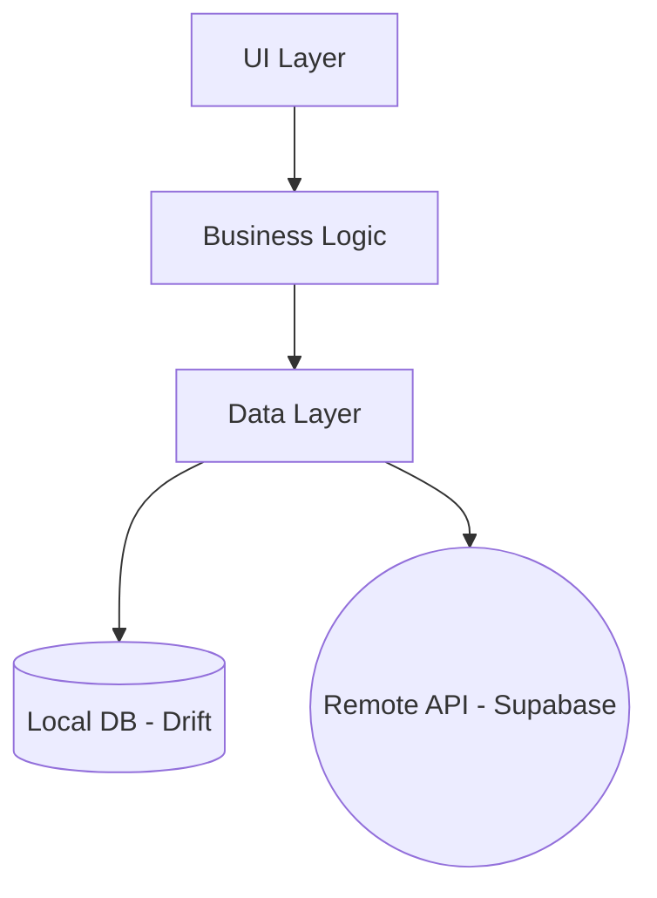

### Popis vrstev

#### 1. UI Layer (Presentation)

- **Komponenty:** Ekrany (`Screen`), Widgety, Dialogy
- **Odpovědnost:** Vykreslování stavu a zachytávání vstupů uživatele
- **Pravidlo:** Žádná business logika v UI. UI pouze volá metody z controllerů/notifierů
- **Bez notifikací:** Žádné snackbary, toasty ani jiné popup notifikace. Stav se zobrazuje přímo v UI komponentách.
- **Implementace:** `ConsumerWidget` pro přístup k Riverpod providerům

#### 2. Business Logic Layer (Application)

- **Komponenty:** Riverpod `Notifier`, `AsyncNotifier`
- **Odpovědnost:**
    - Držení a transformace stavu UI (např. aktuální košík, filtr seznamu)
    - Validace uživatelských vstupů
    - Volání metod z Data Layer
    - Error handling pro UI pomocí typu `Result<T>`
- **State:** Preferujeme immutable state pomocí `Freezed`

#### 3. Data Layer (Domain/Data)

- **Komponenty:** Repositories, Data Sources (Local/Remote), Models
- **Odpovědnost:**
    - Abstrahovat zdroj dat od zbytku aplikace
    - Implementace "Offline-first" logiky (nejdříve zapsat lokálně, pak sync)
    - Mapování mezi DB entitami a doménovými modely
- **Result Pattern:** Veškeré návratové typy z repozitářů jsou obaleny v `Result<T>` (sealed class: `Success` nebo `Failure`). Viz [Result Pattern](#result-pattern).

### Hybridní architektura

Projekt kombinuje **centralizovanou datovou vrstvu** s **feature-first přístupem pro UI**:

- **Core Data Layer (`lib/core/data/`)**: Centralizovaná definice dat, repozitářů a synchronizace. Zabraňuje cyklickým závislostem v relačně provázaném datovém modelu.
- **Feature Layer (`lib/features/`)**: Distribuovaná prezentační vrstva. Obsahuje pouze UI (Screens, Widgets) a aplikační logiku (Providers/View Models).

### Result Pattern

Všechny repozitáře vracejí `Result<T>` místo throwování výjimek. Sealed class se dvěma variantami:

- **`Success(T value)`** — úspěšný výsledek s hodnotou
- **`Failure(String message)`** — chyba s textovou zprávou

Repozitář obalí operaci v try/catch a vrátí `Success` nebo `Failure`. UI/Notifier zpracuje výsledek přes pattern matching (`switch`).

### BaseCompanyScopedRepository

Všechny entity-specific repozitáře dědí z `BaseCompanyScopedRepository<T>`, který poskytuje standardní CRUD + watch metody s automatickým company scope:

| Metoda | Návratový typ | Popis |
|--------|---------------|-------|
| `create(T entity)` | `Future<Result<T>>` | Vytvoření entity |
| `getById(String id)` | `Future<Result<T>>` | Načtení podle ID |
| `update(T entity)` | `Future<Result<T>>` | Aktualizace entity |
| `delete(String id)` | `Future<Result<void>>` | Soft delete (nastaví `deletedAt`) |
| `watchAll(String companyId)` | `Stream<List<T>>` | Reaktivní stream všech entit firmy |
| `watchById(String id)` | `Stream<T?>` | Reaktivní stream jedné entity |

Specifické query a business metody (např. `getByStatus`, `createOrderWithItems`) si definuje každý repozitář sám.

### Navigace (GoRouter)

Deklarativní routing s auth guardem:

```
/onboarding          → ScreenOnboarding (nové zařízení)
/login               → ScreenLogin (výběr uživatele → PIN)
/bills               → ScreenBills (hlavní obrazovka)
/bills/:id           → DialogBillDetail
/sell                → ScreenSell (rychlý prodej — bez billId)
/sell/:billId        → ScreenSell (objednávka na existující účet)
/settings            → Settings (taby: Uživatelé, Stoly, Sekce, Kategorie, Produkty, Daň. sazby, Plat. metody)
/dev                 → ScreenDev (vývojářské nástroje — pouze development)
```

**Auth guard:** Nepřihlášený uživatel je přesměrován na `/login`. Pokud neexistuje firma, přesměrování na `/onboarding`.

---

## Struktura Projektu

```text
lib/
├── main.dart
├── core/                              # Globální infrastruktura a sdílené jádro
│   ├── auth/                          # Autentizace (PIN, session)
│   ├── data/                          # Globální datová vrstva
│   │   ├── enums/                     # Dart enum definice
│   │   ├── mappers/                   # Entity ↔ Model mapování
│   │   ├── models/                    # Doménové modely (Freezed)
│   │   ├── providers/                 # DI registrace (Riverpod)
│   │   ├── repositories/              # Repozitáře (přímý přístup k DB)
│   │   └── services/                  # Seed, sync
│   ├── database/                      # Drift databáze
│   │   └── tables/                    # Definice tabulek
│   ├── network/                       # Supabase konfigurace
│   ├── sync/                          # Sync engine (outbox, pull, lifecycle)
│   ├── logging/                       # AppLogger
│   └── l10n/                          # Extension context.l10n
├── features/                          # Funkční moduly (UI only)
│   ├── auth/                          # Přihlášení (ScreenLogin)
│   ├── bills/                         # Přehled účtů (ScreenBills, DialogBillDetail, DialogNewBill, DialogPayment)
│   ├── onboarding/                    # Onboarding wizard (ScreenOnboarding)
│   ├── sell/                          # Prodejní obrazovka (ScreenSell)
│   └── settings/                      # Nastavení aplikace (ScreenSettings, ScreenDev)
└── l10n/                              # ARB soubory + generovaný kód
```

### Core Data Layer konvence

Každá entita v `core/data/` se skládá z následujících souborů:

| Soubor | Vzor |
|--------|------|
| `models/<entity>_model.dart` | Doménový model (Freezed) |
| `repositories/<entity>_repository.dart` | Repository — přímý přístup k AppDatabase |
| `mappers/supabase_mappers.dart` | Push: Model → Supabase JSON (typované parametry) |
| `mappers/supabase_pull_mappers.dart` | Pull: Supabase JSON → Drift Companion |

**Architektura:** Repozitáře pracují přímo s `AppDatabase` (Drift) bez DataSource abstrakce. Sync logika (outbox zápis, pull merge) žije přímo v repozitářích.

**Dva vzory outbox zápisu:**
- **Konfigurační entity** (sections, categories, items, tables, payment_methods, tax_rates, users): Dědí z `BaseCompanyScopedRepository<T>` — automatický outbox zápis v transakci s CRUD operací.
- **Prodejní entity** (bills, orders, order_items, payments): Vlastní repozitáře (`BillRepository`, `OrderRepository`) s injektovaným `SyncQueueRepository` a explicitním `_enqueue*` voláním po každé mutaci. Ruční přístup — business metody (createOrderWithItems, recordPayment, cancelBill cascade) nepasují do CRUD patternu base repository.

---

## Databáze

### Šifrování databáze (Etapa 3)

Šifrování se zavádí až v Etapě 3 (Milník 3.1) společně se sync. Během vývoje běží DB jako plain SQLite pro snadnější debugging.

- **Technologie:** SQLCipher (`sqlcipher_flutter_libs`)
- **Šifrovací klíč:** 32-byte náhodný hex řetězec, generován při prvním spuštění
- **Úložiště klíče:** `flutter_secure_storage` (macOS: Keychain, Linux: libsecret, Windows: Credential Manager)
- **Migrace:** Automatická detekce plain SQLite a migrace přes `sqlcipher_export`

### Umístění lokální databáze

Databáze se ukládá přímo v adresáři projektu:

```
<projekt>/epos_database.sqlite
```

Soubor je v `.gitignore`. Jedna cesta pro všechny platformy — nezávisí na OS.

### Mazání lokálních dat (Clean Install)

Pro simulaci čisté instalace (např. testování onboardingu):

```bash
rm -f epos_database.sqlite
```

Po smazání databáze a restartu aplikace se zobrazí **ScreenOnboarding** — onboarding wizard pro vytvoření firmy a admin účtu.

### Schema — Drift (SQLite)

> **Development mode:** Žádné migrace. Při změně schématu stačí smazat lokální DB soubor a spustit aplikaci znovu. Migrace budou přidány až pro produkční nasazení.

#### SyncColumnsMixin

> Sync sloupce jsou předpřipravené ve schématu od Etapy 1. V Etapě 1–2 zůstávají prázdné (nullable). Využijí se až v Etapě 3 při aktivaci sync.

Všechny aktivní tabulky používají mixin `SyncColumnsMixin` se sloupci: `lastSyncedAt` (D), `version` (I, default 1), `serverCreatedAt` (D), `serverUpdatedAt` (D). Tabulka `sync_queue` z rozšíření mixin nepoužívá.

Navíc každá tabulka definuje: `createdAt`, `updatedAt`, `deletedAt` (soft delete).

> **Konvence:** Drift automaticky konvertuje camelCase na snake_case (`createdAt` → `created_at`, `companyId` → `company_id`). Používáme `.named()` **pouze** když potřebujeme jiný název než automatická konverze (např. `layoutMap` → `.named('map')` pro zkrácení názvu, nebo `name` → `.named('table_name')` pro vyhnutí se konfliktu s klíčovým slovem).

#### Přehled tabulek

##### Aktivní tabulky (20) — Etapa 1–2

| SQL tabulka | Drift Table | Drift Entity | Model |
|-------------|-------------|--------------|-------|
| `bills` | `Bills` | `Bill` | `BillModel` |
| `categories` | `Categories` | `Category` | `CategoryModel` |
| `companies` | `Companies` | `Company` | `CompanyModel` |
| `currencies` | `Currencies` | `Currency` | `CurrencyModel` |
| `items` | `Items` | `Item` | `ItemModel` |
| `order_items` | `OrderItems` | `OrderItem` | `OrderItemModel` |
| `orders` | `Orders` | `Order` | `OrderModel` |
| `payment_methods` | `PaymentMethods` | `PaymentMethod` | `PaymentMethodModel` |
| `payments` | `Payments` | `Payment` | `PaymentModel` |
| `permissions` | `Permissions` | `Permission` | `PermissionModel` |
| `registers` | `Registers` | `Register` | `RegisterModel` |
| `role_permissions` | `RolePermissions` | `RolePermission` | `RolePermissionModel` |
| `roles` | `Roles` | `Role` | `RoleModel` |
| `sections` | `Sections` | `Section` | `SectionModel` |
| `tables` | `Tables` | `TableEntity` | `TableModel` |
| `tax_rates` | `TaxRates` | `TaxRate` | `TaxRateModel` |
| `user_permissions` | `UserPermissions` | `UserPermission` | `UserPermissionModel` |
| `users` | `Users` | `User` | `UserModel` |
| `layout_items` | `LayoutItems` | `LayoutItem` | `LayoutItemModel` |
| `register_sessions` | `RegisterSessions` | `RegisterSession` | `RegisterSessionModel` |

> **Poznámka:** `TableEntity` používá `@DataClassName` anotaci (konflikt s Drift `Table`).

##### Tabulky rozšíření (aktivní sync + budoucí)

| SQL tabulka | Drift Table | Kdy | Stav |
|-------------|-------------|-----|------|
| `sync_queue` | `SyncQueue` | Sync (Etapa 3) | **Aktivní** |
| `sync_metadata` | `SyncMetadata` | Sync (Etapa 3) | **Aktivní** |
| `shifts` | `Shifts` | Provoz (Etapa 3) | Plánovaná |
| `cash_movements` | `CashMovements` | Provoz (Etapa 3) | Plánovaná |
| `company_settings` | `CompanySettings` | CRM rozšíření | Plánovaná |
| `customers` | `Customers` | CRM rozšíření | Plánovaná |
| `customer_transactions` | `CustomerTransactions` | CRM rozšíření | Plánovaná |
| `vouchers` | `Vouchers` | CRM rozšíření | Plánovaná |
| `item_modifiers` | `ItemModifiers` | Gastro rozšíření | Plánovaná |
| `order_item_modifiers` | `OrderItemModifiers` | Gastro rozšíření | Plánovaná |
| `reservations` | `Reservations` | Gastro rozšíření | Plánovaná |
| `product_recipes` | `ProductRecipes` | Sklad rozšíření | Plánovaná |
| `manufacturers` | `Manufacturers` | Sklad rozšíření | Plánovaná |
| `suppliers` | `Suppliers` | Sklad rozšíření | Plánovaná |
| `warehouses` | `Warehouses` | Sklad rozšíření | Plánovaná |
| `stock_levels` | `StockLevels` | Sklad rozšíření | Plánovaná |
| `stock_documents` | `StockDocuments` | Sklad rozšíření | Plánovaná |
| `stock_movements` | `StockMovements` | Sklad rozšíření | Plánovaná |

#### Sloupce tabulek

Všechny aktivní tabulky obsahují společné sync sloupce (viz [SyncColumnsMixin](#synccolumnsmixin)).

> Typy: **T** = TEXT, **I** = INT, **R** = REAL, **B** = BOOL, **D** = DATETIME
> FK sloupce jsou označeny → cílová tabulka

##### Prodej (bills, orders, payments)

| Tabulka | Sloupce |
|---------|---------|
| **bills** | id (T), company_id →companies, table_id →tables, opened_by_user_id →users, bill_number (T), number_of_guests (I), is_takeaway (B), status (T), currency_id →currencies, subtotal_gross (I), subtotal_net (I), discount_amount (I), tax_total (I), total_gross (I), rounding_amount (I), paid_amount (I), opened_at (D), closed_at (D) |
| **orders** | id (T), company_id →companies, bill_id →bills, created_by_user_id →users, order_number (T), notes (T), status (T), item_count (I), subtotal_gross (I), subtotal_net (I), tax_total (I) |
| **order_items** | id (T), company_id →companies, order_id →orders, item_id →items, item_name (T), quantity (R), sale_price_att (I), sale_tax_rate_att (I), sale_tax_amount (I), discount (I), notes (T), status (T) |
| **payments** | id (T), company_id →companies, bill_id →bills, payment_method_id →payment_methods, amount (I), paid_at (D), currency_id →currencies, tip_included_amount (I), notes (T), transaction_id (T), payment_provider (T), card_last4 (T), authorization_code (T) |
| **payment_methods** | id (T), company_id →companies, name (T), type (T), is_active (B) |

##### Katalog (items, categories, tax)

| Tabulka | Sloupce |
|---------|---------|
| **items** | id (T), company_id →companies, category_id →categories, name (T), description (T), item_type (T), sku (T), unit_price (I), sale_tax_rate_id →tax_rates, is_sellable (B), is_active (B), unit (T) |
| **categories** | id (T), company_id →companies, name (T), is_active (B) |
| **tax_rates** | id (T), company_id →companies, label (T), type (T), rate (I), is_default (B — max 1 per company) |
| **currencies** | id (T), code (T), symbol (T), name (T), decimal_places (I) |

##### Firma, uživatelé, oprávnění

| Tabulka | Sloupce |
|---------|---------|
| **companies** | id (T), name (T), status (T), business_id (T), address (T), phone (T), email (T), vat_number (T), country (T), city (T), postal_code (T), timezone (T), business_type (T), default_currency_id →currencies, auth_user_id (T) |
| **users** | id (T), company_id →companies, auth_user_id (T), username (T), full_name (T), email (T), phone (T), pin_hash (T), pin_enabled (B), role_id →roles, is_active (B) |
| **roles** | id (T), name (T) |
| **permissions** | id (T), code (T), name (T), description (T), category (T) |
| **role_permissions** | id (T), role_id →roles, permission_id →permissions |
| **user_permissions** | id (T), company_id →companies, user_id →users, permission_id →permissions, granted_by →users |

##### Pokladna

| Tabulka | Sloupce |
|---------|---------|
| **registers** | id (T), company_id →companies, code (T), is_active (B), type (T), allow_cash (B), allow_card (B), allow_transfer (B), allow_refunds (B), grid_rows (I), grid_cols (I) |
| **register_sessions** | id (T), company_id →companies, register_id →registers, opened_by_user_id →users, opened_at (D), closed_at (D), order_counter (I) |

##### Stoly

| Tabulka | Sloupce |
|---------|---------|
| **tables** | id (T), company_id →companies, section_id →sections, table_name (T), capacity (I), is_active (B) |

##### Sekce

| Tabulka | Sloupce |
|---------|---------|
| **sections** | id (T), company_id →companies, name (T), color (T), is_active (B) |

##### Layout grid

| Tabulka | Sloupce |
|---------|---------|
| **layout_items** | id (T), company_id →companies, register_id →registers, page (I), grid_row (I), grid_col (I), type (T), item_id →items, category_id →categories, label (T), color (T) |

**Pravidla:**
- `register_id` — FK na registers (každá pokladna má svůj grid layout)
- `page` — číslo stránky gridu (výchozí 0, pro budoucí multi-page)
- `grid_row`, `grid_col` — pozice v gridu (0-based)
- `type` — `item` nebo `category`
- `item_id` — nastaveno když `type = item` (nullable)
- `category_id` — nastaveno když `type = category` (nullable)
- `label` — volitelný custom popis tlačítka (nullable, jinak se použije název item/category)
- `color` — volitelná custom barva tlačítka (nullable)
- Grid rozměry (`grid_rows`, `grid_cols`) — minimum 5×8, tlačítka se automaticky přizpůsobí velikosti gridu. Uloženy na tabulce `registers` (per-pokladna).

#### Indexy

- Indexy na `company_id` + `updated_at` pro tabulky s definovanou `@TableIndex` anotací
- Definovány přes `@TableIndex` anotace v Drift tabulkách (automaticky vytvořeny při `createAll()`)

> **Rozšíření (Etapa 3):** `sync_queue` přidá indexy na `company_id + status`, `entity_type + entity_id`, `created_at` a **unique** `idempotency_key`.

### Schema — Supabase (PostgreSQL) — od Etapy 3

> Celá Supabase schema se implementuje až v Etapě 3 (Milník 3.1 — Sync + multi-device).

#### Server-only tabulky

| Tabulka | Důvod |
|---------|-------|
| activity_logs | Audit trail, write-only |
| company_transactions | Billing, admin-only |

#### Timestamp konvence

| Sloupec | Popis | Kdo nastavuje |
|---------|-------|---------------|
| `created_at` | Čas vytvoření na serveru | Trigger (Supabase) |
| `updated_at` | Čas poslední změny na serveru | Trigger (Supabase) |
| `client_created_at` | Čas vytvoření na klientovi | Aplikace (Flutter) |
| `client_updated_at` | Čas změny na klientovi | Aplikace (Flutter) |
| `deleted_at` | Čas soft delete | Aplikace (Flutter) |

Klientské timestampy se ukládají v **UTC**.

> **Mapování Drift → Supabase:** Drift `createdAt`/`updatedAt` = Supabase `client_created_at`/`client_updated_at`. Serverové `created_at`/`updated_at` nastavuje trigger a v Drift schématu odpovídají SyncColumnsMixin sloupkům `serverCreatedAt`/`serverUpdatedAt`.

#### RLS a přístupová politika

- **Anon přístup** povolen pouze pro `global_currencies` (read-only)
- `roles`, `permissions`, `role_permissions` jsou **read-only pro authenticated**
- Sync tabulky vyžadují authenticated + company-scope policy

#### ENUMs

##### Aktivní ENUMs (Etapa 1–2)

| Dart Enum | Model | Hodnoty |
|-----------|-------|---------|
| `CompanyStatus` | `CompanyModel` | trial, subscribed, deleted |
| `ItemType` | `ItemModel` | product, service, counter |
| `UnitType` | `ItemModel` | ks, g, ml, m |
| `BillStatus` | `BillModel` | opened, paid, cancelled |
| `PrepStatus` | `OrderModel`, `OrderItemModel` | created, inPrep, ready, delivered, cancelled, voided |
| `PaymentType` | `PaymentMethodModel` | cash, card, bank, other |
| `RoleName` | `RoleModel` | helper, operator, admin |
| `TaxCalcType` | `TaxRateModel` | regular, noTax, constant, mixed |
| `HardwareType` | `RegisterModel` | local, mobile, virtual |
| `LayoutItemType` | `LayoutItemModel` | item, category |

##### ENUMs rozšíření (přidají se s příslušnými tabulkami)

| Dart Enum | Kdy | Hodnoty |
|-----------|-----|---------|
| `SubscriptionPlan` | Sync (Etapa 3) | free, basic, advance, pro, enterprise, tech |
| `MovementType` | Provoz (Etapa 3) | sale, refund, expense, cashIn, cashOut |
| `StockDocumentType` | Sklad rozšíření | transfer, waste, inventory, receipt, correction |
| `PurchasePriceChange` | Sklad rozšíření | average, override, weightedAvg |
| `VoucherType` | CRM rozšíření | fixedAmount, percentage, product |
| `VoucherStatus` | CRM rozšíření | valid, used, cancelled, expired |
| `ReservationStatus` | Gastro rozšíření | created, confirmed, cancelled, seated |
| `TableShape` | Gastro rozšíření | rectangle, circle, square |

Hodnoty ENUM jsou uloženy jako `TEXT` v lokální SQLite databázi. Drift `textEnum<T>()` automaticky zajišťuje konverzi mezi enum typy a string hodnotami.

> **Poznámka:** `BillStatus` v Etapě 1–2 neobsahuje `refunded` — přidá se v Etapě 3.2 (pokročilý prodej). `ItemType` v Etapě 1–2 neobsahuje `recipe`, `ingredient`, `variant`, `modifier` — ty se přidají s příslušnými rozšířeními. `PaymentType` neobsahuje `voucher`, `points` — ty se přidají s CRM rozšířením.

---

## Synchronizace (Etapa 3 — částečně implementováno)

> **Stav implementace:** Sync infrastruktura je funkční pro všech 20 tabulek. Konfigurační entity (sections, categories, items, tables, payment_methods, tax_rates, users) dědí z `BaseCompanyScopedRepository` s automatickým outbox zápisem v transakci. Prodejní entity (bills, orders, order_items, payments) používají ruční enqueue — `BillRepository` a `OrderRepository` mají injektovaný `SyncQueueRepository` a explicitní `_enqueue*` volání po každé mutaci. Globální tabulky (currencies, roles, permissions, role_permissions) se pullují bez company_id filtru a pushují při initial sync. Company-scoped entity bez BaseCompanyScopedRepository (registers, register_sessions, layout_items, user_permissions) mají vlastní enqueue. SyncService pulluje všech 20 tabulek v FK-respektujícím pořadí. ConnectCompanyScreen umožňuje připojení nového zařízení k existující firmě stažením dat přes InitialSync (pullAll).

### Outbox Pattern

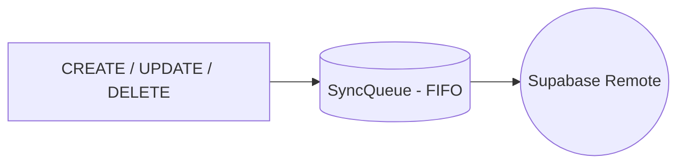

**Výhody:**
- Garantované pořadí operací
- Crash resilience (operace se neztratí)
- Auditovatelnost
- Retry s postupným backoff (1s, 5s, 10s, 50s)

### Sync Lifecycle

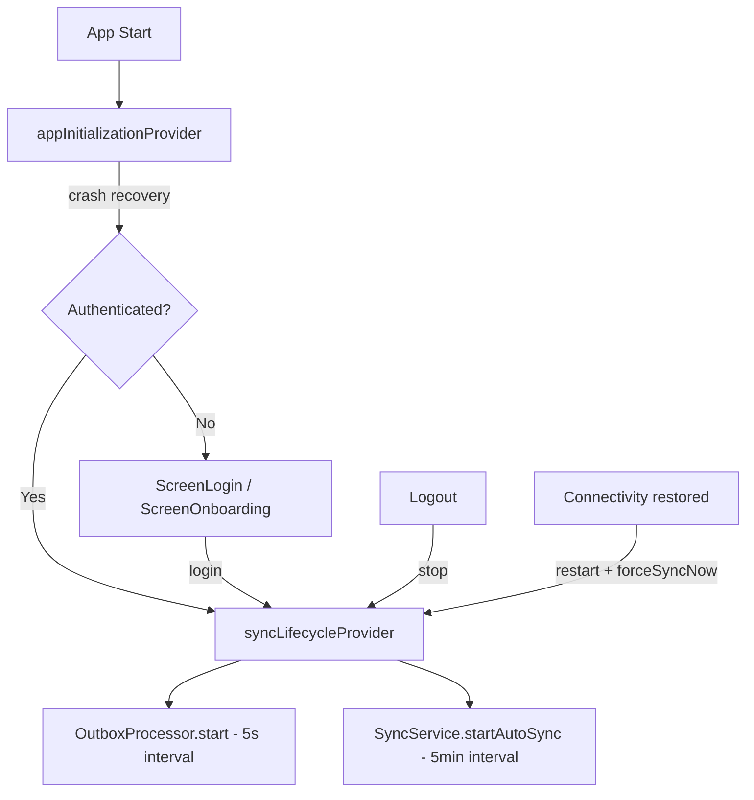

**Klíčové vlastnosti:**
- Sync se **nespouští** dokud se uživatel nepřihlásí
- Při logoutu se sync zastaví
- Crash recovery probíhá při startu aplikace

### Data Flow

**Write (Create/Update/Delete):**
1. UI volá `repository.create(item)` / `repository.recordPayment(...)` apod.
2. Repository uloží do lokální DB (Drift)
3. Vytvoří se záznam v `sync_queue`:
   - **Konfigurační entity:** Atomicky ve stejné transakci (BaseCompanyScopedRepository)
   - **Prodejní entity:** Explicitní `_enqueue*` volání po mutaci (BillRepository, OrderRepository)
4. Repository vrátí úspěch UI (okamžitě)
5. **Asynchronně** OutboxProcessor zpracuje frontu

**Read:**
1. UI volá `repository.getAll()`
2. Repository čte z **LocalDataSource** (Drift)
3. **Pozadí**: SyncService pravidelně pulluje změny ze Supabase

### Conflict Resolution — Last Write Wins (LWW)

#### 1. Server-side trigger (`enforce_lww`)

PostgreSQL BEFORE UPDATE trigger porovnává `client_updated_at`. Pokud je příchozí timestamp starší → vyhodí výjimku `LWW_CONFLICT`.

#### 2. Pull-side LWW

Při stahování změn:
- Entita neexistuje lokálně → vloží se
- Entita existuje, nemá neodeslané změny → přijme se remote verze
- Entita má neodeslané změny → porovnají se `updatedAt` timestamps, novější vyhrává

#### 3. Outbox LWW rejection handling

Když server odmítne push (`LWW_CONFLICT`), outbox processor označí entry jako `completed`. Příští pull přinese správnou verzi ze serveru.

### Retry strategie

- **Transient chyby** (síť, timeout, auth): retry s backoffem (1s → 5s → 10s → 50s)
- **Permanent chyby** (data/constraint/permission): označí se jako `failed` hned
- FIFO je zachováno
- Stuck záznamy (processing > 5 min): automatický reset na `pending`

### Globální reference data

`roles` (3), `permissions` (14), `role_permissions`, `currencies` jsou **globální** (bez `company_id`):
- V Etapě 1–2: seedovány lokálně při onboardingu
- Od Etapy 3: pull ze Supabase (bez company_id filtru), push při initial sync
- Aktuální design předpokládá 1 firma = 1 Supabase projekt

> **Pozn.:** `payment_methods` nejsou read-only — mají plný CRUD od Etapy 1 (viz [Platební metody](#platební-metody)).

### ConnectCompanyScreen — připojení k existující firmě

Flow pro nové zařízení:
1. ScreenOnboarding → "Připojit se k firmě"
2. Formulář: email + heslo → `supabaseAuthService.signIn()`
3. Po přihlášení: fetch company z Supabase (`companies.auth_user_id = userId`)
4. Zobrazí název firmy + tlačítko "Připojit"
5. InitialSync: `syncService.pullAll(companyId)` — stáhne všech 20 tabulek
6. Po dokončení → navigace na `/login`

### Known Issues / Limitations

- **Company switching**: Nepodporováno. Jedno zařízení = jedna firma. Přepnutí na jinou firmu vyžaduje smazání lokální DB.
- **Globální tabulky vs multi-company**: roles/permissions/role_permissions/currencies jsou globální (bez company_id). Při více firmách na jednom Supabase projektu by došlo ke kolizím. Aktuální design předpokládá 1 firma = 1 Supabase projekt.
- **InitialSync recovery**: Pokud InitialSync selže uprostřed, data jsou neúplná. Další auto-pull (5min) doplní chybějící data.

---

## Obchodní model — Účty a objednávky

### Přehled architektury Bill/Order

POS systém odděluje **platební/účetní jednotku** (Bill) od **kuchyňské dispečerské jednotky** (Order):

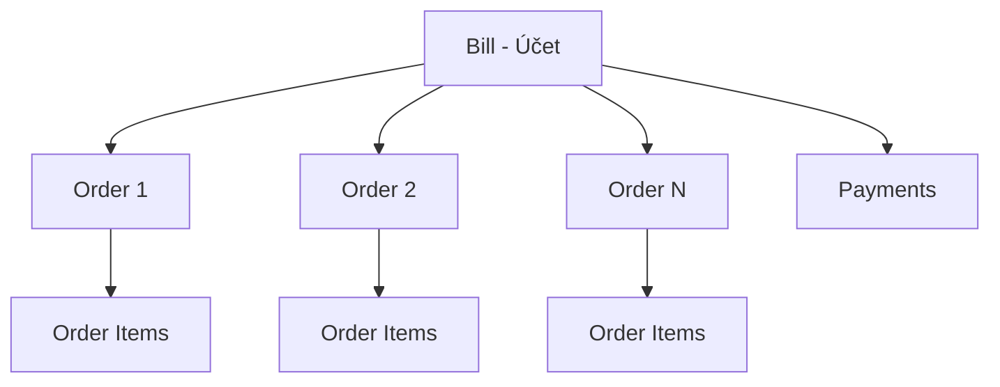

| Entita | Český název | Účel | Vztah |
|--------|-------------|------|-------|
| **Bill** | Účet | Platební/účetní jednotka, seskupuje objednávky | 1:N s Orders, 1:N s Payments |
| **Order** | Objednávka | Kuchyňská dispečerská jednotka, seskupuje položky | N:1 s Bill, 1:N s OrderItems |
| **OrderItem** | Položka | Jednotlivá položka objednávky s cenou a stavem přípravy | N:1 s Order |
| **Payment** | Platba | Záznam o platbě | N:1 s Bill |

> **Rozšíření:** OrderItemModifier (modifikátory položek) a Voucher (poukazy vázané na bill) se přidají s gastro/CRM rozšířením.

### Přepočet Bill totalů a slevy

Bill totaly se přepočítávají **po každé změně** (createOrder, cancelOrder, voidOrder). Výpočet zahrnuje pouze aktivní položky (ne cancelled/voided):

1. `item_subtotal = sale_price_att × quantity - discount` (discount = 0 v E2)
2. `bill.subtotal_gross = Σ(item_subtotals)` přes všechny aktivní orders
3. `bill.tax_total = Σ(sale_tax_amount × quantity)` přes aktivní items
4. `bill.subtotal_net = subtotal_gross - tax_total`
5. `bill.total_gross = subtotal_gross - discount_amount + rounding_amount`

> **E2:** `discount_amount`, `rounding_amount` a `order_items.discount` jsou vždy 0. Zjednodušení: `total_gross = subtotal_gross`.

**Slevy (od Etapy 3.2):** 2 úrovně — položka (`order_items.discount`) a účet (`bills.discount_amount`). Sloupce jsou ve schématu připraveny, UI a logika se implementují v E3.2. Slevy na úrovni objednávky (Order) neexistují.

### Platební metody

Při vytvoření firmy (onboarding) se seedují **3 výchozí platební metody**:

| Seed název | PaymentType | Popis |
|------------|-------------|-------|
| Hotovost | `cash` | Platba v hotovosti |
| Karta | `card` | Platba kartou |
| Převod | `bank` | Bankovní převod |

**Pravidla:**
- Plný **CRUD** je dostupný od Etapy 1 (Settings → Správa platebních metod)
- Uživatel může přidat novou platební metodu (name + PaymentType)
- Uživatel může deaktivovat platební metodu (`is_active = false`, soft-delete)
- Seedované metody lze deaktivovat, ale nelze je smazat z DB
- Každá platební metoda odkazuje na `PaymentType` enum (`cash`, `card`, `bank`, `other`)
- Při přidání vlastní metody uživatel vybere typ z PaymentType

> **Pozn.:** Tabulka `payment_methods` je per-company (filtruje se přes `company_id`). Na rozdíl od `roles`/`permissions` není read-only.

### Statusy

#### BillStatus (stav účtu)

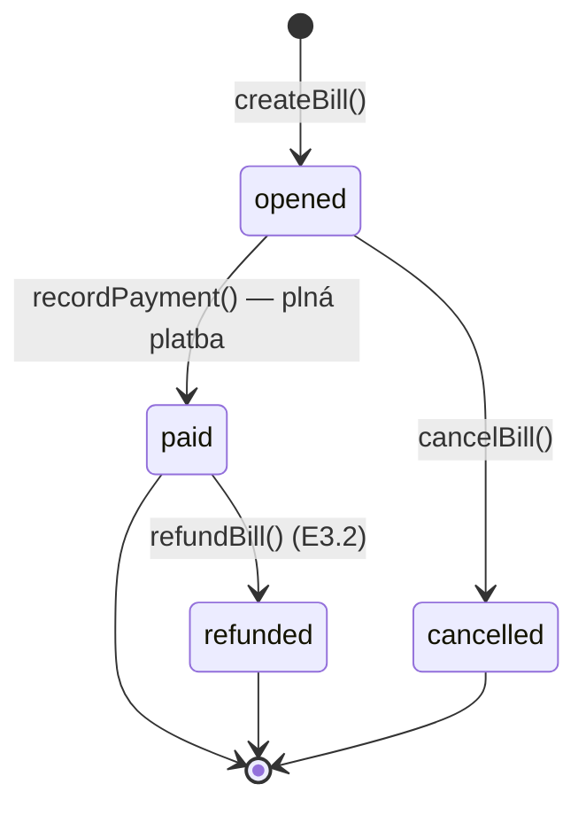

| Status | Podmínka | closedAt |
|--------|----------|----------|
| `opened` | `paid_amount < total_gross` | null |
| `paid` | `paid_amount >= total_gross` | set |
| `cancelled` | Manuální storno (pouze z `opened`) | set |

> **Rozšíření (Etapa 3.2):** `refunded` (vrácení peněz po `paid`, closedAt = set). Přechod: `paid → refunded`. Ve filtru ScreenBills se `refunded` řadí pod "Zaplacené". Status `partiallyPaid` neexistuje — platba musí vždy pokrýt celou částku (lze rozdělit mezi více platebních metod).

#### PrepStatus (stav přípravy objednávky a položky)

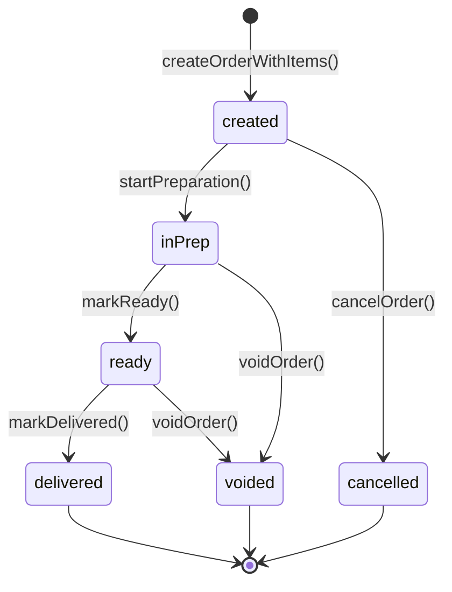

| Status | Popis | Lze změnit na |
|--------|-------|---------------|
| `created` | Objednávka vytvořena | `inPrep`, `cancelled` |
| `inPrep` | Kuchyň začala připravovat | `ready`, `voided` |
| `ready` | Připraveno k výdeji | `delivered`, `voided` |
| `delivered` | Doručeno zákazníkovi | (finální stav) |
| `cancelled` | Zrušeno před přípravou | (finální stav) |
| `voided` | Stornováno po přípravě | (finální stav) |

#### Agregace Order.status z OrderItem.status

> **E2:** Status se nastavuje na úrovni celé objednávky (Order) — všechny items mají stejný status. Agregace z individuálních item statusů se implementuje v Etapě 3.

Cílové chování (od E3):

Order.status se odvozuje z položek:
- Všechny items `delivered` → Order je `delivered`
- Všechny items `ready` nebo `delivered` → Order je `ready`
- Jakýkoliv item `inPrep` → Order je `inPrep`
- Všechny items `cancelled` → Order je `cancelled`
- Všechny items `voided` → Order je `voided`
- Mix `cancelled` + `voided` → Order je `voided`
- Jinak → `created`

### Klíčová rozhodnutí

| Aspekt | Rozhodnutí |
|--------|------------|
| **Bill číslo** | `B-001` — per-day reset, 3 cifry s prefixem |
| **Order číslo** | `O-0001` — per register session, reset při nové session, 4 cifry s prefixem |
| **Prázdný bill** | Povolen (placeholder pro stůl) |
| **Po zrušení všech items** | Bill zůstane otevřený |
| **Slevy** | 2 úrovně — bill, item (od Etapy 3.2) |
| **Přepočet totalů** | Po každé změně (createOrder, cancelOrder, voidOrder) |
| **Zaokrouhlení** | Pouze na bill level |
| **Payment** | Pouze na bill |
| **Permissions** | Oddělené `bills.*` |

### Workflow — Quick Sale (rychlý prodej)

Rychlý prodej je zjednodušený flow pro prodej bez stolů. Spouští se tlačítkem **Rychlý účet** na ScreenBills, naviguje na `/sell` (bez billId). Účet se vytvoří až při potvrzení platby.

**Příznak:** `is_takeaway = true` v tabulce bills. V UI se zobrazuje jako "Rychlý účet".

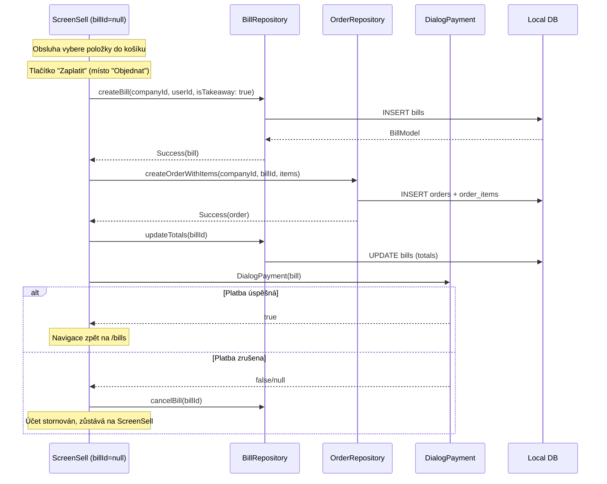

**Rozdíl oproti stolovému prodeji:**
- Účet se vytvoří **až při potvrzení** (ne předem)
- Namísto "Objednat" je tlačítko **"Zaplatit"**
- Po zrušení platby se účet automaticky stornuje
- V přehledu účtů se zobrazuje jako "Rychlý účet"

### Workflow — Stolový prodej

Pro restaurační provoz s více objednávkami na jeden účet:

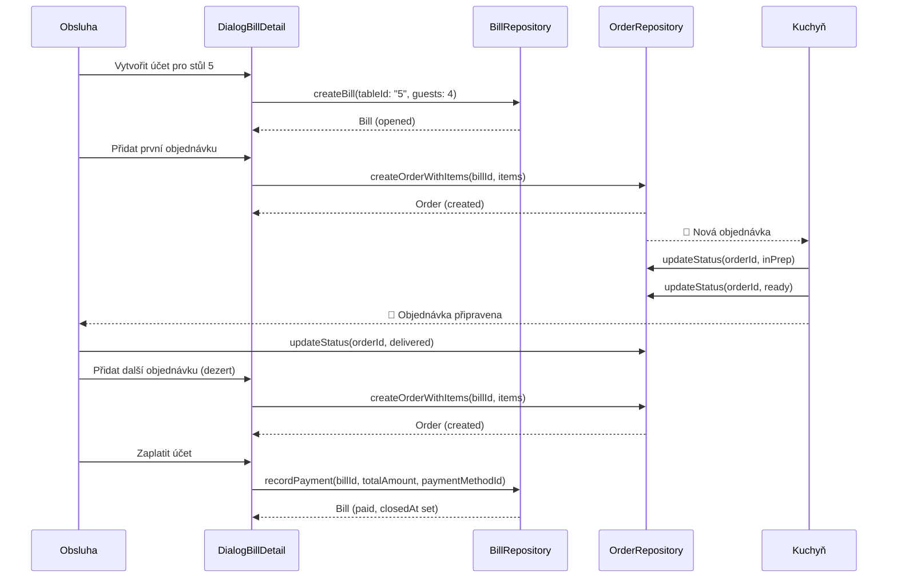

### Workflow — Vytvoření účtu (DialogNewBill)

Jednokrokový dialog. Obsluha zadá počet hostů a volitelně vybere stůl. Rychlý prodej je **samostatný flow** (viz [Quick Sale](#workflow--quick-sale-rychlý-prodej)) — nespouští se přes DialogNewBill.

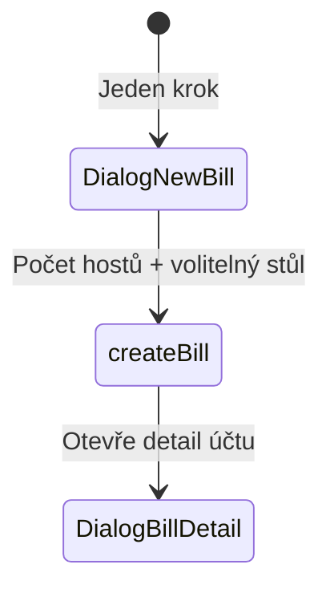

| Pole | Hodnota |
|------|---------|
| `is_takeaway` | false (vždy) |
| `table_id` | vybraný stůl nebo null |
| `number_of_guests` | vstup (výchozí 0) |
| `currency_id` | default |
| `opened_by_user_id` | current |

**Pravidla:**
- `is_takeaway=true` se nastavuje **pouze** při rychlém prodeji (automaticky)
- Stůl je volitelný — účet může existovat bez přiřazení ke stolu
- Prázdný bill je povolen (placeholder pro stůl)
- Bill se vytvoří se statusem `opened` a `opened_at = now`
- Po vytvoření se otevře **DialogBillDetail** (ne ScreenSell)

### Workflow — Storno

Systém rozlišuje **2 typy storna** podle fáze přípravy:

| Typ | Kdy | Přechod |
|-----|-----|---------|
| **Cancel** | Před začátkem přípravy | `created` → `cancelled` |
| **Void** | Po začátku přípravy | `inPrep`/`ready` → `voided` |

#### Storno účtu (cancelBill)

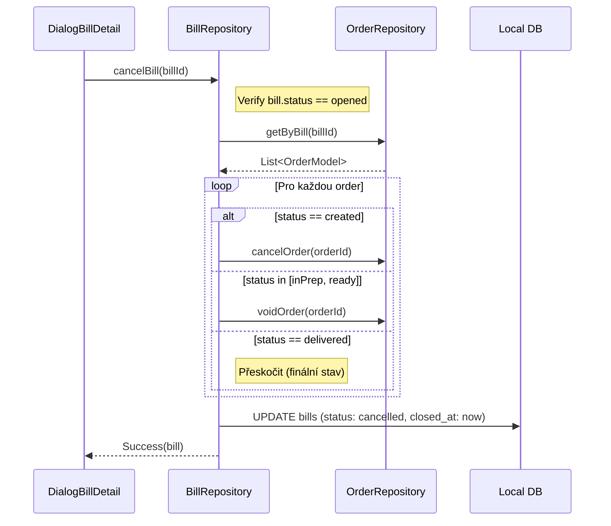

**Pravidla pro cancelBill:**
- Lze stornovat pouze `opened` bill (ne `paid`)
- Payment záznamy se neruší — zůstávají jako audit trail
- V E3.2+: zaplacený bill → refund (ne cancel)

#### Storno objednávky (cancelOrder / voidOrder)

- **cancelOrder:** `status` musí být `created` → všechny items → `cancelled`, order → `cancelled`
- **voidOrder:** `status` musí být `inPrep` nebo `ready` → všechny items → `voided`, order → `voided`
- **delivered** order nelze stornovat (finální stav)
- Po stornování se **Bill totals přepočítají** (odečtou se cancelled/voided items)

| Akce | Bill.status | Bill.totals |
|------|-------------|-------------|
| Cancel/void jedné order | Zůstává `opened` | Přepočítají se |
| Cancel/void všech orders | Zůstává `opened` (prázdný bill povolen) | 0 |
| cancelBill | → `cancelled` | Všechny orders cancel/void dle stavu |

### Workflow — Register Session (od Etapy 2)

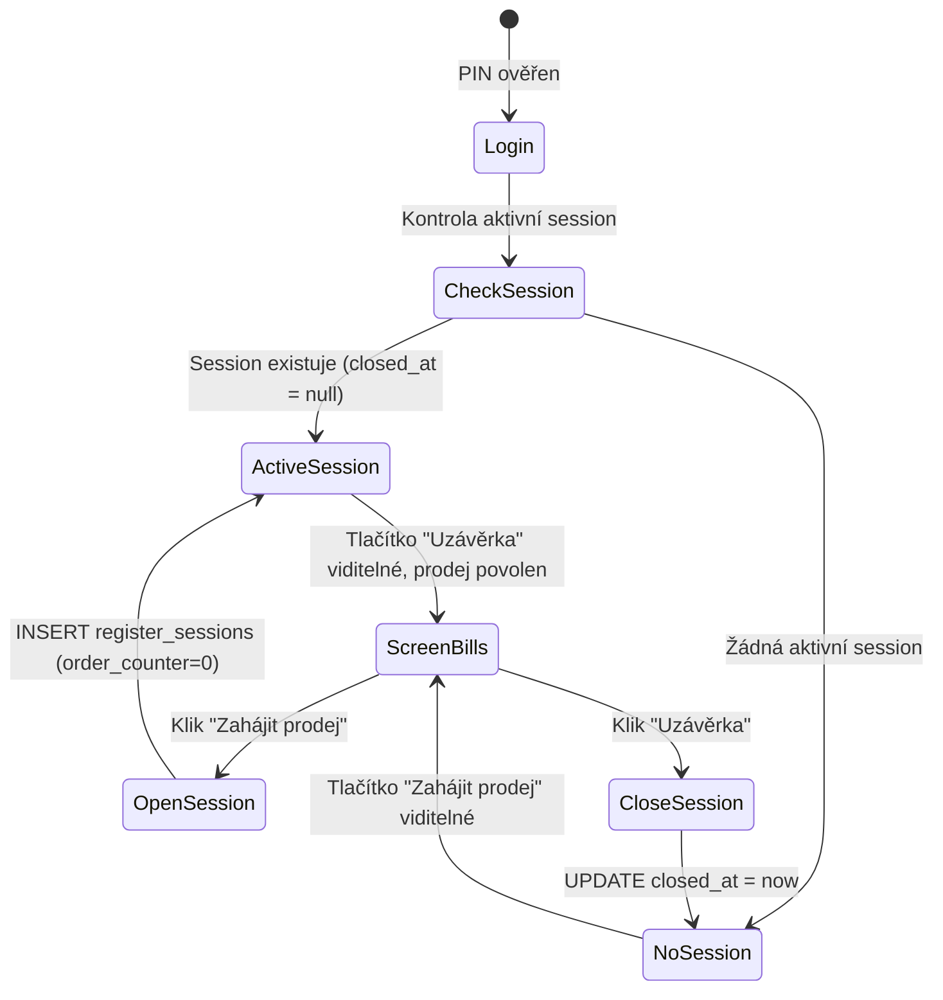

**Pravidla:**
- Bez aktivní register session **nelze vytvářet účty ani objednávky**
- Tlačítko v pravém panelu ScreenBills se mění dynamicky:
  - Žádná aktivní session → **"Zahájit prodej"** (zelená)
  - Aktivní session → **"Uzávěrka"** (neutrální)
- Order counter (`O-0001`) se resetuje při otevření nové session
- E2: Jednoduché otevření/zavření (bez cash count)
- E3+: Rozšíření o počáteční/koncový stav hotovosti, Z-report

### Repository API

#### BillRepository

- **Query:** watchByCompany (s filtry status/section), watchById, watchByStatus, getById, generateBillNumber
- **Business:** createBill, updateTotals, recordPayment (vytvoří Payment + aktualizuje Bill.paidAmount a status), cancelBill (cascade — cancel/void všech orders a items)
- **Sync:** Injektovaný `SyncQueueRepository`, ruční enqueue — `_enqueueBill`, `_enqueueOrder`, `_enqueueOrderItem`, `_enqueuePayment`. Každá mutace (createBill, updateTotals, recordPayment, cancelBill vč. cascade) po sobě enqueueuje všechny dotčené entity.
- **E3.2:** přibude updateStatus (pro refunded)

#### OrderRepository

- **Query:** watchByBill, watchOrderItems, getOrderItems, watchLastOrderTimesByCompany
- **Business:** createOrderWithItems, updateStatus, startPreparation, markReady, markDelivered, cancelOrder, voidOrder
- **Sync:** Injektovaný `SyncQueueRepository`, ruční enqueue — `_enqueueOrder`, `_enqueueOrderItem`. createOrderWithItems enqueueuje order + všechny items. updateStatus enqueueuje order + všechny items (delegující metody cancelOrder, voidOrder, startPreparation, markReady, markDelivered automaticky pokryty přes updateStatus).

#### PaymentRepository

- **Vazba:** Payments jsou vázány na Bill (ne Order)
- **Query:** getByBill, watchByBill
- **Pozn.:** Vytváření plateb řídí `BillRepository.recordPayment` — PaymentRepository má pouze query metody

---

## Autentizace

### PIN Flow

1. **Výběr uživatele:** ScreenLogin zobrazí seznam aktivních uživatelů (jméno). Uživatel vybere svůj účet.
v průběhu 2. **Zadání PINu:** Dotyková číselná klávesnice (numpad) + podpora fyzické klávesnice. Zadané znaky zobrazeny jako hvězdičky (`*`).
3. **Průběžné ověření:** PIN se ověřuje automaticky od 4. číslice (bez potvrzovacího tlačítka). Shoda = okamžité přihlášení. Při 6 číslicích bez shody se počítá neúspěšný pokus.
4. **Hashování:** PINy jsou ukládány jako solený hash (Salted SHA-256 + 128-bit `Random.secure()` salt)
   - **Formát `pin_hash`:** `"hex_salt:hex_hash"` — salt a hash uloženy v jednom sloupci, oddělené dvojtečkou
5. **Session:** Úspěšné přihlášení aktivuje `SessionManager`. Session je "volatile" (pouze v RAM)

### Multi-session model

Na jednom zařízení může být současně **více uživatelů přihlášeno** (PIN ověřený), ale **aktivně pracuje jen jeden**:

- **Aktivní uživatel:** Právě pracující obsluha. Všechny akce se přiřadí tomuto uživateli.
- **Přihlášení uživatelé:** Ostatní uživatelé s ověřeným PINem. Zobrazeni v info panelu.
- **Přepnutí obsluhy:** Dialog se seznamem přihlášených uživatelů → výběr → PIN (v E1-2 vždy vyžadován, nastavitelné v budoucnu). Dialog má 3 stavy: výběr uživatele → PIN → chyba/lockout.
- **Odhlášení:** Odhlásí pouze aktivního uživatele. Ostatní zůstávají přihlášeni. Po odhlášení se **nenastavuje** žádný další aktivní uživatel (`_activeUser = null`) — router přesměruje na `/login`, kde se další uživatel musí přihlásit PINem.
- **Reset:** Při restartu aplikace se všechny sessions vymaží (volatile, RAM only).

### Brute-Force ochrana

Progresivní lockout chrání proti hádání PIN kódu:

| Neúspěšný pokus | Lockout |
|-----------------|---------|
| 1–3 | Žádný (tolerance překlepů) |
| 4 | 5 sekund |
| 5 | 30 sekund |
| 6 | 5 minut |
| 7+ | 60 minut (cap) |

**Implementace:**
- **Scope:** Per-device (globální počítadlo pro celé zařízení, ne per-user)
- Stav se drží v paměti (`AuthService`) — reset při restartu aplikace
- `AuthLocked` result obsahuje `remainingSeconds` pro UI countdown
- Úspěšné přihlášení resetuje počítadlo

**Efektivita:** Bez ochrany lze 4-místný PIN (10 000 kombinací) prolomit za minuty. S lockoutem trvá útok **dny**.

### Cloud Sync Auth (implementováno)

- Každé zařízení musí mít uložené **admin email + password** (Supabase Auth)
- Pokud credentials chybí, aplikace zobrazí `ScreenCloudAuth` a vyžádá admin přihlášení
- Synchronizace se spustí až po validním Supabase session (RLS vyžaduje auth)
- `SupabaseAuthService` zajišťuje signIn/signUp a session management

> **Supabase Auth konfigurace:** Funkce **Leaked Password Protection** (HaveIBeenPwned integrace) je v projektu záměrně **vypnutá**. Důvod: POS systém používá jednoduché admin heslo primárně pro sync mezi zařízeními, nikoliv pro přímé přihlašování uživatelů. Uživatelé se přihlašují pomocí PIN kódu.

### Navigace

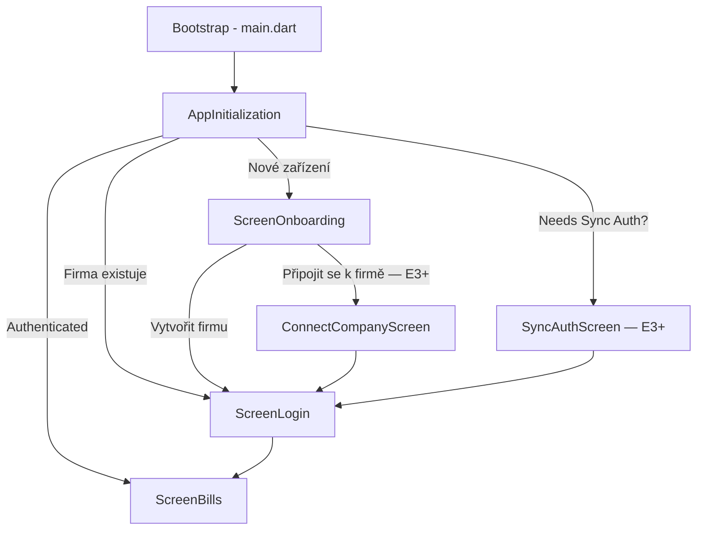

> **E1-2:** Pouze cesta Nové zařízení → Vytvořit firmu → PIN → Bills. SyncAuthScreen a ConnectCompanyScreen se aktivují v E3.

#### ScreenOnboarding Flow

Při prvním spuštění aplikace (bez lokálních dat) se zobrazí **ScreenOnboarding**.

##### Etapa 1–2 — Vytvoření firmy (wizard)

Pouze možnost „Vytvořit novou firmu":
Tlačítko „Připojit se k firmě" je zobrazeno jako disabled (aktivuje se v Etapě 3).

**Krok 1 — Firma:**
- Název firmy (povinné)
- IČO, adresa, email, telefon (volitelné)

**Krok 2 — Admin uživatel:**
- Celé jméno, username (povinné)
- PIN 4–6 číslic + potvrzení (povinné)

**Krok 3 — Automatický seed:**

Po odeslání formuláře se v jedné transakci vytvoří:

| Entita | Počet | Detail |
|--------|-------|--------|
| Company | 1 | Dle formuláře, status: `trial` |
| Currency | 1 | CZK (Kč, 2 des. místa). Formátování řídí `intl` package dle locale. |
| TaxRate | 3 | Základní 21% (`regular`), Snížená 12% (`regular`), Nulová 0% (`noTax`), is_default: Základní=true |
| Permission | 14 | Viz [Katalog oprávnění](#katalog-oprávnění-14) |
| Role | 3 | helper, operator, admin |
| RolePermission | 29 | helper: 5, operator: 10, admin: 14 |
| PaymentMethod | 3 | Viz [Platební metody](#platební-metody) |
| Section | 3 | Hlavní (zelená), Zahrádka (oranžová), Interní (šedá) |
| Table | 13 | Hlavní: Stůl 1–5 (kap. 4), Zahrádka: Stolek 1–5 (kap. 2), Interní: Majitel, Repre, Odpisy (kap. 0) |
| Register | 1 | code: `REG-1`, type: `local`, is_active: true, allow_cash/card/transfer: true, allow_refunds: false, grid: 5×8 |
| User | 1 | Admin s PIN hashem, role_id: admin |
| UserPermission | 14 | Všech 14 oprávnění, granted_by: admin user ID (self-grant při onboardingu) |

**Pořadí seedu (respektuje FK závislosti):**
1. Company → Currency (`default_currency_id`)
2. TaxRates, Permissions, Roles, RolePermissions
3. PaymentMethods, Sections, Tables
4. Register
5. User → UserPermissions

Po dokončení se zobrazí `ScreenLogin`.

##### Etapa 3+ — Připojit se k firmě

Přibude druhá možnost „Připojit se k firmě" (ConnectCompanyScreen):

1. Uživatel zadá email + heslo (Supabase admin credentials)
2. Aplikace ověří přihlášení a najde uživatele podle `auth_user_id`
3. Z uživatelského záznamu získá `company_id`
4. `InitialSyncService` stáhne data firmy v pořadí FK závislostí:
   1. Company, Currency, TaxRates
   2. Permissions, Roles, RolePermissions, PaymentMethods, Registers
   3. Users, UserPermissions, Categories, Tables
   4. Items
   5. Bills, Orders, OrderItems, Payments
5. Po dokončení se zobrazí `ScreenLogin`

---

## Oprávnění

Systém oprávnění funguje **offline-first**. Veškerá data jsou uložena lokálně v Drift (SQLite). V Etapě 1–2 jsou `roles`, `permissions` a `role_permissions` seedovány lokálně. Od Etapy 3 se synchronizují se Supabase (read-only pull).

### Klíčové principy

- `user_permissions` = **zdroj pravdy** pro autorizaci (ne role)
- Role = **šablony** pro hromadné přiřazení oprávnění
- Runtime check = **O(1)** lookup v in-memory `Set<String>`
- Po přiřazení role se oprávnění zkopírují do `user_permissions` — změna role šablony neovlivní stávající uživatele

### Architektura oprávnění

```
┌─────────────────────────────────────────────────┐
│  permissions (katalog)                          │
│  14 položek, read-only, seed lokálně (sync od E3)│
└─────────────────────┬───────────────────────────┘
                      │
┌─────────────────────▼───────────────────────────┐
│  role_permissions (šablony)                     │
│  Vazba role → permission, read-only             │
│  admin: 14, operator: 10, helper: 5             │
└─────────────────────┬───────────────────────────┘
                      │  "Přiřadit roli" = zkopírovat permission_ids
                      ▼
┌─────────────────────────────────────────────────┐
│  user_permissions (zdroj pravdy)                │
│  Vazba user → permission, full CRUD + outbox    │
└─────────────────────┬───────────────────────────┘
                      │
┌─────────────────────▼───────────────────────────┐
│  userPermissionCodesProvider                    │
│  Reaktivní Set<String> kódů přihlášeného user   │
└─────────────────────┬───────────────────────────┘
                      │
┌─────────────────────▼───────────────────────────┐
│  hasPermissionProvider('orders.void')           │
│  → true / false (O(1) contains)                 │
└─────────────────────────────────────────────────┘
```

### Katalog oprávnění (14)

| Kategorie | Kód | Popis |
|-----------|-----|-------|
| **bills** | `bills.create` | Vytvořit účet |
| | `bills.view` | Zobrazit účty |
| | `bills.void` | Stornovat účet |
| | `bills.discount` | Aplikovat slevu na účet |
| **orders** | `orders.create` | Vytvořit objednávku |
| | `orders.view` | Zobrazit objednávky |
| | `orders.void` | Stornovat objednávku |
| | `orders.discount` | Aplikovat slevu na položku |
| **products** | `products.view` | Zobrazit produkty |
| | `products.manage` | Spravovat produkty |
| **tables** | `tables.manage` | Spravovat stoly |
| **users** | `users.view` | Zobrazit uživatele |
| | `users.manage` | Spravovat uživatele |
| **settings** | `settings.manage` | Upravovat nastavení |

> **Pozn.:** `bills.discount` a `orders.discount` jsou seedované od E1, ale UI pro slevy se implementuje až v Etapě 3.2.

> **Rozšíření:** Nové permissions se přidají s příslušnými funkcemi: `bills.split` (gastro), `register.open_close`, `register.cash_movement` (provoz), `inventory.view`, `inventory.manage` (sklad), `customers.view`, `customers.manage` (CRM), `reports.view` (reporty).

### Role (šablony)

| Oprávnění | helper | operator | admin |
|-----------|:------:|:--------:|:-----:|
| `bills.create` | ✓ | ✓ | ✓ |
| `bills.view` | ✓ | ✓ | ✓ |
| `bills.void` | | ✓ | ✓ |
| `bills.discount` | | ✓ | ✓ |
| `orders.create` | ✓ | ✓ | ✓ |
| `orders.view` | ✓ | ✓ | ✓ |
| `orders.void` | | ✓ | ✓ |
| `orders.discount` | | ✓ | ✓ |
| `products.view` | ✓ | ✓ | ✓ |
| `products.manage` | | | ✓ |
| `tables.manage` | | ✓ | ✓ |
| `users.view` | | | ✓ |
| `users.manage` | | | ✓ |
| `settings.manage` | | | ✓ |
| **Celkem** | **5** | **10** | **14** |

### Přiřazení role uživateli

Metoda `applyRoleToUser`:
1. Soft-delete všech stávajících `user_permissions` pro daného uživatele a firmu
2. Vytvoření nových `user_permissions` pro každé oprávnění z role
3. Od Etapy 3: každá operace se zařadí do `sync_queue` (Outbox Pattern)

---

## UI/UX Design

POS aplikace je **pracovní nástroj**, ne marketingový produkt. Design optimalizuje pro minimalizaci chyb obsluhy a podporu svalové paměti.

### Základní principy

- Uživatel **nečte**, reaguje vizuálně
- Barva = **význam / role**, ne dekorace
- Touch-first (hover se nepoužívá)
- Konzistentní napříč obrazovkami

### Typy akcí

| Typ | Význam | Barva | Příklady |
|-----|--------|-------|----------|
| **Primární pracovní** | Flow pokračuje, účet zůstává otevřený | Modrá | Objednat, Vytvořit účet |
| **Primární finální** | Flow končí, účet se uzavírá | Zelená | Zaplatit, Uzavřít |
| **Sekundární** | Doplňkové, podpůrné | Neutrální (outlined) | Filtrovat, Hledat |
| **Systémové** | Práce s identitou | Šedá | Přepnout obsluhu |
| **Kritické** | Destruktivní | Červená (outlined) | Zrušit, Storno, Odhlásit |

### Barevný systém

| Role | Barva | Význam |
|------|-------|--------|
| Primary | Modrá | Pokračuji v práci |
| Success | Zelená | Uzavírám / dokončuji |
| Neutral | Šedá | Navigace, doplněk |
| Error | Červená | Ruším / končím |

> **Jemné rozlišení:** Pokud jsou dvě primární akce blízko sebe (např. "Vytvořit účet" × "Rychlý účet"), použije se **stejná barva, ale jiná tonalita** (plná vs tónovaná).

### Specifikace tlačítek

| Vlastnost | Hodnota |
|-----------|---------|
| Výška | 52 px |
| Min. šířka | 160 px |
| Padding | 16 px horizontálně |
| Border radius | 8 px |
| Font | Inter / Roboto, 15 px, weight 600 |
| Pressed stav | Ztmavení + posun 1px / scale 0.98, 80-120ms |

### Příklady podle obrazovek

**Hlavní obrazovka (přehled účtů):**
- Vytvořit účet → primární pracovní (modrá plná)
- Rychlý účet → primární pracovní (modrá tónovaná)
- Přehled prodeje → sekundární
- Přepnout obsluhu → systémová
- Odhlásit → kritická

**Detail účtu:**
- Objednat → primární pracovní (modrá)
- Zaplatit → primární finální (zelená)
- Storno → kritická

### Zakázáno

- Používat hover efekty
- Přidávat nové barvy bez role
- Více než 2 primární tlačítka stejné barvy vedle sebe
- Měnit význam barvy mezi obrazovkami

### Layouty obrazovek

#### ScreenBills (hlavní obrazovka)

Layout: **80/20 horizontální split**

```
┌──────────────────────────────────────────┬──────────────┐
│ [Vše] [Hl.sál] [Zahrádka]    [ŘAZENÍ]   │ RYCHLÝ ÚČET  │
│                                          │ VYTVOŘIT ÚČET│
│  Stůl │Host│Hostů│Celkem│Posl.obj│Obsluha│              │
│ ─────┼────┼─────┼──────┼────────┼───────│ (E3+ tlač.)  │
│Stůl 1│Novák│  2 │212,- │ 15min  │Karel │              │
│Stůl 2│Darek│    │ 89,- │  1min  │Martin│──────────────│
│Zahr.1│     │    │  0,- │ 2h 30m │      │ Datum, čas   │
│      │ Tom │    │765,- │ 10min  │      │ Stav pokladny│
│                                          │ Aktivní user │
│                                          │ Přihlášení   │
│                                          │ Pokladna: Kč │
│──────────────────────────────────────────│──────────────│
│ [✓ OTEVŘENÉ] [✓ ZAPLACENÉ] [✓ STORNO]   │ PŘEPNOUT OBS.│
│                                          │ ODHLÁSIT     │
└──────────────────────────────────────────┴──────────────┘
```

**Levý panel (80%):**
- **Top bar:** Sekce jako taby/chipy (radio — vždy jeden aktivní, první tab „Vše"), tlačítko Řazení
- **Tabulka:** Stůl, Host, Počet hostů, Celkem, Poslední objednávka (relativní čas), Obsluha
- **Barva řádku** = status účtu (opened, paid, cancelled — dle barevného systému)
- **Sloupec Host:** Prázdný v E1-2 (zobrazí se až s CRM rozšířením)
- **Sloupec Poslední objednávka:** Relativní čas (< 1min, Xmin, Xh Ym) — aktualizuje se reaktivně ze streamu
- **Bottom bar:** FilterChip pro filtrování podle statusu (Otevřené, Zaplacené, Stornované)
  - **Výchozí stav:** Pouze "Otevřené" vybrané
  - **Barvy chipů:** Modrá (otevřené), Zelená (zaplacené), Růžová (stornované)
  - **Responsivní layout:** FilterChip se automaticky zalamují pomocí `Wrap` widgetu
- **Prázdný stav:** Tabulka s hlavičkou, bez řádků, žádný placeholder text
- **Sloupec Stůl:** Pro `isTakeaway` účty zobrazuje lokalizovaný text "Rychlý účet"

**Pravý panel (20%):**
- **Akční tlačítka:** Rychlý účet (naviguje na `/sell`), Vytvořit účet (otevře DialogNewBill → po vytvoření DialogBillDetail)
- **Info panel:** Datum/čas, stav pokladny (E1-2: vždy "offline", E3+: online/offline sync stav), aktivní obsluha (jméno + doba aktivity), přihlášení uživatelé, stav pokladny v Kč
- **Bottom:** Přepnout obsluhu, Odhlásit
- **Etapa 2:** Dynamické tlačítko — "Zahájit prodej" (žádná aktivní register session) / "Uzávěrka" (aktivní session)
- **Etapa 3+:** Pokladní deník, Přehled prodeje, Sklad, Mapa, **Další** (PopupMenuButton s budoucími akcemi)

#### DialogBillDetail (detail účtu)

Dialog (overlay) s informacemi o účtu a historií objednávek.

```
┌──────────────────────────────────────────────────────────┐
│  Stůl 01    Zákazník: Novák    305 Kč                    │
│             Vytvořen: 1.12. 11:21  Posl.obj: 11:35       │
│┌──┬──────────────────────────────────────┬──────────────┐│
││ ↑│    Historie objednávek               │  ZÁKAZNÍK    ││
││ ↓│ 12:21  2ks Pivo 0,5l    110 Kč Karel│  PŘESUNOUT   ││
││  │ 12:21  1ks Cappuccino    65 Kč Pepa │  SLOUČIT     ││
││ ✕│ 12:41  2ks Zákusek      130 Kč Pepa │  ROZDĚLIT    ││
││ +│                                      │  SUMÁŘ       ││
││ ⋮│                                      │  TISK        ││
│└──┴──────────────────────────────────────┴──────────────┘│
│          [ZAVŘÍT]  [ZAPLATIT]  [OBJEDNAT]                │
└──────────────────────────────────────────────────────────┘
```

**Header:** Stůl (nebo "Rychlý účet" pro isTakeaway), zákazník, celková útrata, čas vytvoření, poslední objednávka
**Centrum:** Historie objednávek — čas, množství, položka, poznámka, cena, obsluha
**Levý sloupec:** Navigace (↑↓ scroll, ✕ storno položky, + přidat, ⋮ více)
**Pravý sloupec:** Akční tlačítka
**Bottom:** Zavřít (červená), Zaplatit (zelená), Objednat (modrá)

**Dostupnost tlačítek podle etapy:**

| Tlačítko | Etapa | Popis |
|----------|-------|-------|
| OBJEDNAT | E2 | Navigace na ScreenSell |
| ZAPLATIT | E2 | Otevře DialogPayment |
| ZAVŘÍT | E2 | Storno účtu (cancelBill) |
| ZÁKAZNÍK | E3+ | Přiřazení zákazníka (CRM) |
| PŘESUNOUT | E3+ | Přesun na jiný stůl |
| SLOUČIT | E3+ | Sloučení účtů |
| ROZDĚLIT | E3+ | Split bill |
| SUMÁŘ | E3+ | Souhrn účtu |
| TISK | E3+ | Tisk účtenky |

#### ScreenSell (prodejní obrazovka)

Layout: **20/80 horizontální split**

```
┌──────────────┬───────────────────────────────────────────┐
│              │ [VYHLEDAT] [SKENOVAT] [ZÁKAZNÍK] [POZNÁM.]│
│ Souhrn polož.│                                           │
│──────────────│ ┌────────┬────────┬────────┬────────┐     │
│ 3x Cappucino │ │NÁPOJE  │Cappuc. │ Pivo   │ Limo   │     │
│       160,-  │ ├────────┼────────┼────────┼────────┤     │
│ 1x Lízátko   │ │JÍDLO   │Jídlo 1 │Jídlo 2 │        │     │
│        12,-  │ ├────────┼────────┼────────┼────────┤     │
│ 1x Pivo 0,5l │ │DEZERTY │Dezert 1│        │        │     │
│        45,-  │ ├────────┼────────┼────────┼────────┤     │
│              │ │OBALY   │ Box    │ Taška  │        │     │
│              │ ├────────┼────────┼────────┼────────┤     │
│              │ │OSTATNÍ │Billiard│Doprava │Voucher │     │
│──────────────│ └────────┴────────┴────────┴────────┘     │
│ Celkem 217,- │                                           │
│[ZRUŠIT][OBJ.]│                                           │
└──────────────┴───────────────────────────────────────────┘
```

**Levý panel (20%) — Košík:**
- Header: Souhrn položek
- Seznam: množství × název, cena
- Bottom: Celkem, Zrušit (červená), akční tlačítko:
  - **Rychlý prodej** (`billId = null`): **"Zaplatit"** (zelená) — vytvoří bill + order + otevře DialogPayment
  - **Stolový prodej** (`billId` zadáno): **"Objednat"** (modrá) — vytvoří order na existující bill

**Pravý panel (80%) — Konfigurovatelný grid:**
- **Top toolbar:** Vyhledat, Skenovat, Zákazník, Poznámka, Akce (všechny disabled v E2, funkční od E3+)
- **Grid:** N×M konfigurovatelných tlačítek (minimum 5×8, tlačítka se velikostí automaticky přizpůsobí)
- **Každé tlačítko** = položka (item), kategorie, nebo prázdné
- **Klik na položku:** Přidá do košíku (quantity +1)
- **Klik na kategorii:** Zobrazí podstránku s položkami dané kategorie ve stejném gridu
- **Text na tlačítku:** Jednořádkový, s `ShaderMask` fade efektem na okrajích (plynulé zeslabení textu místo ořezu)
- **Editační režim:** V nastavení lze každému tlačítku přiřadit položku nebo kategorii
- **Auto-layout:** Budoucí funkce — automatické rozmístění produktů do gridu
- **Rozměry gridu:** Uloženy v tabulce `registers` (`grid_rows`, `grid_cols`). Výchozí 5×8 (seed).

Grid konfigurace je uložena v tabulce `layout_items` (viz [Schéma](#layout-grid)).

#### Settings (nastavení)

Layout: **Taby + inline editace**

```
┌──────────────────────────────────────────────────────────┐
│ [Uživatelé] [Sekce] [Stoly] [Kategorie] [Produkty] [Daň.sazby] [Plat.met.] │
│──────────────────────────────────────────────────────────│
│                                          [+ Přidat]      │
│  Jméno        │ Username │ Role     │ Aktivní │ Akce     │
│ ──────────────┼──────────┼──────────┼─────────┼────────  │
│  Karel Novák  │ karel    │ admin    │   ✓     │ ✏ 🗑    │
│  Martin Darek │ martin   │ operator │   ✓     │ ✏ 🗑    │
│  Pepa Svoboda │ pepa     │ helper   │   ✓     │ ✏ 🗑    │
│                                                          │
└──────────────────────────────────────────────────────────┘
```

**Navigace:** Horizontální taby — Uživatelé, Sekce, Stoly, Kategorie, Produkty, Daňové sazby, Platební metody
**Obsah:** Datová tabulka s inline editací
**Akce:** Přidat řádek (tlačítko nahoře), editace přímo v řádku, soft delete

**Sloupce per tab:**

| Tab | Sloupce |
|-----|---------|
| Uživatelé | Jméno, Username, Role (dropdown), PIN (skrytý), Aktivní, Akce |
| Sekce | Název, Barva, Aktivní, Akce |
| Stoly | Název stolu, Sekce (dropdown), Kapacita, Aktivní, Akce |
| Kategorie | Název, Aktivní, Akce |
| Produkty | Název, Kategorie (dropdown), Cena, Daňová sazba (dropdown), Typ, Aktivní, Akce |
| Daňové sazby | Název, Typ, Sazba (%), Výchozí, Akce |
| Platební metody | Název, Typ (dropdown), Aktivní, Akce |

---

## Možná rozšíření v budoucnu

Funkce, které nejsou součástí aktuálního plánu. Mohou se přidat kdykoli později bez zásadního dopadu na existující architekturu.

### Sklad a zásobování

- Skladové hospodářství — tabulky `warehouses`, `stock_levels`, `stock_documents`, `stock_movements`
- Receptury a ingredience — tabulka `product_recipes`, item_type: recipe, ingredient
- Automatické odečítání skladu při prodeji
- Inventury a inventurní předlohy (tisk)
- Dodavatelé a výrobci — tabulky `suppliers`, `manufacturers`, FK na items

### CRM a zákazníci

- Evidence zákazníků — tabulka `customers`, FK na bills
- Věrnostní program — body, credit, tabulka `customer_transactions`
- Vouchery — tabulka `vouchers`, vazba na bill (purchased_in_bill_id, used_in_bill_id)
- Zákaznický tier systém
- Nastavení firmy — tabulka `company_settings` (loyalty_enabled, credit_enabled, tier_system_enabled, vouchers_enabled, table_reservations_enabled)

### Gastro rozšíření

- Vizuální mapa stolů — rozšíření `sections` o pos_x, pos_y, shape (základní sekce jsou v E1)
- Rezervace — tabulka `reservations`, propojení se stolem a zákazníkem
- Split bill — rozdělení účtu na úrovni items
- Modifikátory položek — tabulky `item_modifiers`, `order_item_modifiers` (extra sýr, bez cibule apod.)

### Pokročilé produkty

- Varianty produktů — parent_id ve items, item_type: variant
- Hierarchické kategorie — parent_id v categories (stromová struktura)
- Alternativní SKU (alt_sku)

### Pokladna a směny

- Register session rozšíření — cash count, Z-report (základní session je v E2)
- Směny — tabulka `shifts`, evidence pracovní doby
- Hotovostní pohyby — tabulka `cash_movements`, vklady/výběry/výdaje
- Detailní konfigurace registru — auto_print, auto_logout

### Další

- Multi-currency operace (přepočty, více měn na jednom účtu)
- KDS (Kitchen Display System) — samostatná kuchyňská obrazovka
- Offline split bill
- Tisk inventurních předloh

---

## Development Guide

### Build příkazy

```bash
# Spuštění v Debug módu
flutter run

# Build pro produkci
flutter build macos --release    # macOS
flutter build linux --release    # Linux
flutter build windows --release  # Windows

# Code generation (po změně Drift tabulek nebo Freezed modelů)
dart run build_runner build --delete-conflicting-outputs

# Instalace závislostí
flutter pub get
```

### Konfigurace prostředí (od Etapy 3)

> V Etapě 1–2 aplikace nepotřebuje žádnou konfiguraci prostředí — běží čistě lokálně.

Od Etapy 3 se konfigurace řeší přes `--dart-define`:

| Klíč | Popis |
|------|-------|
| `SUPABASE_URL` | URL Supabase projektu |
| `SUPABASE_ANON_KEY` | Anon klíč pro SDK inicializaci |
| `ENV` | Prostředí: `development` (default), `staging`, `production` |

### Logování

Používej `lib/core/logging/app_logger.dart`. `print()` se nepoužívá.

Pravidla:
1. `AppLogger.debug` a `AppLogger.info` se v release buildu nevypisují
2. `AppLogger.warn` a `AppLogger.error` se logují vždy
3. Nevypisovat citlivá data (tokens, payloady, credentials)
4. Logovací zprávy jsou pouze v angličtině

### Coding Standards

#### Obecná pravidla

- **KISS** — Keep It Simple, Stupid
- **DRY** — Don't Repeat Yourself
- **Separation of Concerns** — UI ≠ Logic ≠ Data

#### Jazyková pravidla

| Oblast | Jazyk | Příklad |
|--------|-------|---------|
| **Identifikátory** (proměnné, funkce, třídy) | Angličtina | `getUserById`, `AuthService`, `isActive` |
| **Komentáře a docstringy** | Angličtina | `/// Authentication service for PIN-based login` |
| **TODO/FIXME/NOTE** | Angličtina | `// TODO: Implement order completion` |
| **Log zprávy** (`AppLogger`) | Angličtina | `AppLogger.info('Sync completed')` |
| **Technické chybové zprávy** | Angličtina | `AuthFailure('Invalid PIN format')` |
| **UI texty** | **Lokalizované** | `context.l10n.companyNameRequired` |
| **ARB klíče** | Angličtina (camelCase) | `companyNameRequired`, `syncStatusSyncing` |

**Lokalizace (i18n):**
- UI texty se **NIKDY** nepíší přímo do kódu (`'Přihlásit'`)
- Vždy použij `context.l10n.xxx` z vygenerovaných lokalizací
- Template ARB soubor: `lib/l10n/app_cs.arb` (čeština je primární jazyk UI)
- Generování: `flutter gen-l10n`
- Extension pro snadný přístup: `import '../../../core/l10n/app_localizations_ext.dart'`

#### Naming Conventions

| Typ | Styl | Příklad |
|-----|------|---------|
| Třídy | `PascalCase` | `ProductProvider` |
| Soubory | `snake_case.dart` | `product_provider.dart` |
| Proměnné | `camelCase` | `totalAmount` |
| Konstanty | `UPPER_SNAKE_CASE` | `MAX_RETRY_COUNT` |

### Dependency Injection

Projekt využívá **Riverpod** jako Service Locator a DI kontejner.

**Klíčové Globální Providery:**
- `appDatabaseProvider` — Single instance Drift databáze
- `defaultCurrencyProvider` — Výchozí měna firmy
- `hasPermissionProvider` — O(1) kontrola oprávnění
- `supabaseProvider` — Supabase klient
- `syncServiceProvider` — Řízení synchronizace (pull)
- `outboxProcessorProvider` — Zpracování offline fronty (push)
- `syncLifecycleProvider` — Orchestrace sync lifecycle (start/stop/initial push)

### Git Workflow

1. **Branch:** `feature/nazev-feature` nebo `fix/popis-chyby`
2. **Commit:** Conventional Commits (`feat: ...`, `fix: ...`, `docs: ...`)
3. **PR:** Code review vyžadováno před merge do main

### Definition of Done

Pro každou feature:

- [ ] Funkcionalita odpovídá zadání
- [ ] Funguje v offline režimu
- [ ] Kód neobsahuje hardcoded stringy (lokalizace přes `context.l10n`)
- [ ] Žádné chyby v konzoli / linteru

### Flutter SDK Channel

Preferujeme **stable** channel. Master channel použijeme pouze pokud to vyžadují závislosti.
